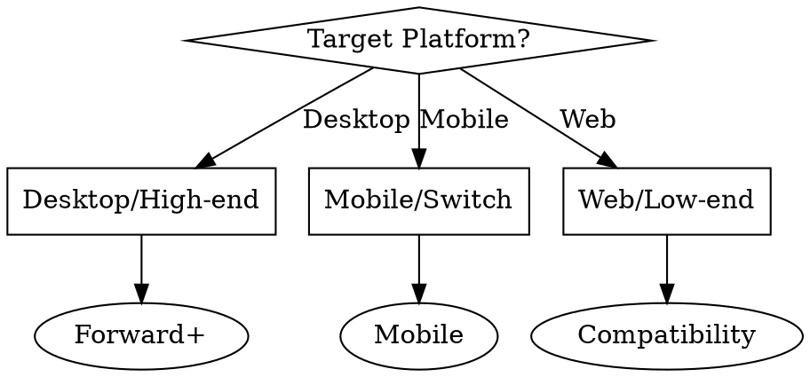

# Godot 渲染优化器

## 概述

优化 Godot 4.x 渲染管线以实现稳定的 60+ FPS 性能。检测渲染器配置不匹配、批处理效率低下、绘制调用过多以及材质/着色器瓶颈。为 Forward+、Mobile 和 Compatibility 渲染器提供特定的优化策略。

**核心原则：** 渲染性能取决于将渲染器与目标平台匹配、通过批处理和剔除最小化绘制调用，以及通过 LOD 和材质优化 GPU 工作负载。

## 何时使用

**适用场景：**
- 帧率低于目标（60 FPS 或 30 FPS）
- 绘制调用超过 100（2D）或 500（3D）
- GPU 使用率异常偏高
- 游戏在移动端/低端设备上卡顿
- 切换目标平台（桌面端 → 移动端）
- 发布前针对目标硬件进行优化
- 3D 中出现可见的弹入或剔除问题

**不适用场景：**
- CPU/GDScript 性能问题（请使用 godot-profile-performance）
- 物理模拟性能
- 网络同步问题
- 音频性能问题

## 渲染器选择

### 检测：当前渲染器配置

```bash
# 检查 project.godot 中的渲染器设置
grep -A 5 "rendering/renderer" project.godot 2>/dev/null || echo "Using default renderer"
```

**预期输出：**
```ini
[rendering]
renderer/rendering_method="forward_plus"
# 或 "mobile" 或 "gl_compatibility"
```

### 渲染器对比

| 渲染器 | 适用场景 | 绘制调用 | 功能 | 性能 |
|----------|----------|------------|----------|-------------|
| Forward+ | 桌面端/高端设备 | 1000-5000 | 完整 | 桌面端最佳 |
| Mobile | 移动端/中端设备 | 500-2000 | 精简 | 针对 Tile-based GPU 优化 |
| Compatibility | 低端设备/Web | 100-500 | 有限 | 最大兼容性 |

### 按渲染器的优化策略

#### Forward+（默认）

**最适合：** 桌面端、高端移动设备、复杂光照

**优化方案：**
- 保持绘制调用 <2000 以达到 60 FPS
- 使用簇式光照处理大量灯光
- 根据需要启用 SSAO、SSR、体积效果

**项目设置：**
```ini
[rendering]
renderer/rendering_method="forward_plus"
anti_aliasing/quality/msaa_3d=2
environment/ssao/quality=1
```

#### Mobile

**最适合：** 移动设备、Nintendo Switch、集成显卡

**优化方案：**
- 目标绘制调用 <1000
- 限制每个对象的动态光源数
- 尽可能使用烘焙光照
- 禁用昂贵的特效

**项目设置：**
```ini
[rendering]
renderer/rendering_method="mobile"
anti_aliasing/quality/msaa_3d=0
lights/max_lights_per_object=4
environment/ssao/quality=0
```

#### Compatibility

**最适合：** 低端硬件、Web 导出、旧 GPU

**优化方案：**
- 保持绘制调用 <500
- 避免复杂着色器
- 尽可能使用 2D
- 最小化过度绘制

**项目设置：**
```ini
[rendering]
renderer/rendering_method="gl_compatibility"
anti_aliasing/quality/screen_space_aa=0
environment/glow/upscale_mode=0
```

### 渲染器选择逻辑



## 2D 批处理优化

### 检测：批处理效率低下

```bash
# 检查常见的批处理中断模式
echo "=== Checking 2D Batching Issues ==="

# 不同纹理导致批处理中断
echo "Unique textures in sprites:"
find . -name "*.png" -o -name "*.jpg" | wc -l

# 不同材质中断批处理
echo "Unique materials in 2D scenes:"
grep -r "material" scenes/ --include="*.tscn" | wc -l

# 着色器修改中断批处理
echo "Custom shaders in 2D:"
find . -name "*.gdshader" | xargs grep -l "canvas_item" 2>/dev/null | wc -l
```

### 批处理中断模式

| 模式 | 影响 | 解决方案 |
|---------|--------|----------|
| 每个精灵使用独立纹理 | 每个 +1 绘制调用 | 使用纹理图集 |
| 不同混合模式 | 批处理中断 | 按混合模式分组 |
| 自定义着色器参数 | 批处理中断 | 使用 uniform 数组 |
| Z-index 变化 | 重排序开销 | 按 z-index 分组 |
| Modulate 颜色变化 | 材质变体 | 批量更新颜色 |

### 优化：纹理图集

**之前：**
```gdscript
# 100 个精灵 = 100 次绘制调用（100 个独立纹理）
for i in range(100):
    var sprite = Sprite2D.new()
    sprite.texture = load("res://sprites/sprite_%d.png" % i)
    add_child(sprite)
```

**之后：**
```gdscript
# 100 个精灵 = 1-2 次绘制调用（图集 + 单一材质）
@onready var atlas: Texture2D = preload("res://sprites/atlas.png")

func _ready():
    for i in range(100):
        var sprite = Sprite2D.new()
        sprite.texture = atlas
        # 使用区域从图集中选择特定精灵
        sprite.region_enabled = true
        sprite.region_rect = get_sprite_region(i)
        add_child(sprite)
```

**图集创建：**
```bash
# 使用 Godot 内置的图集导入器
# 1. 使用 "2D Pixel" 预设导入多个纹理
# 2. 在导入设置中启用 "Atlas"
# 3. 设置最大图集尺寸（推荐 2048x2048）
```

### 优化：材质批处理

**之前：**
```gdscript
# 每个精灵有独立材质 = 批处理中断
for i in range(100):
    var sprite = Sprite2D.new()
    var mat = ShaderMaterial.new()
    mat.shader = load("res://shaders/glow.gdshader")
    mat.set_shader_parameter("intensity", i * 0.01)
    sprite.material = mat
    add_child(sprite)
```

**之后：**
```gdscript
# 使用实例 uniform 的单一材质
@onready var shared_material: ShaderMaterial = preload("res://materials/shared_glow.tres")

func _ready():
    for i in range(100):
        var sprite = Sprite2D.new()
        # 使用相同材质（一起批处理）
        sprite.material = shared_material
        # Godot 会将使用相同材质的精灵批处理在一起
        add_child(sprite)
```

## 遮挡剔除（3D）

### 检测：缺少遮挡剔除

```bash
# 检查是否启用了遮挡剔除
grep -r "occlusion_culling" project.godot 2>/dev/null || echo "Occlusion culling not configured"

# 计算遮挡器节点数量
echo "Occluder nodes in scenes:"
grep -r "OccluderInstance3D" scenes/ --include="*.tscn" | wc -l
```

### 设置步骤

**第 1 步：启用遮挡剔除**
```ini
[rendering]
occlusion_culling/use_occlusion_culling=true
occlusion_culling/occlusion_rays_per_thread=512
```

**第 2 步：添加 OccluderInstance3D 节点**

**之前：**
```
关卡结构：
- BuildingA (MeshInstance3D) ← 始终渲染
- BuildingB (MeshInstance3D) ← 始终渲染
- BuildingC (MeshInstance3D) ← 始终渲染
  - 即使在 BuildingA 后面也会渲染！
```

**之后：**
```
关卡结构：
- BuildingA
  - MeshInstance3D（视觉网格）
  - OccluderInstance3D（遮挡形状）← 遮挡后面的建筑
- BuildingB
  - MeshInstance3D
  - OccluderInstance3D
```

**第 3 步：配置遮挡几何体**
```gdscript
# 从网格创建遮挡形状（简化版）
func setup_occlusion(mesh_instance: MeshInstance3D):
    var occluder = OccluderInstance3D.new()
    # 使用简化的凸包进行遮挡
    var hull = ConvexPolygonShape3D.new()
    hull.points = mesh_instance.mesh.get_faces()
    occluder.shape = hull
    mesh_instance.add_child(occluder)
```

### 遮挡剔除最佳实践

| 应该做 | 不应该做 |
|----|-------|
| 使用简单凸面形状作为遮挡器 | 使用复杂网格作为遮挡器 |
| 在大型建筑/地形上放置遮挡器 | 在小道具上放置 |
| 保持遮挡器为静态 | 对遮挡器添加动画 |
| 关卡变化时更新烘焙 | 在高度动态场景中启用 |

## LOD（细节层级）配置

### 检测：缺少 LOD

```bash
# 检查 LOD 配置
echo "MeshInstance3D nodes without LOD:"
grep -r "MeshInstance3D" scenes/ --include="*.tscn" -A 5 | grep -c "lod_bias" || echo "0"

# 替代方案：检查 LOD 节点
echo "LOD nodes found:"
grep -r "LODGroup\|lod_bias" scenes/ --include="*.tscn" | wc -l
```

### 自动 LOD 生成

**导入器设置：**
```bash
# 在 Godot 的导入标签页中配置 .gltf/.glb：
[importer_defaults]
gltf/lod_generate=true
gltf/lod_bias=1.0
gltf/lod_num_levels=3
```

**手动 LOD 设置：**

**之前：**
```gdscript
# 高面数网格在所有距离都渲染
extends MeshInstance3D

func _ready():
    mesh = load("res://models/tree_high_poly.obj")
    # 5000 三角形在任何距离都可见！
```

**之后：**
```gdscript
# 根据距离切换 LOD
extends MeshInstance3D

@export var lod_high: Mesh
@export var lod_medium: Mesh
@export var lod_low: Mesh

@onready var lod_component: LODComponent = $LODComponent

func _ready():
    # 根据距离自动切换网格
    lod_component.set_lod_meshes([
        { mesh = lod_high, distance = 0 },      # 0-20m: 5000 三角形
        { mesh = lod_medium, distance = 20 },   # 20-50m: 1000 三角形
        { mesh = lod_low, distance = 50 }       # 50m+: 200 三角形
    ])
```

### LOD 距离配置

**推荐的 LOD 距离：**

| 对象类型 | LOD0（高） | LOD1（中） | LOD2（低） |
|-------------|-------------|---------------|------------|
| 角色 | 0-10m | 10-30m | 30m+ |
| 道具 | 0-15m | 15-40m | 40m+ |
| 建筑 | 0-50m | 50-150m | 150m+ |
| 地形 | 0-100m | 100-300m | 300m+ |

**项目设置：**
```ini
[rendering]
lod/lod_bias=1.0
lod/lod_change_threshold=0.1
```

## 绘制调用减少

### 检测：绘制调用过多

**在 Godot 中监控：**
```gdscript
# 添加到调试 UI 脚本中
func _process(delta):
    var draw_calls = RenderingServer.get_rendering_info(
        RenderingServer.RENDERING_INFO_DRAW_CALLS_IN_FRAME
    )
    print("Draw calls: ", draw_calls)
```

**Bash 检测：**
```bash
# 查找包含大量 MeshInstance3D 节点的场景
echo "Scenes with high node counts (potential draw call issues):"
for scene in $(find . -name "*.tscn"); do
    count=$(grep -c "type=\"MeshInstance3D\"" "$scene" 2>/dev/null || echo 0)
    if [ "$count" -gt 50 ]; then
        echo "$scene: $count MeshInstance3D nodes"
    fi
done
```

### 绘制调用优化策略

#### 1. 合并静态网格

**之前：**
```gdscript
# 100 把独立椅子 = 100 次绘制调用
for i in range(100):
    var chair = MeshInstance3D.new()
    chair.mesh = preload("res://models/chair.obj")
    chair.position = chair_positions[i]
    add_child(chair)
```

**之后：**
```gdscript
# 合并为单个网格 = 1 次绘制调用
@onready var multimesh: MultiMeshInstance3D = $MultiMeshInstance3D

func _ready():
    var mm = MultiMesh.new()
    mm.transform_format = MultiMesh.TRANSFORM_3D
    mm.mesh = preload("res://models/chair.obj")
    mm.instance_count = 100

    for i in range(100):
        mm.set_instance_transform(i,
            Transform3D(Basis(), chair_positions[i]))

    multimesh.multimesh = mm
```

#### 2. 减少材质变体

**之前：**
```
材质（5 个变体）：
- chair_wood_red.tres
- chair_wood_blue.tres
- chair_wood_green.tres
- chair_metal_red.tres
- chair_metal_blue.tres
```

**之后：**
```
材质（2 个基础 + 实例参数）：
- chair_wood.tres（带颜色参数）
- chair_metal.tres（带颜色参数）

# 通过脚本设置每个实例的颜色
mesh_instance.set_instance_shader_parameter("albedo_color", color)
```

#### 3. GPU 实例化

**用于重复对象：**
```gdscript
# 不使用 1000 棵独立的树
# 使用 MultiMesh 实现 1 次绘制调用
@onready var forest: MultiMeshInstance3D = $Forest

func generate_forest():
    var mm = MultiMesh.new()
    mm.mesh = preload("res://models/tree.obj")
    mm.instance_count = 1000

    for i in range(1000):
        var pos = random_position_in_forest()
        var scale = randf_range(0.8, 1.2)
        var transform = Transform3D(
            Basis().scaled(Vector3(scale, scale, scale)),
            pos
        )
        mm.set_instance_transform(i, transform)

    forest.multimesh = mm
```

### 各平台绘制调用目标

| 平台 | 2D 目标 | 3D 目标 | 备注 |
|----------|-----------|-----------|-------|
| 桌面端 | <100 | <500 | 高端可处理 1000+ |
| 移动端 | <50 | <200 | Tile-based GPU 敏感 |
| Web | <30 | <100 | 浏览器开销显著 |
| Switch | <75 | <300 | 类似移动端的限制 |

## 材质与着色器优化

### 检测：昂贵的材质

```bash
# 检查复杂着色器
echo "Complex shader patterns found:"
echo "Fragment loops:"
grep -r "for.*in.*fragment" shaders/ --include="*.gdshader" | wc -l

echo "Texture samples >4:"
grep -r "texture(" shaders/ --include="*.gdshader" | wc -l

echo "Discards in fragment:"
grep -r "discard" shaders/ --include="*.gdshader" | wc -l
```

### 材质优化模式

#### 1. 减少纹理采样

**之前：**
```glsl
shader_type canvas_item;

uniform sampler2D albedo;
uniform sampler2D normal;
uniform sampler2D roughness;
uniform sampler2D metallic;
uniform sampler2D emission;
uniform sampler2D ao;

void fragment() {
    COLOR = texture(albedo, UV);
    NORMAL = texture(normal, UV).rgb;
    // 每像素 6 次纹理采样！
}
```

**之后：**
```glsl
shader_type canvas_item;

// 打包到单个纹理中或减少数量
uniform sampler2D albedo_metallic;  // RGB=albedo, A=metallic
uniform sampler2D normal_roughness; // RG=normal, B=roughness

void fragment() {
    vec4 alb_met = texture(albedo_metallic, UV);
    vec3 norm_rough = texture(normal_roughness, UV).rgb;
    // 2 次纹理采样 - 减少 3 倍
}
```

#### 2. 简化片段着色器逻辑

**之前：**
```glsl
void fragment() {
    for (int i = 0; i < 8; i++) {
        // 复杂的逐光源计算
        vec3 light_dir = normalize(light_positions[i] - WORLD_POSITION);
        float diff = max(dot(NORMAL, light_dir), 0.0);
        // ... 更多计算
    }
}
```

**之后：**
```glsl
// 使用 Godot 内置光照
// 将复杂计算移到顶点着色器或预计算
void vertex() {
    // 尽可能在顶点中计算光照
}

void fragment() {
    // 简单的纹理查找
    COLOR = texture(albedo, UV) * light_color;
}
```

#### 3. 优化透明度

**Alpha 混合 vs Alpha 测试：**

| 方法 | 性能 | 适用场景 |
|--------|-------------|----------|
| Alpha 混合 | 慢（需要排序） | 渐变透明 |
| Alpha 裁剪 | 快（无需排序） | 镂空/遮罩 |
| 不透明 | 最快 | 无透明度 |

**Alpha 裁剪设置：**
```glsl
shader_type spatial;
render_mode depth_draw_opaque, cull_disabled;

uniform sampler2D albedo;
uniform float alpha_scissor : hint_range(0.0, 1.0) = 0.5;

void fragment() {
    vec4 color = texture(albedo, UV);
    if (color.a < alpha_scissor) {
        discard;  // 比混合快得多
    }
    ALBEDO = color.rgb;
}
```

### 着色器复杂度指南

| 着色器类型 | 最大指令数 | 纹理采样数 | 备注 |
|-------------|------------------|-----------------|-------|
| 简单 2D | <20 | 1 | 基本精灵着色器 |
| 复杂 2D | <50 | 2-3 | 特效、光照 |
| 简单 3D | <30 | 1-2 | 标准材质 |
| 复杂 3D | <100 | 3-4 | 自定义 PBR、特效 |
| 仅顶点 | <50 | 0 | 位移、动画 |

## 性能验证

### 需要监控的指标

**Godot 分析器指标：**
```gdscript
func _process(delta):
    # 绘制调用（目标：3D <500，2D <100）
    var draw_calls = RenderingServer.get_rendering_info(
        RenderingServer.RENDERING_INFO_DRAW_CALLS_IN_FRAME
    )

    # 处理的顶点数
    var vertices = RenderingServer.get_rendering_info(
        RenderingServer.RENDERING_INFO_VERTICES_IN_FRAME
    )

    # 纹理内存
    var tex_memory = RenderingServer.get_rendering_info(
        RenderingServer.RENDERING_INFO_TEXTURE_MEM_USED
    )

    print("Draw calls: %d, Vertices: %d, Texture mem: %d MB" % [
        draw_calls, vertices, tex_memory / 1024 / 1024
    ])
```

### 性能目标

| 指标 | 桌面端 | 移动端 | Web |
|--------|---------|--------|-----|
| 绘制调用（3D） | <500 | <200 | <100 |
| 绘制调用（2D） | <100 | <50 | <30 |
| 帧时间（GPU） | <8ms | <12ms | <16ms |
| 纹理内存 | <512MB | <256MB | <128MB |
| 每帧顶点数 | <500k | <200k | <100k |

## 示例

### 示例 1：2D 游戏批处理修复

**问题：**
```gdscript
# hud_controller.gd
func _ready():
    # 50 个 UI 元素 = 50 次绘制调用
    for i in range(50):
        var icon = TextureRect.new()
        icon.texture = load("res://icons/icon_%d.png" % i)
        icon.material = ShaderMaterial.new()
        icon.material.shader = load("res://shaders/ui_glow.gdshader")
        add_child(icon)
```

**分析器输出：**
```
渲染信息：
- 绘制调用：52（50 个图标 + 2 个基础）
- 纹理切换：50
- 着色器切换：50
```

**优化后：**
```gdscript
# hud_controller.gd
@onready var icon_atlas: Texture2D = preload("res://icons/ui_atlas.png")
@onready var shared_material: Material = preload("res://materials/ui_glow.tres")

func _ready():
    # 50 个 UI 元素 = 1 次绘制调用
    for i in range(50):
        var icon = TextureRect.new()
        icon.texture = icon_atlas
        icon.region_enabled = true
        icon.region_rect = get_icon_region(i)  # 图集坐标
        icon.material = shared_material  # 共享材质一起批处理
        add_child(icon)
```

**结果：**
```
渲染信息：
- 绘制调用：2（1 个图集批次 + 1 个基础）
- 纹理切换：1
- 着色器切换：1
- 性能：绘制调用减少 50 倍！
```

### 示例 2：3D 关卡优化

**问题：**
```
城市场景：
- 500 栋建筑（独立 MeshInstance3D）= 500 次绘制调用
- 无遮挡剔除（始终全部渲染）
- 无 LOD（所有距离都使用高面数模型）
- 200+ 次绘制调用来自小道具
```

**分析器输出：**
```
渲染信息：
- 绘制调用：720
- 每帧顶点数：2,500,000
- 帧时间：22ms（45 FPS）
```

**优化后：**
```
城市场景：
- 500 栋建筑 → 每个区域 20 个合并网格（批处理）
- 在大型建筑上启用遮挡剔除（减少 40% 渲染对象）
- 所有建筑启用 LOD（3 个级别：高/中/低）
- 道具 → MultiMesh（200 个道具 = 1 次绘制调用）
```

**代码修改：**
```gdscript
# combine_static_meshes.gd
func batch_buildings_by_district():
    for district in city_districts:
        var static_body = StaticBody3D.new()
        var mesh_instance = MeshInstance3D.new()

        # 合并区域内所有静态网格
        var combined_mesh = ArrayMesh.new()
        var surfaces = []

        for building in district.buildings:
            if building.is_static:
                surfaces.append(building.mesh)

        # 合并表面
        mesh_instance.mesh = merge_meshes(surfaces)
        static_body.add_child(mesh_instance)

        # 为大型建筑添加遮挡
        if district.has_large_buildings:
            add_occlusion_culling(static_body)

        add_child(static_body)

func optimize_props():
    # 将 200 把独立长椅转换为 MultiMesh
    var bench_multimesh = MultiMeshInstance3D.new()
    bench_multimesh.multimesh = create_multimesh_from_nodes(
        get_tree().get_nodes_in_group("benches")
    )
    add_child(bench_multimesh)
```

**结果：**
```
渲染信息：
- 绘制调用：85（减少 92%！）
- 每帧顶点数：400,000（LOD + 剔除）
- 帧时间：6ms（165 FPS）
- GPU 内存：减少 40%
```

### 示例 3：渲染器迁移

**问题：** 桌面游戏在移动端仅运行 30 FPS

**之前（移动端使用 Forward+）：**
```ini
[rendering]
renderer/rendering_method="forward_plus"
lights/max_lights_per_object=16
environment/ssao/quality=2
anti_aliasing/quality/msaa_3d=4
```

**之后（优化的 Mobile 渲染器）：**
```ini
[rendering]
renderer/rendering_method="mobile"
lights/max_lights_per_object=4
environment/ssao/quality=0
anti_aliasing/quality/msaa_3d=0
anti_aliasing/quality/use_taa=true
environment/glow/upscale_mode=0
```

**额外修改：**
```gdscript
# 在移动端降低阴影质量
func _ready():
    if OS.get_name() == "Android" or OS.get_name() == "iOS":
        # 降低阴影贴图分辨率
        get_viewport().msaa_3d = Viewport.MSAA_DISABLED

        # 减少灯光数量
        for light in get_tree().get_nodes_in_group("decorative_lights"):
            light.hide()  # 禁用非必要灯光

        # 更激进地启用 LOD
        RenderingServer.viewport_set_lod_threshold(
            get_viewport().get_viewport_rid(), 1.5
        )
```

**结果：**
```
移动端性能：
- 之前：30 FPS，设备发热，电池消耗快
- 之后：稳定 60 FPS，温度正常，电池消耗减少 40%
```

## 成功标准

渲染优化成功的标志：

### 量化指标
- [ ] 绘制调用减少 >50%（或在平台目标范围内）
- [ ] 帧时间稳定 <16.67ms 以达到 60 FPS
- [ ] GPU 内存使用减少或保持稳定
- [ ] 通过 LOD/剔除减少顶点数
- [ ] 纹理切换最小化（每帧 <10 次）
- [ ] 材质/着色器切换最小化

### 配置检查
- [ ] 渲染器与目标平台匹配
- [ ] 有遮挡的 3D 场景启用了遮挡剔除
- [ ] 所有高面数网格配置了 LOD
- [ ] 2D 批处理使用了纹理图集
- [ ] 重复的 3D 对象使用了 MultiMesh
- [ ] 材质共享纹理和着色器

### 验证步骤
1. **优化前分析：** 记录基准绘制调用、帧时间、GPU 使用率
2. **应用优化：** 系统性地使用上述模式
3. **优化后分析：** 对比指标，验证 >50% 的改善
4. **在目标硬件上测试：** 确保在实际目标设备上正常工作
5. **视觉回归测试：** 确认无视觉质量损失
6. **压力测试：** 验证在最坏情况下的性能

## 快速参考

| 优化项 | 检测方法 | 修复方案 | 影响 |
|--------------|-----------|-----|--------|
| 渲染器不匹配 | 检查 project.godot | 匹配目标平台 | 2-3 倍性能提升 |
| 2D 批处理中断 | 简单场景绘制调用过多 | 纹理图集、共享材质 | 10-50 倍减少 |
| 无遮挡剔除 | 墙后的对象仍在渲染 | 添加 OccluderInstance3D | 剔除 20-60% 对象 |
| 缺少 LOD | 远距离顶点数过高 | 设置 LOD 网格 | 顶点减少 50-90% |
| 绘制调用过多 | >500（3D）或 >100（2D） | 合并网格、MultiMesh | 5-20 倍减少 |
| 昂贵的着色器 | GPU 帧时间过高 | 简化、减少纹理采样 | 着色器速度提升 2-5 倍 |

## 常见错误

### 错误：不分析就优化
**问题：** 猜测瓶颈，优化非关键区域
**修复：** 始终先分析，关注最耗时的部分

### 错误：过早的 LOD
**问题：** 过于激进的 LOD 导致视觉弹入
**修复：** 平衡性能与质量，使用平滑的 LOD 过渡

### 错误：无意中破坏批处理
**问题：** 添加逐实例着色器参数或独立材质
**修复：** 谨慎使用实例 uniform 或批量更新

### 错误：在移动端使用桌面端设置
**问题：** 使用 Forward+ 渲染器、高 MSAA、复杂着色器
**修复：** 切换到 Mobile 渲染器，使用平台检测

### 错误：忽略顶点处理
**问题：** 只关注绘制调用，忽略顶点数
**修复：** 监控每帧顶点数，优化网格复杂度

### 错误：过度遮挡
**问题：** 遮挡器过多导致 CPU 开销
**修复：** 仅在大型对象上使用，分析遮挡的成本与收益
