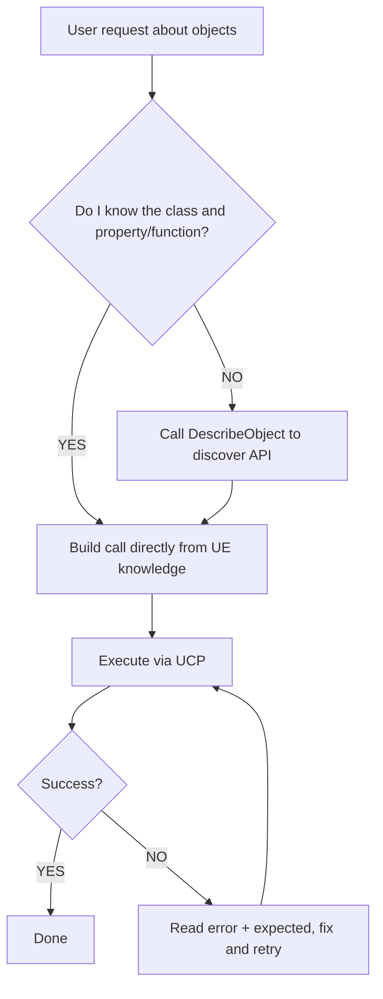

# Unreal Object Operations

Operate on UObjects through UCP's `call` command. This skill covers two function libraries: one available at runtime and one editor-only.

**Prerequisite**: The `unreal-client-protocol` skill must be available and the UE editor must be running with the UCP plugin enabled.

---

## Runtime

### UObjectOperationLibrary

**CDO Path**: `/Script/UnrealClientProtocol.Default__ObjectOperationLibrary`

| Function | Params | Description |
|----------|--------|-------------|
| `GetObjectProperty` | `ObjectPath`, `PropertyName` | Read a UPROPERTY, returns JSON with property value |
| `SetObjectProperty` | `ObjectPath`, `PropertyName`, `JsonValue` | Write a UPROPERTY (supports Undo in editor). JsonValue is a JSON string. |
| `DescribeObject` | `ObjectPath` | Returns class info, all properties (with current values), and all functions |
| `DescribeObjectProperty` | `ObjectPath`, `PropertyName` | Returns detailed property metadata and current value |
| `DescribeObjectFunction` | `ObjectPath`, `FunctionName` | Returns full function signature with parameter types |
| `FindObjectInstances` | `ClassName`, `Limit` (default 100) | Find UObject instances by class path |
| `FindDerivedClasses` | `ClassName`, `bRecursive` (default true), `Limit` (default 500) | Find all subclasses of a class |
| `ListComponents` | `ObjectPath` | List all components attached to an actor |
| `FindObjectsByOuter` | `OuterPath`, `ClassName` (default ""), `Limit` (default 100) | Find objects owned by a given outer object |

### Examples

**Read a property:**
```json
{"object":"/Script/UnrealClientProtocol.Default__ObjectOperationLibrary","function":"GetObjectProperty","params":{"ObjectPath":"/Game/Maps/Main.Main:PersistentLevel.StaticMeshActor_0.StaticMeshComponent0","PropertyName":"RelativeLocation"}}
```

**Write a property:**
```json
{"object":"/Script/UnrealClientProtocol.Default__ObjectOperationLibrary","function":"SetObjectProperty","params":{"ObjectPath":"/Game/Maps/Main.Main:PersistentLevel.StaticMeshActor_0.StaticMeshComponent0","PropertyName":"RelativeLocation","JsonValue":"{\"X\":100,\"Y\":200,\"Z\":0}"}}
```

**Find instances:**
```json
{"object":"/Script/UnrealClientProtocol.Default__ObjectOperationLibrary","function":"FindObjectInstances","params":{"ClassName":"/Script/Engine.StaticMeshActor","Limit":50}}
```

**Describe an unfamiliar object:**
```json
{"object":"/Script/UnrealClientProtocol.Default__ObjectOperationLibrary","function":"DescribeObject","params":{"ObjectPath":"/Game/Maps/Main.Main:PersistentLevel.BP_CustomActor_C_0"}}
```

**List components on an actor:**
```json
{"object":"/Script/UnrealClientProtocol.Default__ObjectOperationLibrary","function":"ListComponents","params":{"ObjectPath":"/Game/Maps/Main.Main:PersistentLevel.StaticMeshActor_0"}}
```

**Find objects by outer:**
```json
{"object":"/Script/UnrealClientProtocol.Default__ObjectOperationLibrary","function":"FindObjectsByOuter","params":{"OuterPath":"/Game/Maps/Main.Main:PersistentLevel","ClassName":"/Script/Engine.StaticMeshActor","Limit":50}}
```

---

## Editor Only

### UObjectEditorOperationLibrary

**CDO Path**: `/Script/UnrealClientProtocolEditor.Default__ObjectEditorOperationLibrary`

| Function | Params | Description |
|----------|--------|-------------|
| `UndoTransaction` | `Keyword` (optional, default "") | Undo the last editor transaction. If Keyword is set, only undoes if the top transaction contains the keyword. |
| `RedoTransaction` | `Keyword` (optional, default "") | Redo the last undone transaction. If Keyword is set, only redoes if the top transaction contains the keyword. |
| `GetTransactionState` | (none) | Returns undo/redo stack state: canUndo, canRedo, undoTitle, redoTitle, undoCount, queueLength |
| `ForceReplaceReferences` | `ReplacementObjectPath`, `ObjectsToReplacePaths` | Redirect all references from the listed objects to the replacement object. `ObjectsToReplacePaths` is an array of strings. |

### Examples

**Get transaction state:**
```json
{"object":"/Script/UnrealClientProtocolEditor.Default__ObjectEditorOperationLibrary","function":"GetTransactionState"}
```

**Undo last transaction (unconditional):**
```json
{"object":"/Script/UnrealClientProtocolEditor.Default__ObjectEditorOperationLibrary","function":"UndoTransaction"}
```

**Safe undo (only if top transaction matches):**
```json
{"object":"/Script/UnrealClientProtocolEditor.Default__ObjectEditorOperationLibrary","function":"UndoTransaction","params":{"Keyword":"UCP-A1B2C3D4"}}
```

**Force-replace references:**
```json
{"object":"/Script/UnrealClientProtocolEditor.Default__ObjectEditorOperationLibrary","function":"ForceReplaceReferences","params":{"ReplacementObjectPath":"/Game/Meshes/NewMesh.NewMesh","ObjectsToReplacePaths":["/Game/Meshes/OldMesh.OldMesh"]}}
```

---

## Property Value Formats

When using `SetObjectProperty`, the `JsonValue` parameter is a JSON string:
- `FVector` → `"{\"X\":1,\"Y\":2,\"Z\":3}"`
- `FRotator` → `"{\"Pitch\":0,\"Yaw\":90,\"Roll\":0}"`
- `FLinearColor` → `"{\"R\":1,\"G\":0.5,\"B\":0,\"A\":1}"`
- `FString` → `"\"hello\""`
- `bool` → `"true"` / `"false"`
- `float/int` → `"1.5"` / `"42"`
- `UObject*` → `"\"/Game/Path/To/Asset.Asset\""`

## Safe Undo/Redo Pattern

Every UCP call returns an `id` field (e.g. `"UCP-A1B2C3D4"`) that identifies the Undo transaction. Use this ID as the `Keyword` parameter when undoing to ensure you only undo your own operations:

1. Make a call → response contains `"id":"UCP-A1B2C3D4"`
2. If the call produced an undesired result, undo it with `UndoTransaction(Keyword="UCP-A1B2C3D4")`
3. If the top of the Undo stack is NOT your operation (e.g. user did something manually), the undo will be rejected with an error showing the actual top transaction title.

This prevents accidentally undoing user's manual edits.

**When to use Keyword:**
- After a failed or undesired operation — pass the ID you just received
- For "try and rollback" patterns — record ID, check result, undo if wrong

**When to omit Keyword:**
- When the user explicitly asks to undo (they expect any undo)
- When calling `GetTransactionState` to inspect the stack

## Decision Flow


