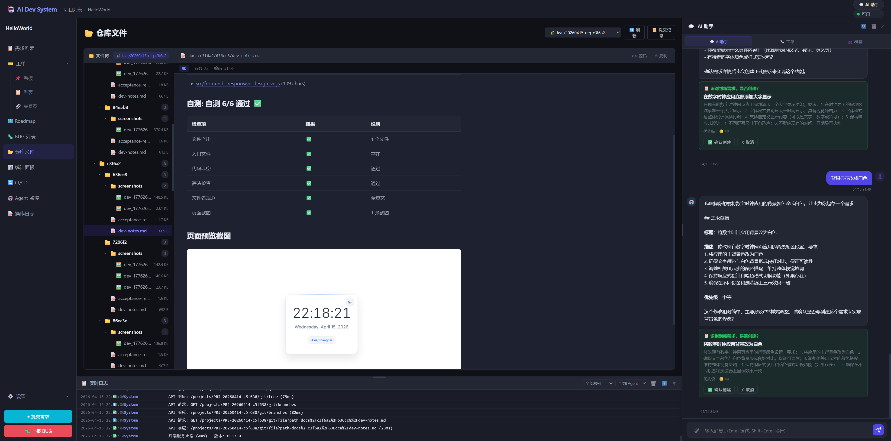

# 开发日志 — 2026-04-15

## 版本
- v0.14.7 → v0.14.8

## 主要改动

### Bug 修复（工单卡流程）

**1. 工单状态 `success` 不在合法状态表中**
- 根因：`ActionResult.to_dict()` 第 24 行 `result["status"] = "success"` 覆盖了 data 中已有的 `acceptance_rejected`
- 影响：验收打回变成 success → 不在 transition_rules → 依赖链全卡
- 修复：`to_dict()` 不覆盖 data 中已有的 status + orchestrator 白名单校验

**2. 验收/测试死循环 53 次**
- 根因：BY_ORDER 模式 SelfTestAction 的 files 覆盖了 WriteCodeAction 的 files → index.html 丢失 → 验收永远不通过
- 修复：`_react_by_order` 中 pop files 后再 update，防止覆盖 + 加 MAX_RETRIES=5

**3. subtasks 格式不兼容**
- 根因：LLM 返回 subtasks 为字符串列表 `["子任务1"]`，代码期望 dict `[{"title":"..."}]`
- 影响：handle_requirement 崩溃 → 分支没创建
- 修复：兼容字符串和 dict 两种格式

**4. JSON 中文引号解析失败**
- 根因：LLM 在 JSON value 中使用中文引号 `""` 或未转义的 `""`，json.loads 失败
- 影响：需求创建卡片不显示
- 修复：新增 `_try_fix_json` 三策略修复引擎（替换中文引号 → 正则提取 → 删除内部引号）

### 验收改进（SOP v2.0）

- SOP YAML 每个 stage 新增 `config` 字段，定义 Action 具体行为
- 验收 config: `review_code_content` / `pass_score` / `check_items`
- `AcceptanceReviewAction` 改为读取实际代码内容（不只看文件名）
- 传入仓库已有文件列表 + 代码片段给 LLM
- 按 SOP 配置的 check_items 逐项检查
- pass_score 可配置（默认 6 分）

### 开发自测截图

- `SelfTestAction` 新增 Playwright → Chrome headless 双方案截图
- 截图保存到工单文档路径 `docs/{req}/{ticket}/screenshots/`
- dev-notes.md 中嵌入截图（相对路径）
- TestAgent 截图路径也改为跟工单文档走
- 截图前先 `_flush_files_to_repo` 把代码写入磁盘

### 仓库 MD 预览支持图片

- 新增 API: `GET /api/projects/{id}/git/file-raw` 返回二进制文件
- `renderMarkdown` 自动把 md 中相对图片路径转为 file-raw API 路径
- 仓库文件预览中 dev-notes.md 的截图可以直接显示

### 效果截图

## 新增/修改文件

### 新增
- `backend/api/projects.py` — `git/file-raw` 二进制文件接口
- `docs/screenshots/` — 系统文档截图目录

### 修改
- `backend/actions/base.py` — to_dict 不覆盖已有 status
- `backend/actions/acceptance_review.py` — 读取实际代码 + SOP config
- `backend/actions/self_test.py` — 截图 + flush_files + 相对路径
- `backend/agents/base.py` — BY_ORDER files 合并修复
- `backend/agents/test.py` — 截图路径改为工单文档目录
- `backend/orchestrator.py` — 状态白名单 + MAX_RETRIES + SOP config 注入
- `backend/api/chat.py` — JSON 修复引擎 + 日志增强
- `backend/sop/default_sop.yaml` — v2.0 含 config 字段
- `frontend/app.js` — MD 预览图片渲染

## Bug 修复统计

| 日期 | 数量 | 类型 |
|------|------|------|
| 04-15 | 8 | 卡流程/死循环/覆盖/解析/路径 |
| 04-14 | 3 | 分支/截断/status |
| 03-30 | 3 | 删除/锁/context |
| **合计** | **14** | |

## 下一步
- 修复剩余盲审 Agent（ProductAgent 拆单/ReviewAgent/DeployAgent）
- Phase 3: v0.15 多 LLM / 并发调度
