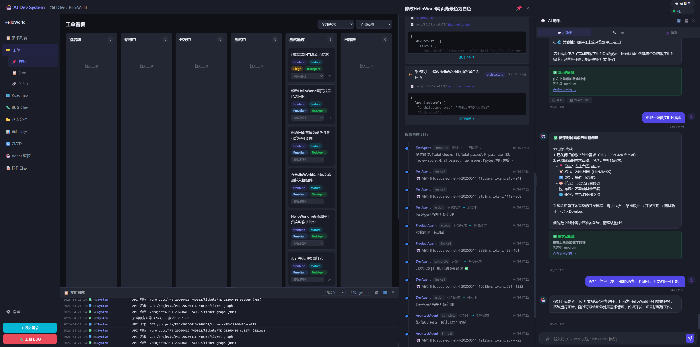

# 开发日志 — 2026-04-21

## 版本
- v0.15.4 → **v0.16.0**

## 主题
**把 MagicAI 对比分析里 4 项值得借鉴的能力全部落地**（Skills 注入、Failure Library、Session Transcript、MCP 客户端），外加若干 UI 修复（看板列宽、卡片点击区、Dock drawer 布局 bug）。

---

## 背景

2026-04-18 完成了 MagicAI 对比分析（`docs/20260418_01_MagicAI对比分析.md`），识别出 3 项 ⭐⭐⭐ 强烈建议 + 3 项 ⭐⭐ 值得借鉴的特性。2026-04-19 落了 Reflexion 反思框架（P0 的预热）。**今日一次性把剩下的 P0/P1/P2/P3 四项全做完**，覆盖 ⭐⭐⭐ 两项 + ⭐⭐ 两项。期间顺手修了几个看板和抽屉的 UI bug，包括今天做 E2E 测试时发现的。

---

## 一、P0 — Skills 注入系统

**问题**：各 Agent 的领域知识（React / FastAPI / Playwright / Git）硬编码在 Action prompt 里，调整一条都得改源码。

**方案**：移植 MagicAI 的 Skills 机制：一个 `.md` = 一个 Skill + `skills.json` 配置挂给哪些 Agent。用 `contextvars.ContextVar` 透明注入到 ActionNode 的 system prompt，**现有 7+ 个 Action 代码零改动**。MagicAI 的 Skill 包格式完全兼容，可直接 drop-in。

**关键改动**：
- 新增 `backend/skills/{__init__.py, loader.py, skills.json}` + `packs/{react_dev, fastapi_dev, playwright_e2e, git_workflow}/prompt.md`
- `BaseAgent.__init__` 加载 `self._skills_prompt`；`run_action` / `_react_by_order` / `_react_with_think` 用 ContextVar 注入
- `ActionNode._compile` 从 ContextVar 读 skills 并 prepend
- `ChatAssistant._build_system_prompt` 单独注入（不走 ActionNode）
- 单测 `_test_skills.py` 8/8 通过
- 设计文档 `docs/20260420_01_Skills注入系统实现方案.md`

**实测效果**：启动日志显示 `🎓 DevAgent 加载 3 个 Skill: react-dev, fastapi-dev, git-workflow`。

---

## 二、P1 — Failure Library（跨工单反思学习）

**问题**：Reflexion 反思只在**同一工单内**共享，工单 A 踩过的坑工单 B 会原样再踩。实测"访问计数"需求被打回 5 次 force_pass，每次反思都说"没加可见 DOM"但下一个类似需求还会重蹈覆辙。

**方案**：新增 `failure_cases` 表 + `FailureLibrary` 服务。DevAgent 反思写入的同时 `record()`；ticket 转 `acceptance_passed`/`testing_done` 时 `mark_resolved()`。未来工单 rework 时按 `agent_type + module + failure_type + 关键词 LIKE` 检索历史 top 3，注入 ReflectionAction 的 prompt，优先借鉴已解决策略。

无向量检索 / 无 FTS —— 纯 Python 关键词提取（中文 2+ 字 / 英文 3+ 字 / 60 词停用词表）+ SQLite LIKE。SQLite 对中文 UTF-8 LIKE 是原生支持的。

**关键改动**：
- 新增 `backend/failure_library.py`（~270 行）+ `failure_cases` 表 + 3 索引
- `backend/_migrate_failure_library.py` 一次性回灌脚本（幂等，按 ticket_id + root_cause 去重）
- `orchestrator._log('reflection')` 处调 `record()`；`_handle_agent_result` 成功分支调 `mark_resolved()`
- `DevAgent._enrich_retry_context` 追加 `search_similar()` → 填 `context['similar_failures']`
- `ReflectionAction` 渲染「## 历史相似失败（跨工单）」段到 user_prompt；system_prompt 加"优先借鉴已解决策略"硬要求
- 单测 `_test_failure_library.py` 6/6 通过
- 设计文档 `docs/20260420_02_失败案例库实现方案.md`

**实测效果**：回灌把本地 DB 里 4 条"HelloWorld 时钟"历史反思入库。相似 frontend 工单 rework 时在 prompt 里已能看到这些前车之鉴。

---

## 三、P2 — Session Transcript

**问题**：调试要去 `server.log` + `ticket_logs` 表 + `llm_conversations` 表三处拼凑。

**方案**：用两个天然 chokepoint（`orchestrator._log()` + `llm_client._save_conversation()`）镜像写入 `backend/logs/session_<req_id>/`：
- `transcript.txt`：人读的时间+emoji+事件流
- `tool_calls.jsonl`：结构化 JSON 一行一条（含 detail 嵌套）

LLM 调用只记 tokens/duration/status，不记 prompt/response（已在 `llm_conversations` 表）。

**关键改动**：
- 新增 `backend/session_logger.py`（SessionLogger 单例，per-req `asyncio.Lock` 防并发乱序）
- `orchestrator._log` / `llm_client._save_conversation` 各 +15 行镜像调用（try/except 降级）
- 单测 `_test_session_logger.py` 5/5（含 100 条并发写入无损）
- 设计文档 `docs/20260420_03_Session_Transcript实现方案.md`

**已知盲点**：`chat_with_tools()`（ChatAssistant 的 tool_use 路径）不走 `_save_conversation`，暂未被覆盖。影响面有限——ChatAssistant 对话流水本就有专门表（`chat_messages`）；Agent 工作流相关 LLM 全部被覆盖。

---

## 四、P3 — MCP 客户端（ChatAssistant 接外部 MCP server）

**问题**：ChatAssistant 有 16 个硬编码 Anthropic tool，每加一个工具都要手写；无法受益于官方 `@modelcontextprotocol/servers` 生态（git-mcp / filesystem-mcp / fetch-mcp 等）。

**方案**：加 `mcp` Python SDK + `mcp_servers.json` 配置，ChatAssistant 启动时连接 `enabled=true` 的 MCP server，自动把它们的工具以 `mcp__<server>__<tool>` 形式挂进 tool_use 列表。现有 16 个 Action 不动，MCP 工具作为**额外能力**叠加。

**明确不做**：
- 内部 Action 迁 MCP（保留现状，工作量大收益低）
- 非 Chat Agent 支持 MCP（走的是 ActionNode 模式，不是 tool_use）
- 暴露本系统为 MCP server（反向，另议）

**关键改动**：
- 新增 `backend/mcp_client.py`（~270 行，subprocess 生命周期 + asyncio.Queue 串行化调用）
- `backend/mcp_servers.json` 默认 3 条 disabled（filesystem / fetch / git）
- `backend/api/mcp_status.py`（`GET /api/mcp/status` 只读）
- `requirements.txt` 加 `mcp>=1.0.0,<2.0.0`（Windows Python 3.14 需额外 `pywin32_postinstall.py -install`）
- `agents/chat_assistant.py`：`_exposed_tool_schemas()` 合并 MCP 工具；`_ChatToolExecutor.execute()` 前缀路由
- `main.py::lifespan` 启动 / 关停 hook
- 单测 `_test_mcp_client.py` 5/5 通过
- 设计文档 `docs/20260421_02_MCP客户端实现方案.md`

---

## 五、UI 系列修复

### 5.1 看板列宽回归"等宽"

**起因**：历史上看板经过几次改动（`d2ccb5b` 空列收窄、`c13c69c` Dock 空白修复、`2cf57eb` 去 max-width），导致**非空列独吃全宽**，其他列压成 110px 窄条。用户反馈"之前都是平均宽度大小的"。

**修法**：
- 删除 `.board-column.empty-col` 全部规则（`styles.css:358-366`）+ `app.js` 里加 class 的逻辑
- `.board` 加 `width: 100%` 确保填满父容器
- `.board-column` min-width 从 220px → 160px（Dock drawer + AI 助手都开时 6 × 160 = 960px 才能同屏）

### 5.2 卡片点击区扩大到整张

**起因**：以前卡片窄，视觉感觉全是标题，实际 `onclick` 只在 `.ticket-title`。等宽后卡片变宽，右侧大片点击无响应。

**修法**：`onclick="openTicketDrawer(...)"` 从 `.ticket-title` 提到外层 `.ticket-card`。卡片内的 `.status-select` 已有 `event.stopPropagation()` 保护，行为不变。

### 5.3 Drawer + Chat 双开时右侧红色空白

**起因**：`body.chat-open.has-docked-drawer .main-container { padding-right: calc(600 + 500) }` 和 `body.chat-open .project-layout { margin-right: 600 }` **重复预留了 chat 的 600px**，总计多出 600px 的右侧空白。

**修法**：删除双开情况下 main-container 的特殊 padding 规则，让 padding(500) + margin(600) = 1100px 正好容纳 drawer+chat。

### 5.4 文件链接点击不关闭抽屉

**起因**：`openArtifactFile()` 以前会关抽屉再切 repo tab，导致属性面板消失。用户反馈"不应该把属性面板消失"。

**修法**：去掉 `closeDrawer()` 调用。Dock 模式下左侧主内容切到仓库文件视图，右侧 drawer 保持原地不动。

---

## 六、效果截图

UI 修复 + P0-P3 全部就位后的运行态（Dock drawer + AI 助手同开，看板 6 列等宽，drawer 点文件链接不关抽屉）：

---

## 七、MagicAI 对标总进展

| # | 能力 | MagicAI 评级 | 状态 |
|---|---|---|---|
| 1 | Reflexion 反思框架 | ⭐⭐⭐ | ✅ 2026-04-19 |
| 2 | Skills 注入系统 | ⭐⭐ | ✅ 2026-04-20 |
| 3 | Failure Library | ⭐⭐⭐ | ✅ 2026-04-20 |
| 4 | Session Transcript | ⭐⭐ | ✅ 2026-04-20 |
| 5 | MCP 客户端 | ⭐⭐ | ✅ 2026-04-21 |
| 6 | Self-Consistency 投票 | ⭐⭐⭐ | ⏸ 待做（2 天） |
| 7 | Checkpoint 机制 | ⭐⭐ | ⏸ 待做（并发调度前不紧迫） |

**已完成 5/7**。总结文档：`docs/20260421_01_MagicAI对标进展总结.md`。

---

## 八、测试覆盖

| 单测 | 用例 | 状态 |
|---|---|---|
| `_test_reflection.py` | 5 | ✅ |
| `_test_skills.py` | 8 | ✅ |
| `_test_failure_library.py` | 6 | ✅ |
| `_test_session_logger.py` | 5 | ✅ |
| `_test_mcp_client.py` | 5 | ✅ |
| `_test_vision_action_node.py` | 4 | ✅ |
| **合计** | **33** | **33/33 绿** |

---

## 九、总结

3 天（4-18 → 4-21）把 MagicAI 对比分析里 7 项中的 5 项落地，包括 ⭐⭐⭐ 的 2/3 项。共计新增 ~1800 行生产代码 + ~700 行测试 + ~3000 行文档。4 项能力全部对现有架构**零破坏**：Skills 用 ContextVar 透明注入；Failure Library 独立表；Session Transcript 只在两个 chokepoint 镜像；MCP 只对 ChatAssistant 叠加。任何一项单独开关都不影响系统其他部分。

下一步建议：进观察期跑实际需求 1-2 周，收集 Failure Library 命中率、Skills 对 DevAgent 产出质量的影响数据，再决定是否上 Self-Consistency（⭐⭐⭐ 剩下的最后一项）。

---

*Co-Authored-By: Claude Opus 4.7 (1M context) <noreply@anthropic.com>*
