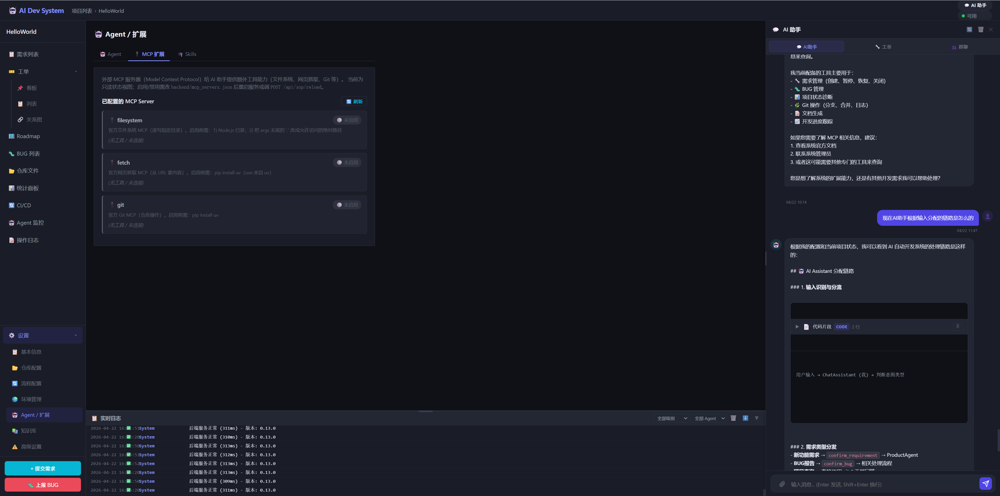

# 开发日志 — 2026-04-22（晚场）

## 版本
- v0.16.2 → **v0.16.3**

## 主题
把侧边栏分散的「Agent 配置」「MCP 扩展」两个设置页合并成一个 **Agent / 扩展** 页，用内部 Tab 切换 Agent / MCP / Skills 三块内容。顺带补了一直缺的 `/api/skills` 只读接口，让前端能看到当前挂在哪些 Agent 上、哪些 prompt 文件还在。

---

## 背景

v0.16.0 把 MagicAI 的 Skills 注入机制落地后，4 个 Skill 包 (`react-dev` / `fastapi-dev` / `playwright-e2e` / `git-workflow`) 已经在每次 Agent 运行时通过 ContextVar 注入到 system prompt 里，但**前端完全没有地方能看到这些**。Skills 是不是启用、注入到哪些 Agent、Prompt 文件是不是还在磁盘上——只能去扫 `skills.json` + `logs/` 判断。

同时 MCP 扩展页（v0.16.0 一起做的）只有一个 `已配置的 MCP Server` 卡片列表，内容和 Agent 配置页高度相关但被放到了独立的侧边栏入口，三个强相关的页面散在三个地方。

用户今天明确提："把 Agent 配置页面，整合一下，在原来基础上，添加 Tab 页，MCP 扩展页面内容加进来，再添加 Skill 的 Tab 页，显示所有 skill。"

---

## 一、后端新增 `/api/skills` 只读接口

`backend/skills/loader.py` 的 `SkillLoader.get_all_skills_status()` 本来就是为调试预留的，返回 `{id: {name, description, enabled, inject_to, priority, prompt_exists}}`。直接包一层 REST 暴露即可。

`backend/api/skills.py`（新建，27 行）：

```python
from fastapi import APIRouter

router = APIRouter(prefix="/api/skills", tags=["skills"])

@router.get("")
async def list_skills():
    from skills import skill_loader
    status = skill_loader.get_all_skills_status()
    skills = [
        {
            "id": sid,
            "name": info["name"],
            "description": info["description"],
            "enabled": info["enabled"],
            "inject_to": info["inject_to"],
            "priority": info["priority"],
            "prompt_exists": info["prompt_exists"],
        }
        for sid, info in status.items()
    ]
    return {"skills": skills, "total": len(skills)}
```

`main.py` 两行注册：`from api.skills import router as skills_router` + `app.include_router(skills_router)`。

---

## 二、前端：侧边栏收敛 + 内部 Tab 切换

### 结构改动（`frontend/index.html`）

- 侧边栏原来的「🤖 Agent 配置」和「🔌 MCP 扩展」两条，合成一条 **「🤖 Agent / 扩展」**
- 原 `tab-settings-mcp` div 整个删掉
- `tab-settings-agents` 重构：顶部加一条 `.inner-tabs` 切换条，下面三个 `.inner-tab-panel`：
  - `#inner-panel-agents`：原 Agent 列表 + Tool Use 开关
  - `#inner-panel-mcp`：原 MCP Server 列表（完整搬入）
  - `#inner-panel-skills`：新 Skills 列表

### JS 改动（`frontend/app.js`）

- `switchTab('settings-agents')` 进入页面时一次性跑 `loadAgentList()` + `loadAgentToolsStatus()` + `loadMCPStatus()` + `loadSkillsList()`（进来就把三个 Tab 的数据都拉好，切换无需等待）
- 新增 `switchAgentConfigTab(inner)` 切换 `.inner-tab` / `.inner-tab-panel` 的 `.active`，并懒加载兜底
- 新增 `loadSkillsList()`：调 `/api/skills`，复用已有的 `.mcp-server-card` 样式渲染（左边色条表示启用状态、右边徽章表示 `已启用 / 未启用 / Prompt 缺失`、底部 chip 列表显示注入到哪些 Agent + 优先级徽章）

### CSS 改动（`frontend/styles.css`）

新增 `.inner-tabs` / `.inner-tab` / `.inner-tab-panel`：下划线式切换条，active 态用 `--primary-light` 底部描边 + 加粗，无多余背景色。整块 33 行 CSS。

### 效果



---

## 三、折腾：僵尸孤儿进程霸占端口

本次最没技术含量但最费时间的部分。

重启后端的时候发现：后端启动日志明明显示"Uvicorn running on 0.0.0.0:8001"、Skills 也正常加载了 4 条、`/api/health` 和 `/api/agents` 也正常返回——但 `/api/skills` 永远是 404，`/openapi.json` 列出的 92 个路由里就是没有 `skills` 这个 tag。

改代码、清 `__pycache__`、touch main.py 触发 reload 都没用。

最后 `Get-CimInstance Win32_Process` 一看：

```
ProcessId ParentProcessId CommandLine
---------  ---------------  -----------
81024          65864        python -c "from multiprocessing.spawn ..."
89480          81296        python main.py                    ← 新 backend
69300          89480        python -c "from multiprocessing.spawn ..."  ← 新 backend 的 worker
```

**PID 81024 是一个孤儿 worker**——它的父进程 `65864`（老 backend）早就被第一次 `Ctrl+C` 杀掉了，但这个 multiprocessing spawn 出来的子 worker 没跟着死，继续以旧代码（没有 `/api/skills` 路由的版本）霸占 8001 端口。Windows 的 TCP 栈显示端口的 `OwningProcess` 还是死掉的 65864（僵尸 socket 记录），新请求实际上是 81024 接的。

而我新启动的 backend (PID 89480) 虽然也"认为自己"在 8001、启动成功、日志齐全，但 `bind()` 实际上应该失败了（或者 Windows 的 SO_REUSEADDR 行为让它静默共存了），收到的请求却走给先 accept() 的那个——就是 81024。

`Stop-Process -Id 81024 -Force` 之后，curl `/api/skills` 立刻 200，4 条 skill 全出来。

**以后的重启姿势**：杀 backend 时不能只杀父 PID，得把所有 `CommandLine like '*multiprocessing*'` 且 ParentProcessId 指向老 backend 的孤儿 worker 一起杀掉。或者干脆 `taskkill /T /F /PID <parent>`（`/T` 递归杀子进程树）。

---

## 改动统计

- `backend/api/skills.py` — 新建，27 行
- `backend/main.py` — 2 行
- `frontend/index.html` — +70 / -25（新增三个 inner-tab-panel，删除独立的 `tab-settings-mcp`）
- `frontend/app.js` — +125（`switchAgentConfigTab` + `loadSkillsList`；`settings-agents` 入口改成一次加载三块）
- `frontend/styles.css` — +33（内部 Tab 切换条样式）

共计 ~260 行代码，零测试（全是 UI + 只读 API，手工验证即可）。

---

## Commit Message

> **feat(v0.16.3): Agent 配置页整合 Agent / MCP / Skills 三合一**
>
> 侧边栏「Agent 配置」+「MCP 扩展」合并成「Agent / 扩展」单入口，内部用 Tab 切换三块相关内容。新增只读 `/api/skills` 接口暴露 skills.json 的运行态（启用状态、prompt 文件是否存在、注入到哪些 Agent、优先级），让用户能在 UI 上一眼看到四条 Skill 包的状态。期间踩了一个 Windows 僵尸孤儿 worker 霸占端口的坑，记录在 dev-note。
