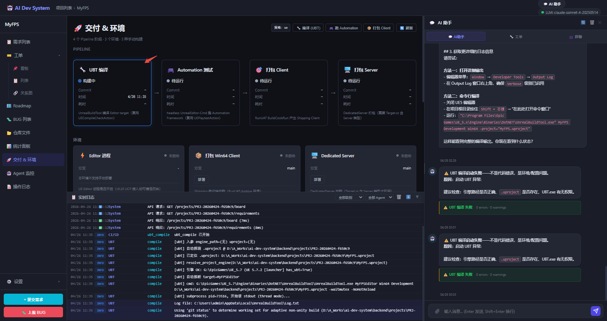

# 开发日志 — 2026-04-26（v0.19.x 完结总结）

## 版本
- **v0.18 → v0.19.x**（本次会话跨越 4/24-4/26，今天集中完结）
- 接续：v0.18 UE 深耕完结后启动 v0.19 三合一计划
- 本次：完整跑完 v0.19 所有 Phase + CI/CD 合并 + 今日重点修复

---

## 一、今日（4/26）重点修复

### 1.1 UBT 无法从 Python 启动（核心 Bug）

**症状**：用户点「编译 (UBT)」按钮，日志报 `[error] 启动 UBT 异常:` 空消息，但手动从命令行跑完全一样的命令却 `Result: Succeeded`。

**根因**：Python 3.14 `asyncio.ProactorEventLoop` + Windows + UE 5.7 的 UBA（Unreal Build Accelerator）三者组合的兼容问题：
- UBA 启动 `UbaServer` 子进程并保持 stdout pipe handle 不关
- asyncio `create_subprocess_exec` 对此场景抛空异常（异常消息因多行被日志截断，长期误以为"找不到文件"）

**修复**：把 3 个 UE action 的子进程启动全部改为 **`subprocess.Popen + threading.Thread + asyncio.Queue`**：

```python
# 旧（失败）
proc = await asyncio.create_subprocess_exec(*cmd, stdout=PIPE, ...)

# 新（成功）  
proc = subprocess.Popen(cmd, stdin=DEVNULL, stdout=PIPE, ...)
def _reader_thread():
    for line in proc.stdout:
        loop.call_soon_threadsafe(queue.put_nowait, line.rstrip())
    loop.call_soon_threadsafe(queue.put_nowait, _sentinel)
threading.Thread(target=_reader_thread, daemon=True).start()
```

涉及文件：`actions/ue_compile_check.py` / `ue_playtest.py` / `ue_package.py`

**验证**：MyFPS 项目（UE 5.7.2）编译通过，exit=0，190 秒。

---

### 1.2 AI 助手看不了编译日志

**症状**：编译失败后 AI 助手说"能把错误日志贴出来吗"——完全看不到。用户体验差。

**根因**：UBT stdout 走 SSE 推到前端操作日志，**不落任何 DB 表**。AI 助手 tool_use 只能查 DB，完全盲。

**修复**：
1. 新增 `GetBuildLogsAction`（`actions/chat/get_build_logs.py`）
   - 读 `ci_builds.build_log`（CI 触发路径）
   - 读 `ticket_logs.detail_data`（SOP 工单路径）
   - 两路合并，结构化错误输出
   - 注册为 ChatAssistantAgent tool，触发词：「编译报错了」「Build 失败」等

2. `UECIStrategy._proactive_diagnose()`：编译失败时**主动**（不等用户问）：
   - 规则引擎分析（不调 LLM，毫秒级，0 成本）
   - 写 `ci_build_diagnosis` 消息到项目聊天
   - 前端渲染诊断卡 + 「让 DevAgent 自动修复」按钮

---

### 1.3 Pipeline 卡片不反映 UE 编译状态

**症状**：`UBT 编译`卡片一直显示「待运行」，即使编译成功了也不更新。

**根因**：
- 后端 `get_pipeline_status()` 硬编码只查 `develop_build/master_build/deploy` 三种 Web 类型
- 前端 `buildTypeByStageId` 没有 UE 的 `ubt_compile/playtest/package_client` 映射

**修复**：
- 后端：动态 `SELECT DISTINCT build_type` 发现所有类型
- 前端：扩展 stage→build_type 映射；`ci_build_completed`/`ci_build_failed` SSE 实时触发刷新

---

### 1.4 TestFPS 积累的 9 个 C++ 编译错误

按批次逐一修完，详见 `dev-notes/2026-04-26_testfps_compile_fix.md`。

最终：`exit=0, 0 errors, 16 warnings, 68s`

---

## 二、v0.19.x 完整交付（4/24-4/26 累计）

### 2.1 v0.19 三合一

**①a 对话一键流**（`actions/chat/create_project.py`）
- UE 项目建完，server-side 自动调 `ProposeUEFrameworkAction`
- 方案卡持久化到 `chat_messages`（刷新后仍可见）
- 前端 `runAutoNextAfterProjectCreated` 跳转后 loadChatHistory 自然渲染

**①b action state 持久化**（`api/chat.py` + `database.py`）
- `chat_messages.action_state/action_result` 两列
- `PATCH /projects/{pid}/chat/messages/{mid}/action-state` 端点
- 4 个 confirm_* 卡片（建项目/需求/Bug/UE 框架）刷新后显示"已执行/已取消"摘要
- 替换 localStorage 的临时方案

**② UE run_playtest**（`actions/ue_playtest.py`）
- `UnrealEditor-Cmd.exe -nullrhi -unattended -buildmachine`
- Automation Framework 日志解析（`Test Completed. Result={}`）
- SOP 派生 `play_test_failed → DevAgent.fix_issues`
- ReflectionAction UE Automation 专属 prompt（6 条坑）
- 3 个 SSE 事件（started/log/result）

**③ 仓库视图优化**
- ③a 二进制文件占位 + UE 文件语法高亮（`.uproject/.Build.cs/.Target.cs`）
- ③b commit inline diff（行级高亮 + >10 行未变化自动折叠）
- ③c 分支树形（约定 parent 推断 + ahead/behind 徽标）

---

### 2.2 CI/CD + 环境管理合并（Phase A-E）

**架构核心**：引入 `CIStrategy` 接口，按项目 traits 匹配策略：

```
TraitLoader.pick_for_project(pid)
  ├─ UE 项目  → UECIStrategy  (priority=100)
  │    stages: UBT编译 → Automation测试 → 打包Client → 打包Server
  │    envs:   Editor进程 / 打包Win64 / DedicatedServer
  ├─ Web 项目 → WebCIStrategy (priority=50)  [委托现有 ci_pipeline.py]
  │    stages: 语法检查 → 冒烟测试 → 合并主分支 → 部署test → 部署prod
  │    envs:   dev / test / prod
  └─ 其他     → DefaultCIStrategy (兜底，继承 Web)
```

**前端合并**：`tab-cicd` + `tab-settings-envs` → 统一「🚀 交付 & 环境」页：
- strategy 徽章 + 动态 build_types 按钮
- stages 进度条（动态生成，UE 和 Web 不同）
- 环境卡片（动态生成）
- 构建历史

**SOP 集成**：`deploy_web.yaml` + `deploy_ue.yaml` fragments → `DeployAgent.run_ci_deploy` 统一调度到 strategy

---

### 2.3 DevAgent UE 自测 Layer 1

7 条静态规则（`actions/ue_lint/rules.py`）：

| 规则 | 检测内容 |
|---|---|
| R1 | UCLASS/USTRUCT/UINTERFACE 必须有 GENERATED_BODY() |
| R2 | 子类 override 父类 OnRep_* 不能加 UFUNCTION() 宏 |
| R3 | `#include "X.h"` 路径可定位（子目录要加前缀） |
| R4 | Build.cs 模块依赖白名单验证 |
| R5 | .uproject Modules ⊇ Source/ 下所有模块 |
| R6 | Target.cs IncludeOrderVersion 与引擎版本兼容 |
| R7 | 常用 UE 类型必需对应 #include |

接入 `SelfTestAction`：`self_test_failed → DevAgent.fix_issues` 回跳（TestFPS 5 错中 4 个被提前拦）

---

### 2.4 工单面板「📍 当前进度」区

`tickets.current_action*` 四列 + orchestrator 心跳 + SSE 推送：

```
工单面板 Drawer
├─ 📍 当前进度          🟢 运行中
│   DevAgent.run_engine_compile
│   ⏱ 已用时 2m 34s · 🔄 4s 前有输出
│   [ubt] Compiling TestFPSGameMode.cpp
│   [查看操作日志 →]   无精确 %ⓘ
```

活性状态：🟢 active（<60s）/ 🟡 silent（60-300s）/ 🔴 zombie（>5min）/ ⚪ starting

---

## 三、数据

| 类别 | 数量 |
|---|---|
| 新增文件 | 35 |
| 修改文件 | 21 |
| Smoke tests | 176 assertions（全通过）|
| 主要提交 | `75b5fb6`（v0.19.x 大包）/ `19bff79`（TestFPS devnote）|
| TestFPS 编译 | `02f9766`（TestFPS 仓库）|

---

## 四、验证截图

UBT 编译线程模式成功 + Pipeline 卡片实时「构建中」：



---

## 五、遗留 / 下一步

| 项 | 状态 |
|---|---|
| 真机跑一次完整 SOP 工单流（DevAgent→自测→UBT→Reflexion→再编）| 待验收 |
| DevAgent UE 自测 Layer 2（UBT -SingleFile 预编，30-90s）| 待做 |
| ②D Functional Test 脚手架自动生成 | 延后 |
| ③b 真 side-by-side diff | 延后 |
| v0.20 UE 编辑态 MCP（Italink/UnrealClientProtocol）| 长期候选 |

---

*2026-04-26 · v0.19.x 完结*
