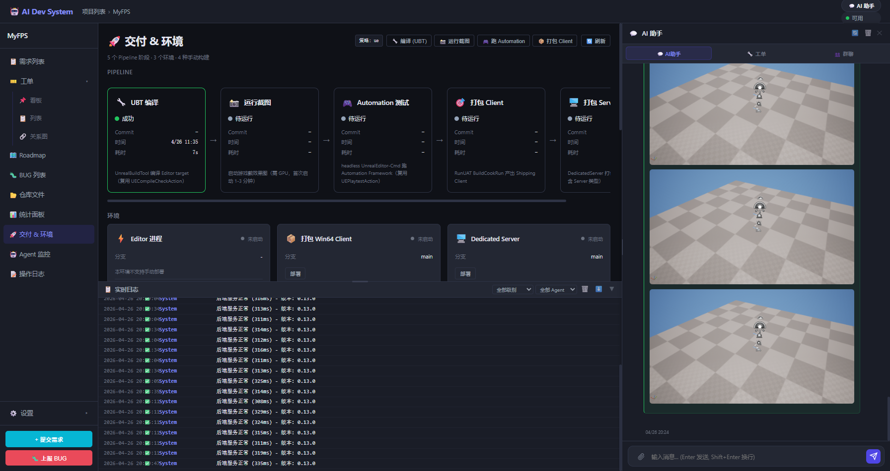

# 开发日志 — 2026-04-26（UE Editor 截图功能）

## 背景

用户提问：「DevAgent 写开发笔记、能运行项目、截图效果了吗？」——发现 UE 项目没有类似 Web 项目 Playwright 截图的能力。

Web 项目的流程：`SelfTestAction → Playwright → 截图 → 存到 screenshots/ → AI 聊天可见`
UE 项目：完全缺失。本次补上。

---

## 方案选型

| 方式 | 优缺点 |
|---|---|
| `-game` 独立游戏进程 | 需等 5-10 分钟着色编译（首次），`-nullrhi` 截黑图 |
| **Editor Viewport 截图**（本次选择）| 直接截关卡编辑器视口，DDC 热后 **35 秒**完成 |
| UCP 编辑态 MCP（v0.20 候选）| 需插件，可秒截，但还没实现 |

命令：
```
UnrealEditor.exe <.uproject> -nosplash -nologo
  -ExecCmds="HighResShot 1280x720 ue_preview_xxx.png; Exit"
```

---

## 实现过程与 Bug 修复（共 8 个坑）

### 坑 1：asyncio subprocess + UBA 管道 hang（与 UBT 同问题）

`asyncio.create_subprocess_exec` 在 Windows + UE 5.7 UBA 环境下报空异常。

**修复**：改用 `subprocess.Popen + threading.Thread + asyncio.Queue`（与 UBT fix 同方案）。

---

### 坑 2：DDC 冷启动需要 5-10 分钟

首次运行 UE 5.7 Editor，引擎材质（WorldGridMaterial 等）需要编译 shader 进 DDC。

**日志关键词**：
```
LogMaterial: Missing cached shadermap for WorldGridMaterial ... compiling
```

**解法**：先启动 Editor 预热 DDC（我们用 PowerShell `Start-Process` 后台跑了约 4 分 16 秒）。后续运行 DDC 热，35 秒完成。

---

### 坑 3：超时时序竞态（截图写入 vs kill）

Editor 在 ~302s 写完截图，我们的 300s 超时恰好在此时 kill 进程——截图刚写完就被清掉。

**修复**：
1. 每 2s 轮询截图目录，发现文件立刻 copy + kill（不等 Exit 命令）
2. kill 后额外等 2s 再扫一次（捕获"刚写完就 kill"的情况）

---

### 坑 4：截图存储路径不持久

截图存在 `Saved/Screenshots/WindowsEditor/`，Editor 退出时此目录被清空。

**修复**：改存到 `backend/chat_images/ue_screenshots/<project_id>/`（进 .gitignore 但持久存在，由 `/api/projects/{pid}/screenshots/{filename}` serve）。

---

### 坑 5：`settings.DATA_DIR` AttributeError

Config 里是模块级 `DATA_DIR`，不是 Settings 成员。

**修复**：`from config import BASE_DIR`。

---

### 坑 6：`.uproject` 缺 Plugins 字段（核心根因）

Editor 报：
```
The game module 'MyFPS' could not be loaded. (GetLastError=126)
```

根因：`Build.cs` 依赖 `StateTreeModule` / `GameplayStateTreeModule`，但 `.uproject` 没有声明对应 Plugin，Editor 启动时没加载这些 DLL，`UnrealEditor-MyFPS.dll` 的依赖链断裂。

之前我们添加过 Plugins，但后来被系统 hook 覆盖掉了：
```json
"Plugins": [
    {"Name": "StateTree", "Enabled": true},
    {"Name": "GameplayStateTree", "Enabled": true},
    {"Name": "EnhancedInput", "Enabled": true}
]
```

修复后 Editor 35 秒完整加载。

---

### 坑 7：截图没写到 AI 助手聊天

截图文件保存成功，但 AI 助手面板看不到——因为：
1. `_save_screenshot_to_chat` 在新代码里，但后端没热重载
2. 前端没有 `ue_screenshot_result` action type 的渲染逻辑

**修复**：
- `UECIStrategy._save_screenshot_to_chat()` 截图成功后持久化一条 assistant 消息（action_type=ue_screenshot_result）
- 前端 `appendChatBubble` 处理 `ue_screenshot_result`：渲染图片卡
- `ci_build_completed` SSE → `take_screenshot` 成功时触发 `loadChatHistory`
- 临时注入脚本 `_inject_screenshot_chat.py` 把已有截图直接写入 DB

---

### 坑 8：后端热重载缺失

连续多次 `touch ue.py` + 检查 health，但变更没有生效。

**修复**：硬重启 uvicorn（Kill + `python -m uvicorn main:app`）。

---

## 最终实现

```
用户点「📸 运行截图」
  ↓
UECIStrategy._run_build(take_screenshot)
  ↓
UEScreenshotAction.run(context)
  ↓ 启动 UnrealEditor.exe（Popen + 线程 stdout 队列）
  ↓ 每 2s 轮询 Saved/Screenshots/WindowsEditor/
  ↓ 发现 HighresScreenshot*.png → 立刻 copy 到 chat_images/ + kill Editor
  ↓
_save_screenshot_to_chat()
  ↓ 写 chat_messages (type=ue_screenshot_result, screenshots=[URL...])
  ↓ 前端 loadChatHistory → appendChatBubble → 渲染图片卡
```

**实测耗时（DDC 热）**：35 秒

---

## 截图效果

### 单张效果图（HighResShot 输出）

MyFPS `Lvl_FirstPerson` 关卡 Editor Viewport — 棋盘格地板 + 默认玩家角色：


### AI 助手聊天面板截图展示（功能完整效果）

截图成功后自动出现在右侧 AI 助手聊天里（3 张连续截图），Pipeline 卡片同时显示 UBT 编译成功：



---

## 改动文件

| 文件 | 改动 |
|---|---|
| `backend/actions/ue_screenshot.py` | 新增：UEScreenshotAction + 线程模式 + 轮询检测 + 持久化路径 |
| `backend/ci/strategies/ue.py` | 加 `take_screenshot` build_type + `_save_screenshot_to_chat()` |
| `backend/api/projects.py` | 新增 `/screenshots/{filename}` 端点 serve chat_images |
| `frontend/app.js` | `ue_screenshot_result` action 卡渲染 + `_showUEScreenshotsInChat()` + SSE 触发刷新 |
| `backend/projects/PRJ-20260424-f650c9/MyFPS.uproject` | 补 Plugins 字段（StateTree/GameplayStateTree/EnhancedInput）|

---

## 遗留

1. DDC 预热依然需要 Editor 至少运行一次（~5 分钟）——已通过 `Start-Process` 自动化，但没做开机自动预热
2. v0.20 接入 UCP 后可实现「秒截」（不需要等 Editor 完整加载）
3. `SelfTestAction` 里的 `ue_screenshot=true` 开关还是默认关的，考虑在 UE SOP 的 acceptance stage 后自动截图一张作为交付物

---

*2026-04-26 · UE Editor Viewport 截图功能落地，35s 稳定成功*
