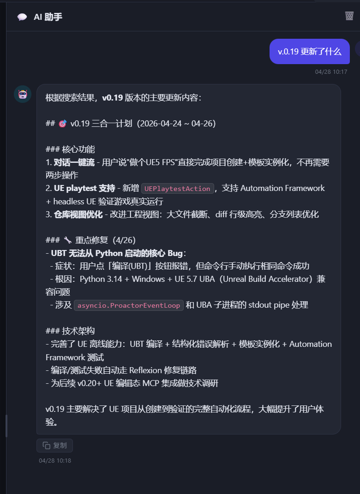
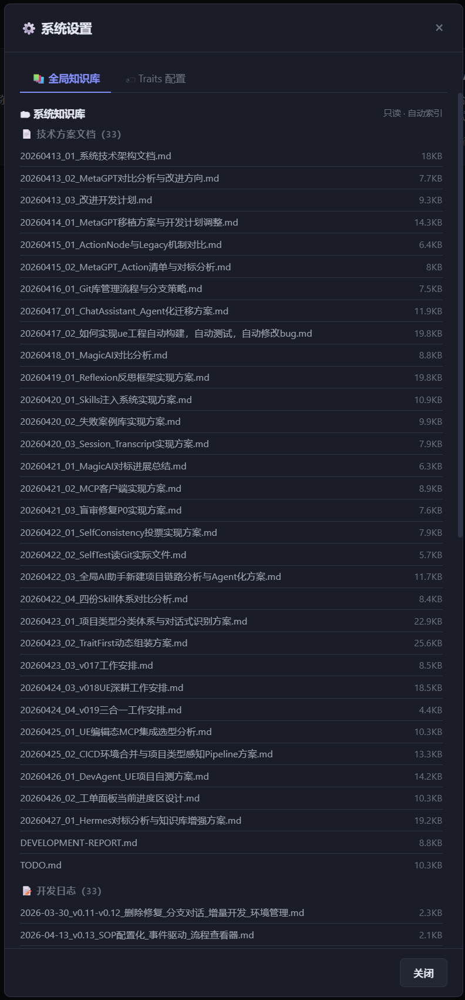

# 开发日志 — 2026-04-28（知识库搜索优化 + 聊天输入历史）

## 背景

接续 2026-04-27 知识库全局 AI 与系统文档索引工作，本次做两件改进：

1. FTS5 搜索查询鲁棒性：AI 搜索 "v0.19"、"v.0.19" 这类含特殊字符的关键词时报错或无结果
2. 聊天输入框缺少历史回溯：每次重新输入，体验割裂

---

## 一、FTS5 查询安全化（search_knowledge）

### 问题

FTS5 默认模式下，`v0.19`、`v.0.19`、`UCapsuleComponent()`、`[ACTION:*]` 等含 `.()-:!` 的查询
会触发语法错误或静默失败，导致 AI 调用 `search_knowledge` 时返回 0 结果。

### 修复

新增 `_sanitize_fts_query(q)` 函数：

```python
def _sanitize_fts_query(q: str) -> str:
    clean = q.replace('"', ' ').strip()
    if re.search(r'[.\-+*():!]', clean):
        return f'"{clean}"'   # 整体用双引号做短语搜索
    return clean
```

所有 SQL 查询改用 `fts_query`（已净化）替代原始 `query`，错误日志也记录净化后的值便于排查。

同步更新 tool description，明确提示 AI 可以搜版本更新、开发日志：

> 用户询问版本更新内容（如 v0.19 做了什么）  
> 用户询问某个功能的设计方案或开发日志

### 验证

AI 助手查询「v.0.19 更新了什么」，成功命中知识库并返回详细内容：



---

## 二、系统设置弹窗 — 系统知识库展示

### 背景

主设置页的系统知识库卡片已在 2026-04-27 完成。但通过「系统设置」按钮打开的弹窗（`showSystemSettingsModal`）
的全局知识库面板尚未接入系统文档，仍显示旧版单一列表。

### 修复

`showSystemSettingsModal` 里的知识库 panel 重构为两区：

```
🗂 系统知识库（只读 · 自动索引）   ← 新增
🌐 自定义全局文档（可新建/编辑）   ← 原有，下移
```

`_loadGlobalKnowledgeIntoModal` 改为并行加载：
- `GET /api/knowledge/system` → 渲染系统文档分组（技术方案文档 / 开发日志）
- `GET /api/knowledge/global` → 渲染用户自定义全局文档

### 效果

系统设置弹窗 → 全局知识库 Tab，可以看到 33 个技术方案文档 + 33 个开发日志（只读，无编辑按钮）：



---

## 三、聊天输入框历史回溯（类 terminal 体验）

### 需求

输入框支持上下键浏览已发送的历史消息，避免重复输入长 prompt。

### 实现

三个模块级变量：

```js
const _chatInputHistory = [];   // 最多 50 条，最新在前
let _chatHistoryIdx = -1;       // -1 = 当前草稿
let _chatInputDraft = '';       // 上键前保存草稿
```

**发送时**（`sendChatMessage`）：将消息插入历史头部（与最近一条相同则去重），重置游标。

**`handleChatKeydown`**：

| 按键 | 条件 | 行为 |
|---|---|---|
| `ArrowUp` | 光标在首位 且 单行或空 | 首次按时保存草稿；游标后移；填入历史消息 |
| `ArrowDown` | `_chatHistoryIdx >= 0` | 游标前移；游标回 -1 时恢复草稿 |
| 其他可见字符 | `_chatHistoryIdx !== -1` | 重置游标，放弃历史浏览 |

多行消息中不触发（避免干扰正常光标移动）。

---

## 改动文件

| 文件 | 改动 |
|---|---|
| `backend/actions/chat/search_knowledge.py` | `_sanitize_fts_query` + 净化查询传参 + description 更新 + `ActionResult` 格式统一 |
| `frontend/app.js` | 聊天输入历史（上下键）+ 系统设置弹窗知识库双区渲染 |

---

*2026-04-28 · 知识库搜索鲁棒性 + 聊天输入历史*
