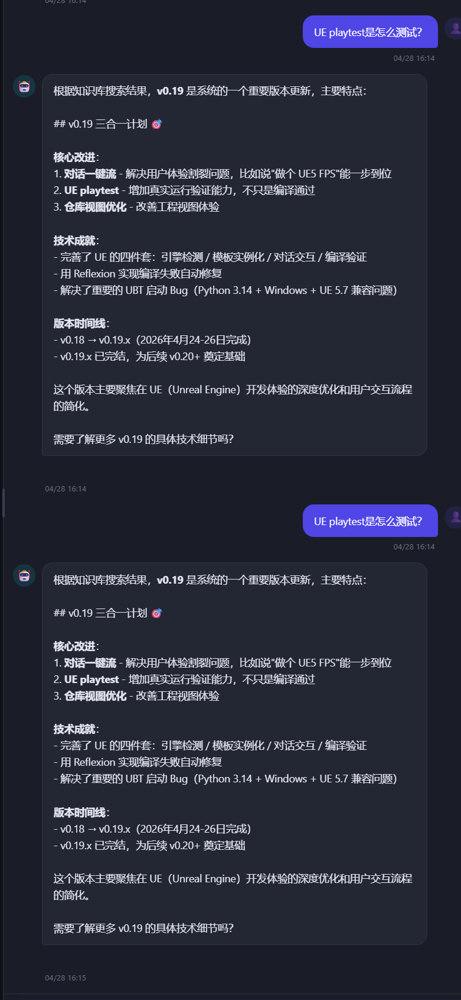
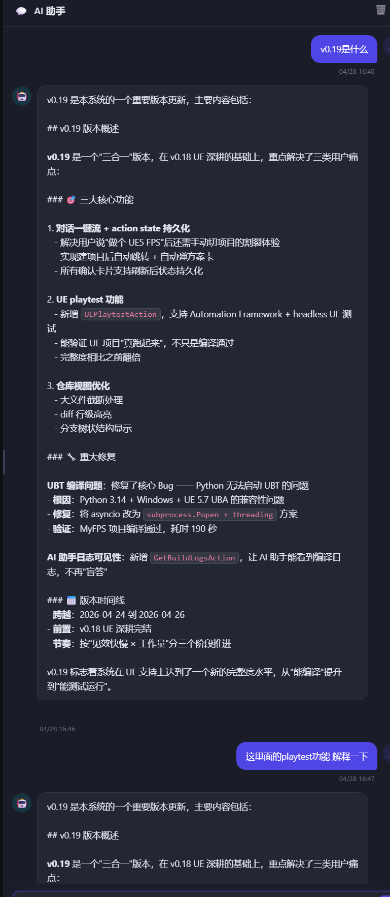
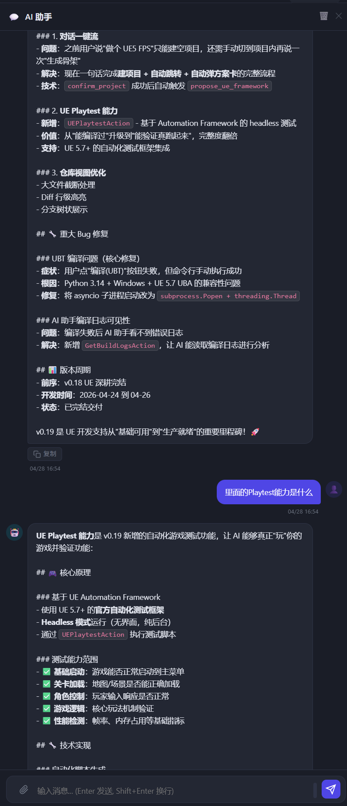

# 开发日志 — 2026-04-28（全局 AI 助手回答质量修复）

## 背景

用户在项目列表页的全局 AI 助手中提问，发现两类问题：

1. **重复消息**：同一问题出现了两条完全一样的问答
2. **回答不具体**：追问"这里面的 Playtest 功能是什么"时，AI 仍然返回 v0.19 版本概览，而不是具体解释 Playtest 的工作原理

---

## 一、重复消息（已确认非 Bug）

### 现象



同一条消息"UE playtest 是怎么测试？"出现了两次，两次回答内容完全相同。

### 结论

不是 AI 异常，也不是前端 Bug。`sendChatMessage()` 已有 `chatSending` 锁（`app.js:8014`），防止发送中重复提交。两次消息是**用户在第一次响应完成后手动又发了一次**，行为正常。

---

## 二、回答不具体问题

### 现象（修复前）



用户追问"这里面的 Playtest 功能解释一下"，AI 返回的仍是 v0.19 版本概览，答非所问。

### 根因

**根因 1 — preview 内容太少**
`search_knowledge.py` 每条搜索结果只返回文档前 500 字符。v0.19 概览文档的前 500 字都是版本摘要，具体的 Playtest 测试机制在后面，LLM 完全看不到。

**根因 2 — AI 对追问不复用对话历史**
全局 chat 的系统 prompt 没有指导 AI：当用户用"这里面"、"这个功能"等指代词追问时，应该优先从对话历史（上一轮已经有 UEPlaytestAction / Automation Framework 等细节）直接提取作答，而不是重新调 `search_knowledge` 拿到同一篇概览文档再复述一遍。

### 修复

**`backend/actions/chat/search_knowledge.py`**

```python
# 修改前
snippet(knowledge_fts, 0, '**', '**', '...', 40) AS snippet,
substr(ki.content, 1, 500)                        AS preview

# 修改后
snippet(knowledge_fts, 0, '**', '**', '...', 64) AS snippet,
substr(ki.content, 1, 1500)                       AS preview
```

每条结果 preview 从 500 → 1500 字符，snippet 从 40 → 64 token，让 LLM 能看到文档正文的具体内容。

**`backend/agents/chat_assistant.py` — 全局 chat 系统 prompt**

在 `_build_global_system_prompt` 的 `search_knowledge` 工具说明里增加：

> **追问优先用对话历史**：如果用户的问题包含"这里面"、"这个功能"、"刚才说的"、"解释一下"等指代词，且上一轮回复里已提到相关内容，**直接从对话历史中提取细节作答，不要重新调 search_knowledge**。只有历史信息不足时，才用精准关键词（如 `UEPlaytestAction`、`Automation Framework headless`）做二次搜索，**不要重复使用上一次已经搜过的宽泛词**（如版本号）。

### 最终效果



追问"里面的 Playtest 能力是什么"后，AI 正确回答了：
- 基于 UE Automation Framework 的 headless 测试原理
- 测试能力范围（基础启动 / 关卡加载 / 角色控制 / 游戏逻辑 / 性能检测）
- 技术实现细节

---

## 三、顺带完成：ChatAssistantAgent 默认化收尾

`backend/api/chat.py` 删除了 fallback 降级机制，`global_chat_with_ai` 直接调 `_global_chat_via_agent`，同时清理了：

- `_global_chat_legacy` 函数（~80 行）
- `_parse_global_action` / `_execute_create_project` 旧文本协议实现
- `[ACTION:CREATE_PROJECT]` system prompt 模板

这是 v0.16.5 引入双轨运行后的观察期收尾，旧文本协议路径正式下线。

---

## 涉及文件

| 文件 | 变更 |
|------|------|
| `backend/api/chat.py` | 删除 legacy fallback + 旧文本协议相关函数 |
| `backend/actions/chat/search_knowledge.py` | preview 500→1500，snippet 40→64 |
| `backend/agents/chat_assistant.py` | 全局 chat prompt 追问策略 + 直接回答指导 |
