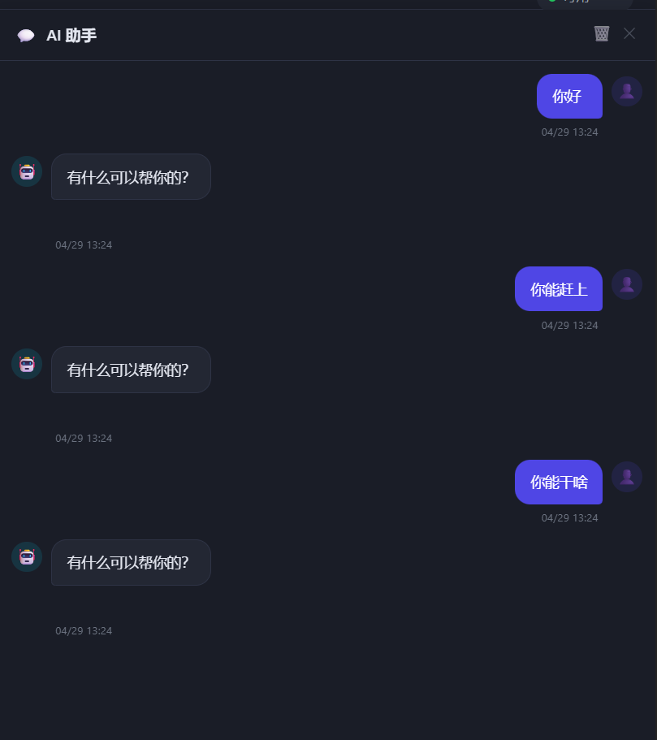
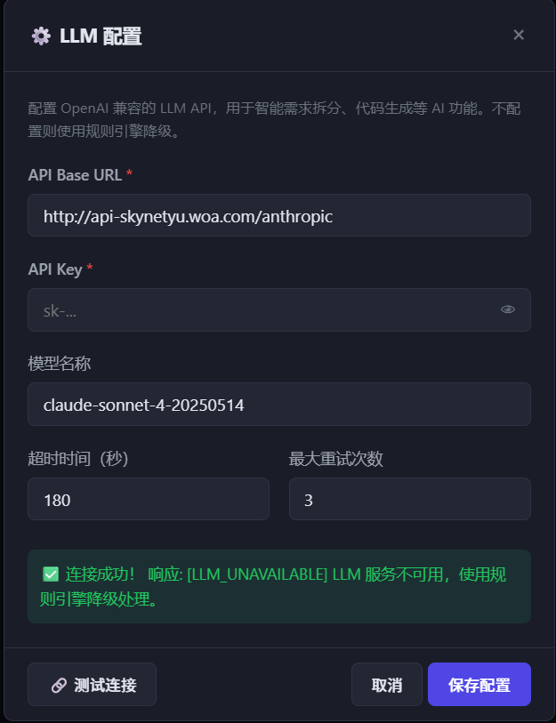
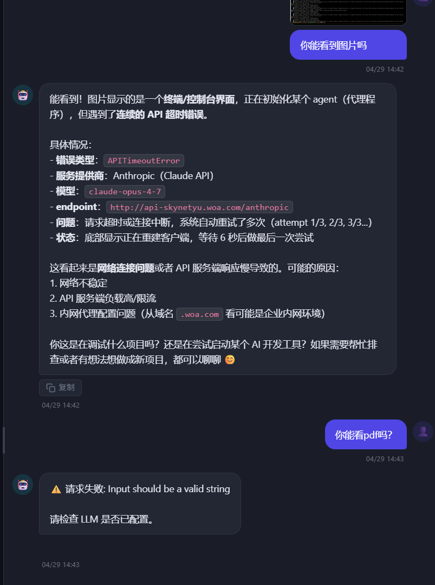
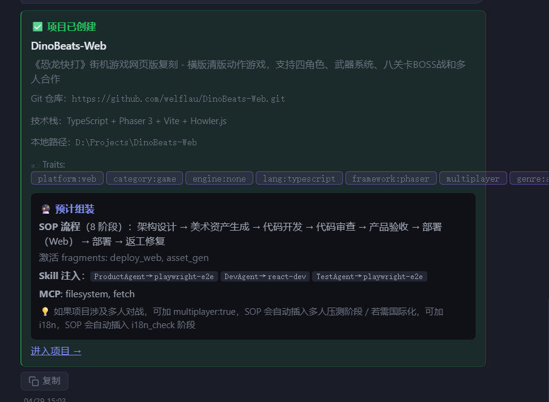
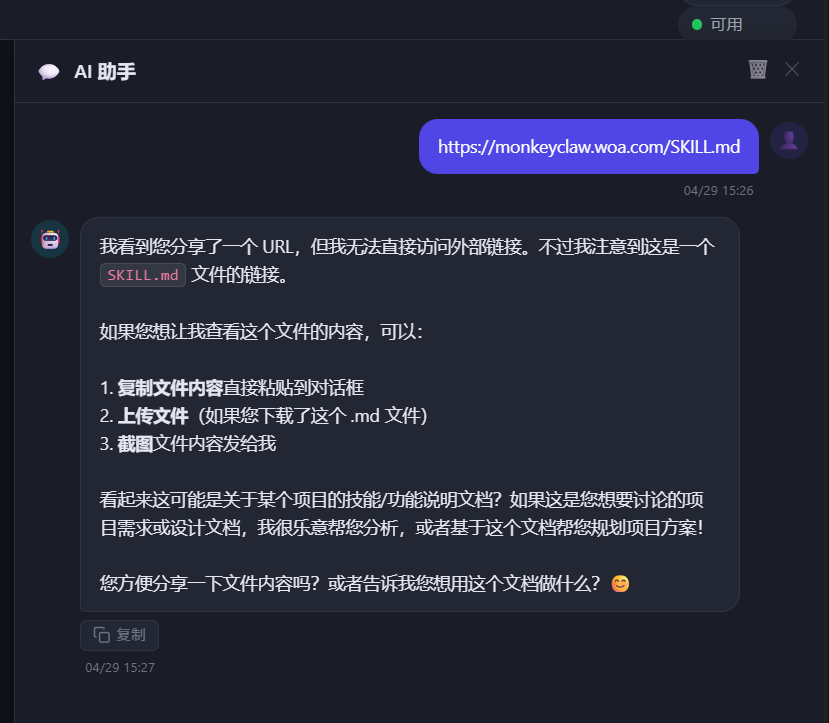
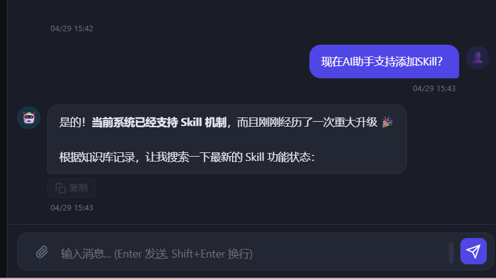
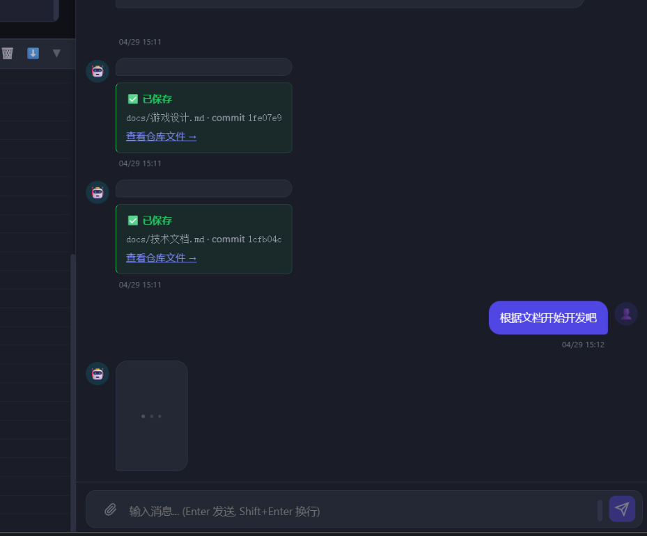
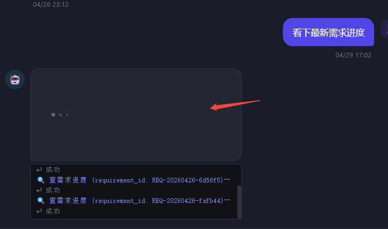
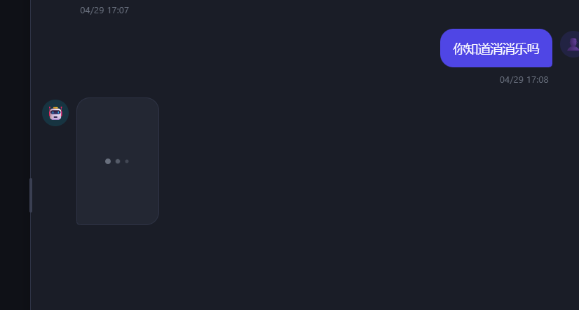
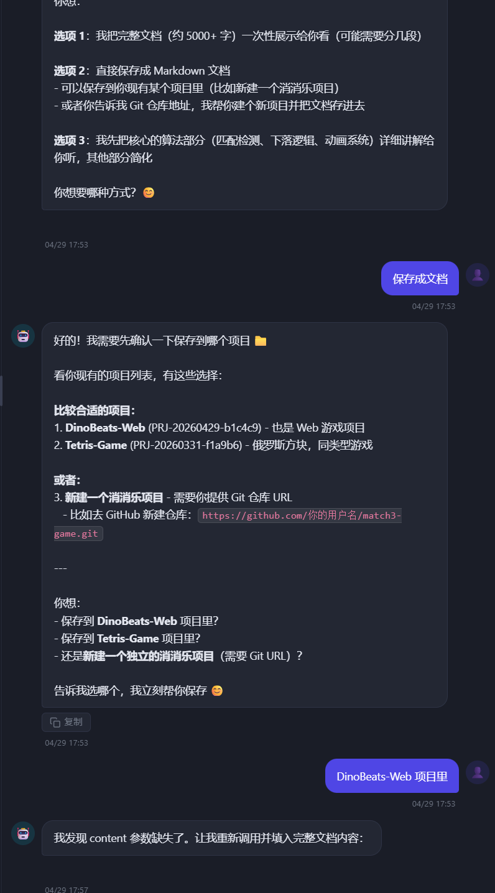

# 开发日志 — 2026-04-29 聊天助手全面修复与功能增强

## 版本背景

本日从真实使用反馈出发，密集修复了全局 AI 助手的多处故障，并新增了若干实用能力。涉及 LLM 连接诊断、历史消息多模态兼容、UI 排版、外部 URL 访问、实时思考日志等方向。

---

## 一、LLM 模型名过期 → AI 助手全量失效

### 问题

AI 助手对任何输入都回复"有什么可以帮你的？"（欢迎语），不进行实际回答。



**根因**：代理（api-skynetyu.woa.com）将 Sonnet 4 下线，但 `.env` 里 `LLM_MODEL` 仍为 `claude-sonnet-4-20250514`，代理返回 `404 model not found`。工具调用失败后 `_extract_final_text()` 找不到文本，兜底返回欢迎语。

### 连接测试的误导性 bug



`test_connection()` 调用 `generate()` 时失败被内部降级为 `"[LLM_UNAVAILABLE]..."` 字符串，`try/except` 全程不抛异常，最终返回 `status: ok` — 绿色✅显示"连接成功"但 response 内容是降级提示。

### 修复

- `backend/.env`：`LLM_MODEL=claude-sonnet-4-20250514` → `claude-sonnet-4-5`
- `backend/llm_client.py:test_connection()`：调用完 `generate()` 后检测 `[LLM_UNAVAILABLE]` 前缀，命中则返回 `status: error` + 可读原因

---

## 二、图片历史导致下一条消息 Pydantic 422

### 问题

发送图片后，紧接着发任何消息（包括"你能看 pdf 吗"）都报"请求失败: Input should be a valid string"。



**根因**：`_buildUserHistoryContent()` 在有图片时返回 Anthropic 多模态 block 列表（`list`），存入 `chatHistory`。下次请求携带这条 list-content 历史，后端 `ChatMessage.content: str` Pydantic 校验拒绝。

### 修复

`backend/api/chat.py:ChatMessage`：
```python
# before
content: str

# after  
content: Union[str, List[Dict[str, Any]]]
```

---

## 三、Traits chip 排版溢出

### 问题

项目创建卡片里的 Traits 标签挤在一行，末尾被截断。



**根因**：`app.js:8521` 用 `.join('')` 零分隔拼接 `<code>` chip，浏览器把整串当不可断单词；外层容器非 flex，无法换行。

### 修复

```js
// 容器改 flex-wrap
<div style="display:flex; flex-wrap:wrap; align-items:center; gap:4px 6px;">
  <span>🏷 Traits:</span>
  ${traitsArr.map(t => `<code>${t}</code>`).join('')}
</div>
```

---

## 四、AI 助手无法访问外部链接

### 问题

用户粘贴 URL，AI 回复"我无法直接访问外部链接"。



**根因**：ChatAssistant 没有 fetch URL 的工具。

### 修复

新增 `backend/actions/chat/fetch_url.py`（`FetchUrlAction`）：
- `httpx` 发 GET，follow redirect，15s 超时
- HTML 自动用 `html.parser` 提取正文（跳过 script/style/head）
- 内容截断至 8000 字符
- 全局聊天 + 项目内聊天均可用（加入 `_GLOBAL_CHAT_TOOLS`）

---

## 五、工具调用耗尽 max_rounds 导致回复截断

### 问题

AI 说"让我搜索一下…"然后结束，实际没输出搜索结果。发送按钮重新可点，表现为请求已完成但回复残缺。



**根因**：`max_react_loop = 3` 三轮全被知识库搜索用光，LLM 没有轮次输出最终总结；`_extract_final_text()` 找不到最后一轮的文字，返回第一轮"让我搜索一下"的前置文字。

### 修复

`chat_assistant.py`：`max_react_loop = 3` → `max_react_loop = 6`

---

## 六、全局 AI 助手聊天记录刷新丢失

**根因**：`_globalChatHistory` / `_globalChatDom` 仅在内存，刷新重置。

**修复**：`localStorage` 持久化。新增 `_saveGlobalChatToStorage()` / `_loadGlobalChatFromStorage()`：
- 每次 assistant 气泡追加后（global 模式）自动保存
- `loadChatHistory()` 优先读内存 → localStorage → 欢迎语
- `clearChatPanel()` 同步清除 localStorage

---

## 七、AI 实时思考日志（工具调用进度）

### 需求

等待 AI 回复时，在气泡下方实时展示正在调用哪个工具、结果摘要，生成结果后消失。



### 实现

**项目内聊天（SSE 已有）**：
- `_ChatToolExecutor.execute()` 工具调用前后推 `chat_thinking_log` 事件
- 前端 `connectSSE()` 加监听，向 `#chatThinkingLog` 追加行

**全局聊天（无 SSE，新增会话频道）**：
- 新增 `GET /api/chat/thinking-stream?session_id=X`（SSE 端点）
- `GlobalChatRequest` 加 `session_id` 字段
- 前端发送前 `crypto.randomUUID()` 生成 session_id，订阅 SSE；`finally` 块关闭
- `_ChatToolExecutor._emit_thinking()` 全局模式走 `asyncio.Queue` → SSE 流

**UI**：`#chatThinkingLog`，固定 80px 高，overflow-y scroll，monospace 小字：
- 调用时：蓝色"🔍 搜索知识库 (query: xxx)…"
- 完成时：灰色"  ↩ 找到 3 条"

---

## 八、loading 气泡太大

### 问题

三个点的 loading 气泡撑满整行宽度，显示为大方块。





**根因**：`.chat-msg-bubble` 是 block 元素，默认拉伸至父容器 85% 宽。`width:fit-content` 在某些场景不可靠。

**修复**：`display:inline-block`（更可靠地收缩到内容尺寸）

---

## 九、context 切换导致回复串台

**问题**：全局聊天请求进行中，切换进项目，AI 回复被追加到项目聊天面板，返回全局后 loading 气泡永远不消失。

**修复**：
1. `_updateChatPanelForContext()` 切换时立即 reset `chatSending`、移除 `#chatTyping`、关闭 `_thinkingESrc`；保存 `_globalChatDom` 时 clone 并剔除 typing 气泡
2. `sendChatMessage()` 记录 `_sendContextId = currentProjectId`，响应回来时对比，不同则丢弃

---

## 十、AI 保存文档功能（B 方案：AI 主动提议）

### 新增能力

新增 `ConfirmSaveDocAction`（`confirm_save_doc`）：
- AI 识别"保存内容"意图后立即调用（**同一轮**，不分两轮）
- 输出确认卡片，显示目标项目、路径、内容预览（200 字）
- 用户点"确认保存"调 `POST /projects/{id}/chat/save-to-repo`

**System prompt 强调**：必须在拿到内容的同一轮立即调用，禁止先问"存哪个项目"再分第二轮调 — 原因是历史压缩会截断大文本。

### 遇到的 content 缺失 bug



AI 分两轮操作（第一轮问用户选项目，第二轮调工具），第二轮时历史压缩把 8000 字文档截断到 800 字，`content` 参数不完整。AI 自己也发现并说"content 参数缺了"。通过 system prompt 约束"同一轮立即调用"解决。

---

## 十一、外部链接思考 Log 排查记录

验证过程中发现思考 log 不显示，排查过程：

1. 后端日志确认 `thinking_log pushed` 已执行
2. SSE 端点正常返回 ping（服务可达）
3. 加 `dict_id` 对比确认两端用同一 `_THINKING_QUEUES` dict（无模块隔离问题）
4. **真正原因**：测试 probe JSON 文件里的 `session_id` 与 SSE 订阅的 `session_id` 不匹配（`debug-123` vs `id-test`）

结论：机制完全正常。全局聊天思考 log 仅在 AI 调工具时出现（纯知识性回答不调工具，log 不显示）。

---

## 变更文件清单

| 文件 | 变更类型 | 说明 |
|---|---|---|
| `backend/.env` | 配置 | `LLM_MODEL` 改为 `claude-sonnet-4-5` |
| `backend/llm_client.py` | 修复 | `test_connection` 正确识别降级响应 |
| `backend/api/chat.py` | 修复+新增 | `ChatMessage.content` 支持 Union；全局聊天思考日志 SSE 端点 |
| `backend/agents/chat_assistant.py` | 修复+功能 | 模型兼容；`max_react_loop` 调至 6；思考日志推送；`confirm_save_doc` system prompt |
| `backend/actions/chat/fetch_url.py` | 新增 | 外部 URL 访问工具 |
| `backend/actions/chat/confirm_save_doc.py` | 新增 | 保存文档确认卡片 Action |
| `frontend/app.js` | 修复+功能 | Traits flex-wrap；历史多模态兼容；loading 气泡尺寸；thinking log；context 切换竞态；localStorage 持久化；全局聊天 SSE session |
