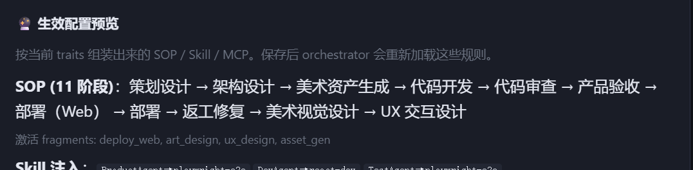
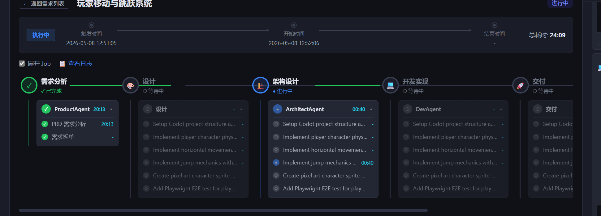
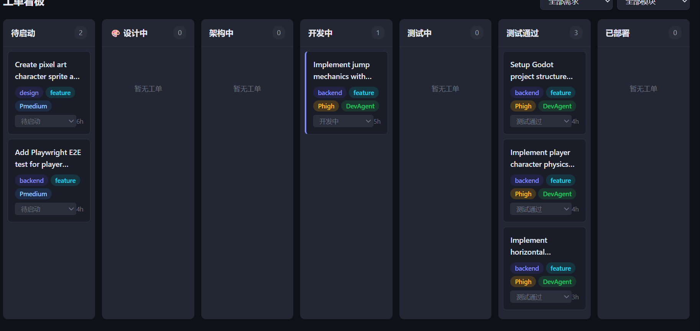
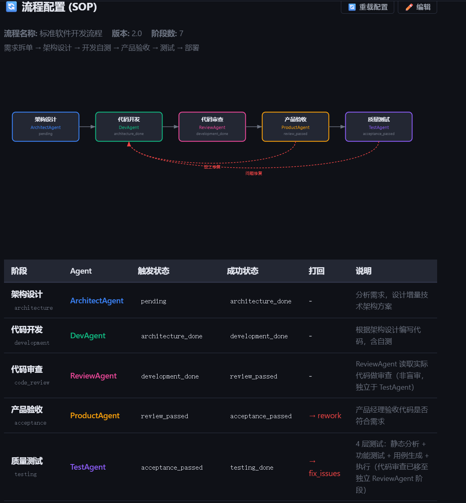

# 设计说明 — SOP / Pipeline / 看板 的关系

> 对应截图：Image #80 生效配置预览、Image #81 需求 Pipeline、Image #82 工单看板、Image #83 流程配置

---

## 四张截图

**Image #80 — 生效配置预览**（设置 → 基本信息 → Traits 下方）



**Image #81 — 需求 Pipeline**（需求详情页）



**Image #82 — 工单看板**（工单 → 看板）



**Image #83 — 流程配置（SOP 骨架）**（设置 → 流程配置）



---

## 一张图说明关系

```
_core.yaml（基础 SOP，7 阶段）
     +
Fragment YAML 文件
（deploy_web / art_design / ux_design / asset_gen …）
     ↓ 按项目 Traits 动态组合
     
【生效配置预览】（Image #80）
组合后的完整 SOP，11 阶段
策划设计 → 架构设计 → 美术资产生成 → 代码开发 → 代码审查 …
     ↓ 同一份 SOP，派生出两个视图

【需求 Pipeline】（Image #81）          【工单看板】（Image #82）
单条需求的横向进度图                     所有工单按当前状态分列
需求分析→设计→架构设计→开发实现→交付    待启动|设计中|架构中|开发中|测试通过…
```

---

## 四个界面详解

### Image #83：流程配置（SOP）

**位置**：设置 → 流程配置

**内容**：只显示 `_core.yaml` 的**基础 SOP**（7 个阶段），是所有项目共用的骨干流程：

```
架构设计 → 代码开发 → 代码审查 → 产品验收 → 质量测试 → 部署
```

**注意**：这里看到的是**未组合**的基础版本，不反映 fragment 注入后的实际阶段。

---

### Image #80：生效配置预览

**位置**：设置 → 基本信息 → Traits 下方 → "生效配置预览"

**内容**：按当前项目的 Traits 组合后的**完整 SOP**（11 阶段）：

```
策划设计 → 架构设计 → 美术资产生成 → 代码开发 → 代码审查 → 产品验收
→ 部署(Web) → 部署 → 返工修复 → 美术视觉设计 → UX 交互设计
```

激活的 fragments：`deploy_web`、`art_design`、`ux_design`、`asset_gen`

**这才是 Orchestrator 真正执行的流程。**

---

### Image #81：需求 Pipeline

**位置**：需求详情页 → 点开具体需求

**内容**：**单条需求**的执行进度图，横向展示当前需求经过了哪些阶段、到哪一步了。

每个阶段下面列出该需求对应的工单和 Agent：
- 需求分析（ProductAgent）√ 已完成
- 设计（等待）
- 架构设计（ArchitectAgent）🔵 进行中
- 开发实现（DevAgent）⭕ 等待
- 交付 ⭕ 等待

**阶段名称和顺序** = 生效配置预览里的 SOP 组合结果，不是 Image #83 的基础 SOP。

---

### Image #82：工单看板

**位置**：工单 → 看板

**内容**：项目**所有工单**（跨需求）的当前状态，横向按状态分列：

```
待启动 | 设计中 | 架构中 | 开发中 | 测试中 | 测试通过 | 已部署
```

**看板列 = SOP 各阶段的状态映射**，例如：
- `开发中` = ticket.status 在 `development` 阶段
- `测试通过` = ticket.status == `testing_done`

同一个需求的多个工单会分散在不同列。

---

## 核心关系总结

| 界面 | 数据来源 | 粒度 | 目的 |
|---|---|---|---|
| 流程配置（Image #83）| `_core.yaml`（基础 SOP） | 项目级 | 查看/编辑基础流程骨架 |
| 生效配置预览（Image #80）| `_core.yaml` + fragments 组合 | 项目级 | 确认当前 Traits 下实际运行的流程 |
| 需求 Pipeline（Image #81）| 生效 SOP + 工单状态 | 单需求级 | 追踪某条需求的执行进度 |
| 工单看板（Image #82）| 所有工单的当前 status | 工单级 | 宏观查看全项目并行工单状态 |

---

## 为什么 Image #81 和 Image #83 的阶段不一样？

Image #83 只有 7 个基础阶段（无 fragment）。
Image #81 的「设计」阶段就来自 `art_design` + `ux_design` fragment 注入的结果（Image #80 中的 11 阶段）。

**修改流程 → 改 YAML fragment（而非看板配置）→ 重载 → 两个 UI 都联动更新。**
