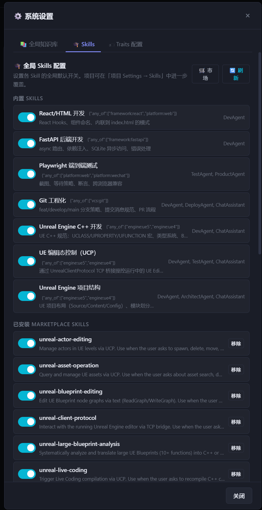
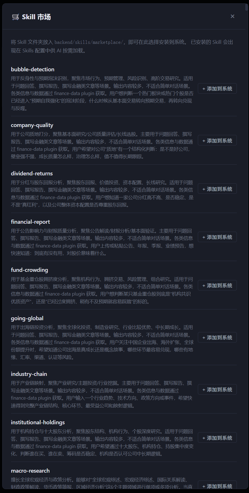
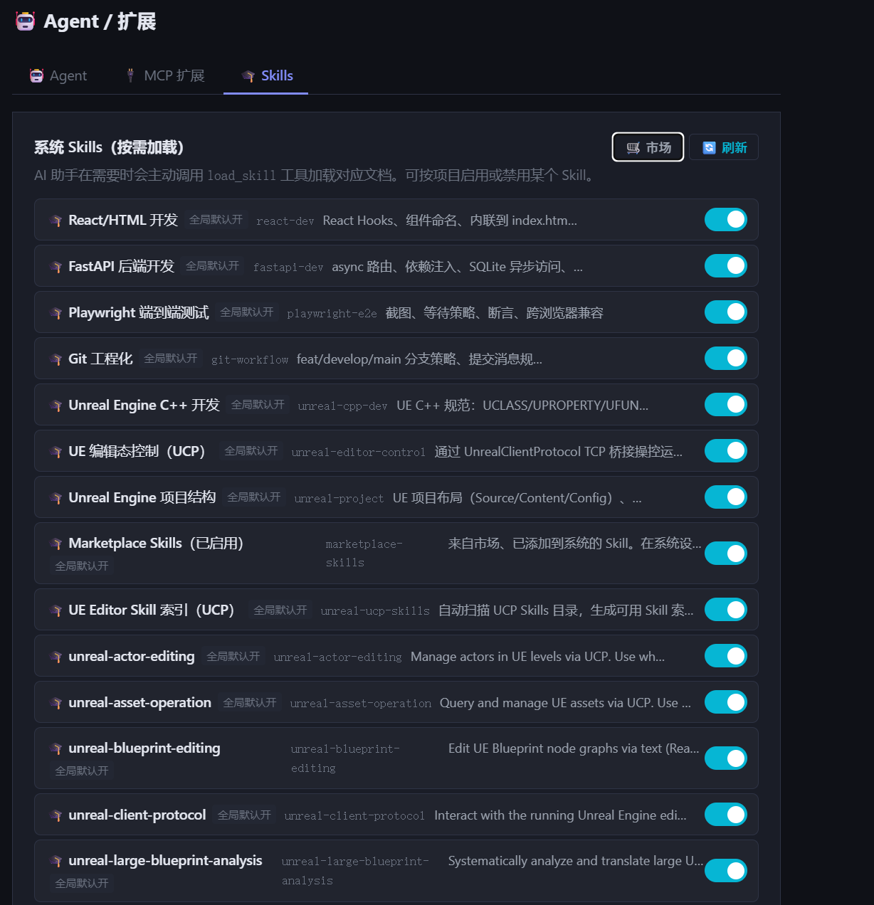

# Skills 系统完整实现验收

> 日期：2026-05-11
> 状态：UI 已验收，API 存在待查 Bug（见末尾）

---

## 一、系统设置 → 全局 Skills 配置



**⚙️ 系统设置 → Skills Tab** 展示两个分区：

**内置 SKILLS**（来自 `backend/skills/packs/`）
- React/HTML 开发 · FastAPI 后端开发 · Playwright 端到端测试
- Git 工程化 · Unreal Engine C++ 开发 · UE 编辑态控制（UCP）· Unreal Engine 项目结构
- 每行显示 traits_match + 注入 Agent + Toggle 开关

**已安装 MARKETPLACE SKILLS**（来自 `backend/skills/use_skills/`）
- 当前已安装：unreal-actor-editing、unreal-asset-operation、unreal-blueprint-editing、unreal-client-protocol、unreal-large-blueprint-analysis、unreal-live-coding
- 每行带「移除」按钮

右上角「🛒 市场」按钮可打开市场面板。

---

## 二、Skill 市场面板



**🛒 Skill 市场** 扫描 `backend/skills/marketplace/` 目录，列出所有可用 Skill，每条带「+ 添加到系统」按钮。

截图中可见大量金融类 Skill（来自 CodeBuddy marketplace）：
- bubble-detection · company-quality · dividend-returns
- financial-report · fund-crowding · going-global
- industry-chain · institutional-holdings · macro-research · …

操作流程：
1. 将 Skill 文件夹放入 `backend/skills/marketplace/`
2. 在市场面板点「+ 添加到系统」
3. 后端复制到 `use_skills/` 并热重载，无需重启

---

## 三、项目 Settings → Skills Tab



**项目 Agent/扩展 → Skills** 展示所有 Skill 含状态：
- 「全局默认开」标签标明来源
- Toggle 可项目级覆盖
- 右上角「🛒 市场」按钮（项目维度，安装到项目 `.Agent/skills/`）
- 包含 marketplace-skills 聚合条目 + UCP 索引条目 + 所有已安装 marketplace Skill

---

## 四、已实现的完整架构

```
backend/skills/
├── packs/          内置 Skill（跟随系统版本）
├── marketplace/    市场目录（浏览用，复制即可出现）
├── use_skills/     系统级已安装（从市场选中后复制进来）
└── rules/          全局编码规范（alwaysApply）

{project}/.Agent/skills/   项目级已安装（从市场选中后复制进来）
```

三层配置优先级：`skills.json` → `global_skill_settings`(DB) → `project_skills`(DB)

四层 Skill ID 可用性：全局 → 全局覆盖 → 项目覆盖 → 项目 `.Agent/skills/`（`agent.*` 前缀）

---

## 五、已知 Bug

**`GET /api/skills/marketplace` 返回 404**

- 表现：市场弹窗显示「加载失败: Not Found」
- 确认：路由已正确注册（Python 测试、OpenAPI 路由列表均显示存在）
- 排查路径：运行服务加载的 `api/skills.py` 版本与磁盘文件不一致（响应字段数量差异：旧版 9 个字段，新版 12 个字段）
- 未解决原因：停止排查，等下次会话继续定位
- 暂时影响：市场功能不可用；其余 Skills 配置（全局 Toggle、项目 Skills Tab）均正常
