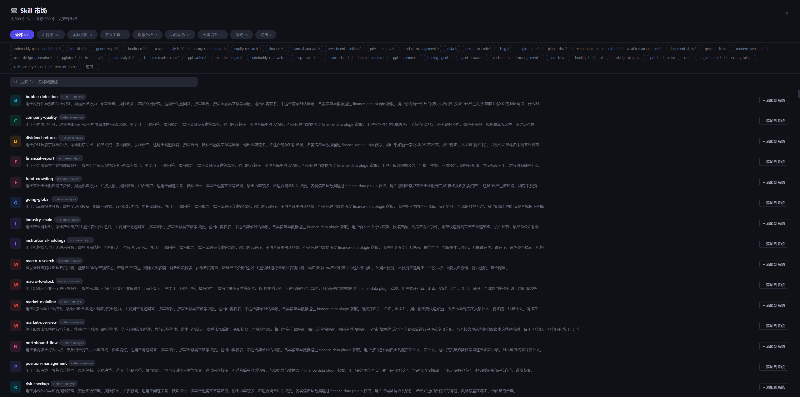
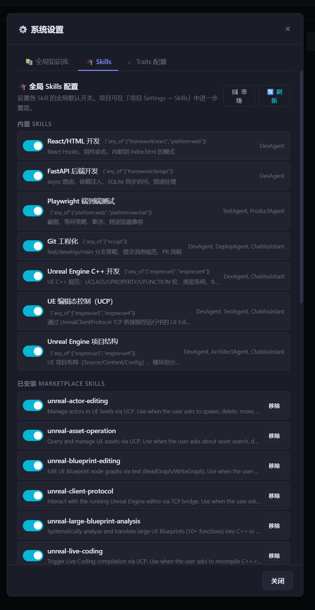
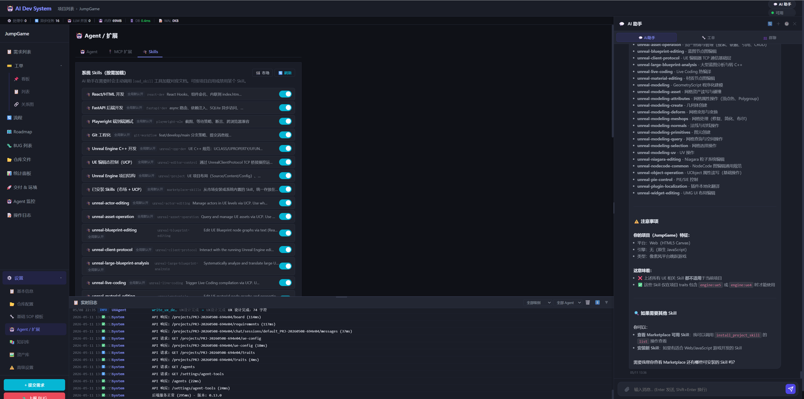

# Skill 市场全页面验收

> 日期：2026-05-11
> 状态：已验收

---

## 一、Skill 市场全页面



**功能亮点：**
- 全屏覆盖页面（非小弹窗）
- 顶部大分类 Tab（全部 580 / AI智能 / 金融投资 / 开发工具 / 数据分析 / 内容创作 / 效率提升 / 游戏 / 通用），每个显示数量
- Tag 行：当前分类下的细粒度 Tag（如 `a-share-analysis`），点击可二次过滤
- 实时搜索框：输入即过滤名称/描述/dir_name
- 每条 Skill：彩色首字母图标 + 名称 + Tag badge + 描述 + 操作按钮
- 已安装显示「✓ 已安装」+ 低调「移除」，未安装显示「+ 添加到系统」

---

## 二、系统设置 → 全局 Skills 配置



**功能：**
- 内置 SKILLS：React/HTML、FastAPI、Playwright、Git、UE C++、UE 编辑态控制（UCP）、UE 项目结构
- 已安装 MARKETPLACE SKILLS：24 个 UCP Skills（已从 `ue_plugins/` 迁移到 `use_skills/`）
- 每行 Toggle 开关可全局开关
- 「🛒 市场」按钮打开全页面市场

---

## 三、项目 Settings → Skills Tab + AI 助手联动



**功能：**
- 项目 Agent/扩展 → Skills：列出所有可用 Skill，含「全局默认开」标签和 ID
- AI 助手右侧面板自动显示当前项目可用的 Skill 索引（按需加载，不全量注入）
- AI 助手能感知 Skill 适配性：截图中提示「这些 Skill 仅在项目 traits 含 engine:ue5 或 engine:ue4 时才能使用」
- 提示用户可通过对话调用 `install_project_skill` 的 list 操作查看可安装 Skill

---

## 四、本次完成的架构

```
marketplace/     浏览目录（580 个 Skill，支持子目录分类）
    ↓ 用户选择安装
use_skills/      系统已安装（24 个 UCP Skills + 未来市场安装）
    ← 统一管理，marketplace-skills scan_dir 扫此目录

{project}/.Agent/skills/   项目已安装
    ← 项目市场安装 / AI 对话安装 / 新建项目自动安装
```
