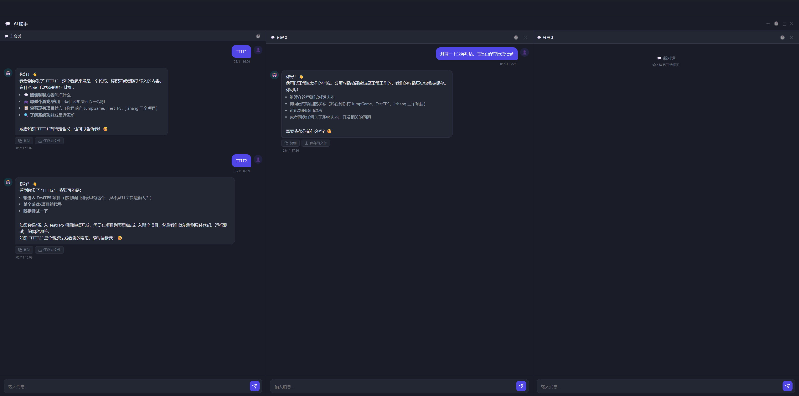

# AI 助手全屏与分屏

> 日期：2026-05-11
> 状态：已验收

---

## 效果

三格分屏：主会话（左）+ 分屏 2（中）+ 分屏 3（右），各自独立 session，均可正常收发消息。

---

## 功能说明

### 全屏模式（⛶ 按钮）
- 隐藏侧栏、主内容区，AI 助手铺满全屏
- 原有消息区、输入框、历史按钮全部保留
- 点 ⊡ 退出全屏，恢复正常布局

### 分屏（⊞ 按钮，仅全屏下可用）
- 最多 3 格水平排列
- 第一格（主会话）：克隆当前主面板消息，保持原有 session
- 新增格：调 `POST /sessions` 创建独立 session，消息保存到各自历史
- 每格头部：🕐 历史按钮（与主面板同风格，今天/本周/更早分组）
- 点击格头或输入框聚焦，顶部蓝线标示当前激活格
- 单格右上角 ✕ 关闭；退出全屏自动销毁所有分屏格

### 历史面板
- 样式与主面板一致：分组 + 标题 + 条数
- title 为 session_id 格式的老记录自动回退显示为「对话（日期，N条）」

---

## 实现要点

- `body.chat-fullscreen`：CSS 隐藏其他区域，chat-panel 全宽
- `body.chat-split`：仅在激活分屏时才隐藏主面板 body/input，显示 `#chatSplitContainer`
- `_setSplitContainerHeight()`：JS 精确计算容器高度（panel 高 - header 高）
- 分屏 session 隔离：新格创建时立即调 `POST /sessions`，发消息时始终携带 `chat_session_id`
- 退出全屏调 `loadChatHistory()` 重新加载主面板，不受分屏影响
