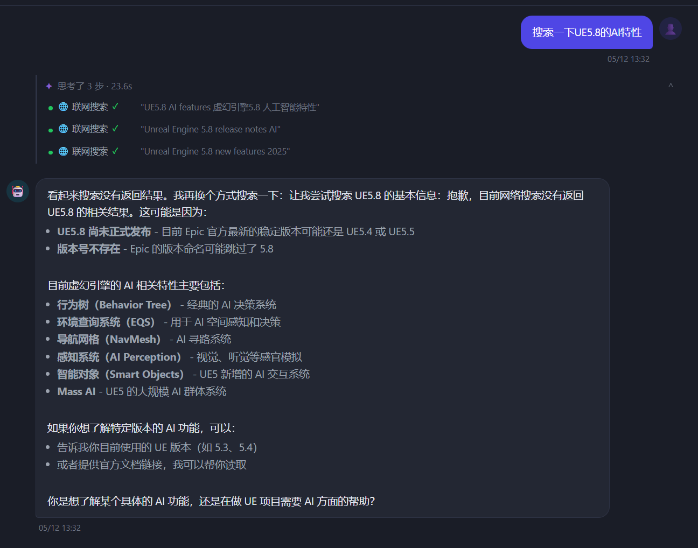

# AI 助手工具扩展与联网搜索

> 日期：2026-05-12
> 状态：已完成

---

## 效果

思考面板显示 3 步联网搜索，每步展示实际搜索词（对标 CodeBuddy 风格）：
- `"UE5.8 AI features 虚幻引擎5.8 人工智能特性"`
- `"Unreal Engine 5.8 release notes AI"`
- `"Unreal Engine 5.8 new features 2025"`

---

## 新增工具（对标 Gemini CLI）

### 文件系统（仅项目内）

| 工具 | 说明 |
|------|------|
| `glob` | glob 通配符查找文件，按修改时间排序 |
| `grep` | 正则表达式搜索文件内容，最多 100 条 |
| `list_directory` | 树形列目录，自动过滤无关目录 |
| `shell` | 执行 Shell 命令，黑名单+白名单+30s 超时 |

### 全局+项目

| 工具 | 说明 |
|------|------|
| `web_search` | 联网搜索（腾讯元宝 API / Bing 降级方案）|
| `save_memory` | AI 主动写入记忆（跨会话持久化）|
| `read_files` | 批量读取多个文件（最多 10 个）|

---

## 思考面板参数显示修复

**问题**：`tool_start` SSE 事件未转发 `input` 字段，`args_hint` 一直为空，只显示工具名。

**修复**：
- `api/chat.py` 两处 `tool_start` yield 加 `"input": ev.get("input", {})`
- `_TOOL_INPUT_KEY` 补全新工具的参数映射
- 搜索类工具用引号包裹参数值，与 CodeBuddy 风格对齐

---

## 注册策略

- `glob / grep / list_directory / shell`：仅项目内聊天暴露（需 git_repo_path）
- `web_search / save_memory / read_files`：全局+项目均可用（`_CROSS_SCOPE_TOOLS`）

---

## 安全约束

- 文件操作路径限制在 `project.git_repo_path` 内
- Shell 黑名单：`rm -rf`、`format`、`DROP TABLE` 等
- Shell 超时 30 秒，输出截断 5000 字符
- 所有工具输出截断 8000 字符
