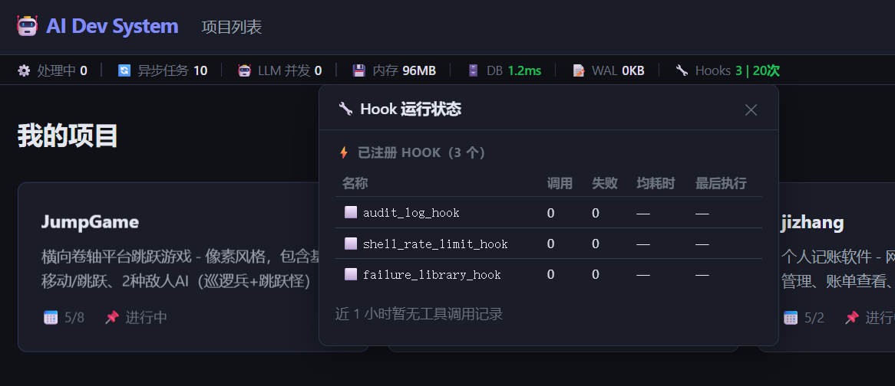

# Hook 可观测性实现记录

> 日期：2026-05-14  
> 提交：`0b4de2e`  
> 方案来源：`docs/20260514_01_Hook可观测性方案.md`

---

## 效果截图



指标条新增 `🔧 Hooks 3 | 20次`，点击弹出"Hook 运行状态"浮层，  
展示 3 个已注册 Hook 的调用次数、失败数、均耗时、最后执行时间。

---

## 交付文件

| 文件 | 说明 |
|------|------|
| `backend/hooks/registry.py` | 新增 `_stats` 调用统计字典；`emit()` 内计时；`get_stats()` 方法 |
| `backend/api/hooks.py` | 新建：`GET /api/hooks/status` + `GET /api/hooks/stats` |
| `backend/main.py` | 注册 `hooks_router` |
| `frontend/index.html` | 指标条新增 Hooks 块 + Hook 浮层 HTML |
| `frontend/app.js` | `refreshHooksMetric()` + `toggleHooksPanel()` + `_renderHooksPanel()` |
| `frontend/styles.css` | `.hooks-panel` 浮层样式 + 进度条样式 |

---

## 设计决策

### 入口：顶部指标条而非 Agent 页

初稿放 Agent 监控页——但 Hook 是系统级基础设施，不属于某个具体 Agent。  
改为顶部指标条（与 DB/WAL/内存同类），平时一个数字，点击展开浮层。

### 统计不持久化

`HookRegistry._stats` 只在内存中，服务重启后清零。  
运行时可观测目的，不需要历史审计——轻量实现，无新 DB 表。

### 浮层三区块

1. **已注册 Hook 列表**：名称 / 调用 / 失败 / 均耗时 / 最后执行  
2. **Shell 限流进度条**：各 Ticket 的计数 / 上限，≥90% 显示 ⚠️ 红色  
3. **近 1 小时工具调用 TOP 8**：横向进度条 + 次数/均耗时

---

## API

```bash
# 注册列表 + 限流计数 + 今日调用总量
GET /api/hooks/status

# 近 N 小时工具调用聚合（from tool_audit_log）
GET /api/hooks/stats?hours=1
```

---

## 遗留

- 初始状态（刚启动，无工具调用）`调用 0 / 失败 0 / — / —` 是正常的，  
  用几次 AI 助手工具后会实时更新
- Shell 限流区块只在有调用记录时显示，初始状态不显示（正常）
