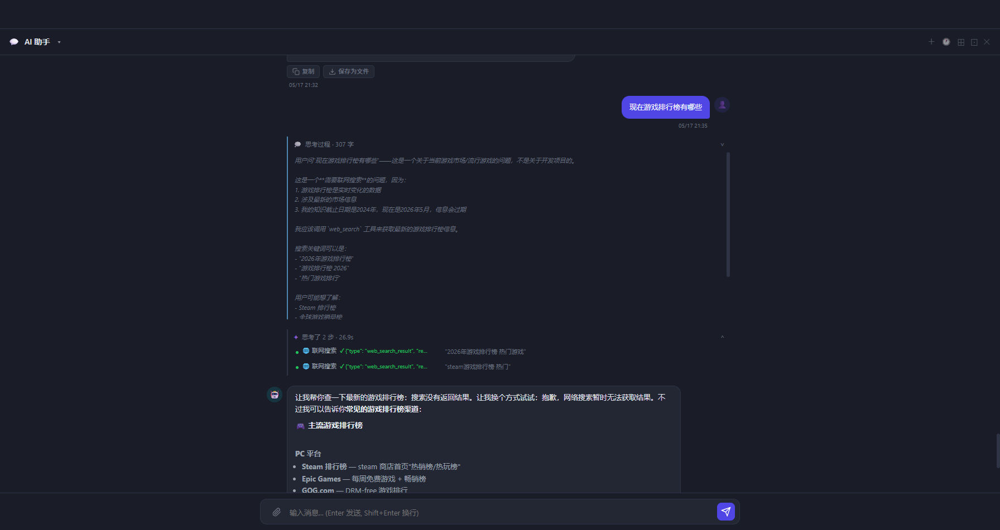

# 思考过程对标 Claude Code（J1/J2/J3）

> 日期：2026-05-17  
> 提交范围：`c24b4dc` → `5b6e5b7`（5 个提交）  
> 对应 TODO：J-1 / J-2 / J-3  
> 评分变化：思考过程展示 ~6/10 → ~9/10

---

## 效果截图



截图说明：
- 顶部蓝色「💭 思考过程 · 307 字」面板展开，显示模型推理全文（灰色斜体）
- 下方紫色「思考了 2 步 · 26.9s」面板，每步含工具标签 + 结构化摘要 + 耗时
- 最下方是 AI 的最终回复
- 布局与 Claude Code 一致：推理链在上，工具步骤居中，回复在下

---

## 一、J-1 每步耗时（思考步骤显示执行时间）

**问题**：每个工具调用步骤只显示"✓ 摘要"，没有耗时，无法感知哪些操作慢。

**修复**：
- `engine.py` thinking_steps 加入 `duration_ms` 字段
- `chat_assistant.py` ToolDoneEvent 透传 `args_hint` + `duration_ms`
- `api/chat.py` SSE `tool_done` 事件透传两个字段
- 前端 `ctp-step-status` 显示格式：`✓ 摘要 (38ms)`

**效果**：
```
● 联网搜索  ✓ {"type": "web_search_result"...  "2026年游戏排行榜 热门游戏"  (1240ms)
```

---

## 二、J-2 结构化工具摘要

**问题**：工具结果截取前 120 字符，是原始 JSON 片段，可读性极差。

**修复**：`engine.py` 新增 `_format_result_summary(tool_name, result_text)` 函数：

| 工具 | 原来 | 改后 |
|---|---|---|
| `grep` | `[{"path": "src/api...` | `23 处匹配 · src/api.py:14` |
| `shell` | `stdout: Compiling...` | `exit 0 · 输出 3 行` |
| `read_files` | `{"files": {"main...` | `main.py · 87 行` |
| `search_knowledge` | `[{"title": "Phas...` | `5 条结果 · Phaser guide` |
| `glob` | `["src/a.py", "src...` | `12 个文件` |
| `web_search` | `[{"title": "Steam...` | `8 条结果 · Steam排行榜` |

截图中可见：联网搜索返回的是 `"2026年游戏排行榜 热门游戏"` 形式的摘要，而非 JSON。

---

## 三、J-3 Extended Thinking 原生推理链

**问题**：用户只能看到"AI 做了什么"（工具调用），看不到"AI 在想什么"（推理过程）。Claude Code 每条消息都有推理链。

### 3.1 后端实现

**`llm_client.py`**：
- 新增 `_model_supports_thinking(model_id)` 白名单检测
- `_call_anthropic_tools_stream` 加 `enable_thinking` / `thinking_budget` 参数
- API 要求 `budget_tokens >= 1024`（实测 1000 会报 HTTP 400）
- 流式处理 `thinking_delta` / `thinking_done` 事件

**`query_engine/engine.py`**：
- `QueryEngine.__init__` 加 `enable_thinking` / `thinking_budget` 参数
- `thinking_budget = max(thinking_budget, 1024)` 防止 API 报错
- yield `ThinkingDeltaEvent` / `ThinkingDoneEvent`

**`chat_assistant.py`**：
- `chat_stream` / `chat_global_stream` 自动检测模型并开启 thinking
- 透传两个新事件到调用方

### 3.2 前端实现

新增 `.chat-reasoning-panel`（蓝色边框，区别于工具步骤的紫色边框）：
- `thinking_delta` 到达时**立即移除**「正在思考…」指示器，面板成为唯一顶部占位
- 推理文字实时流入，灰色斜体，`white-space: pre-wrap`
- `thinking_done` 后自动折叠，标题显示「思考过程 · N 字」
- 可点击展开/折叠

### 3.3 调试记录

| 问题 | 原因 | 修复 |
|---|---|---|
| HTTP 400 | `budget_tokens` 需 ≥ 1024，我们设了 1000 | `max(budget, 1024)` |
| 面板不出现 | thinking 逻辑写在 `_sendChatStreamingToContainer`（分屏），主路径 `_sendChatStreaming` 没有 | 补加到主路径 |
| 面板在回复下方 | `container.appendChild` 追加到末尾，晚于已在 DOM 的 chatTyping | 改为 `insertBefore(reasoningPanel, bubbleWrapper)` |
| 思考中面板位置跳动 | chatTyping 覆盖在面板上方，done 后 chatTyping 消失造成"跳上去"的感觉 | thinking_delta 到达时立即移除 chatTyping |

---

## 四、评分对比

| 维度 | 改进前 | 改进后 |
|---|---|---|
| 工具步骤展示 | ✅ 有，但摘要是截断 JSON | ✅ 结构化（行数/匹配数/exit code） |
| 每步耗时 | ❌ 无 | ✅ `(38ms)` |
| 推理链可见 | ❌ 无 | ✅ 实时流入，可折叠 |
| 面板布局 | ⚠️ 只有工具面板 | ✅ 推理面板（上）+ 工具面板（下）+ 回复 |
| **综合** | **~6/10** | **~9/10** |

---

## 五、三层架构说明：推理链 / 工具调用 / 回答

> Q：Claude Code 里的圆点（工具调用）属于思考过程还是回答内容？

### 三层分离

```
┌─────────────────────────────────┐
│  💭 推理链（Extended Thinking）  │  ← 模型的内心独白
│  "用户问的是游戏排行榜，这需要   │     纯文字，不执行任何操作
│   联网搜索，关键词应该是..."     │
└─────────────────────────────────┘
           ↓ 模型决定怎么做
┌─────────────────────────────────┐
│  ✦ 工具调用（Tool Use）          │  ← 执行过程
│  ● 联网搜索 ✓ 8条结果 (1240ms)  │     模型的 OUTPUT，但不是给用户的答案
│  ● 联网搜索 ✓ 5条结果 (980ms)   │     介于思考和回答之间
└─────────────────────────────────┘
           ↓ 拿到结果后组织答案
┌─────────────────────────────────┐
│  最终回复                        │  ← 回答内容
│  "以下是主流游戏排行榜渠道..."   │     真正给用户看的文字
└─────────────────────────────────┘
```

### Anthropic API 协议层面

| 层 | content_block.type | 说明 |
|---|---|---|
| 推理链 | `"thinking"` | 模型专属，不计入正常 token 上限 |
| 工具调用 | `"tool_use"` | assistant message 的一部分，但不是最终答案 |
| 文字回复 | `"text"` | 真正的回答内容 |

### ADS 对应实现

- **蓝色面板（💭 思考过程）** → Extended Thinking 块，`thinking_delta` / `thinking_done` 事件
- **紫色面板（✦ 思考了 N 步）** → 工具调用 + 结果，`tool_start` / `tool_done` 事件
- **气泡回复** → 最终文字，`text_delta` 事件

Claude Code 把推理链 + 工具调用一起折叠在"工作过程"区，最终文字展开——ADS 的三层分离与此对齐。

---

## 六、提交记录

| 提交 | 内容 |
|---|---|
| `c24b4dc` | feat(J1/J2/J3): 思考过程对标 Claude Code |
| `53d9e6c` | fix(J3): thinking_budget 最低 1024 |
| `8d0e8a0` | fix(J3): 补加到主路径 _sendChatStreaming |
| `f5536dc` | fix(J3): 推理面板插到回复气泡前 |
| `5b6e5b7` | fix(J3): 思考中面板始终显示在上方 |
