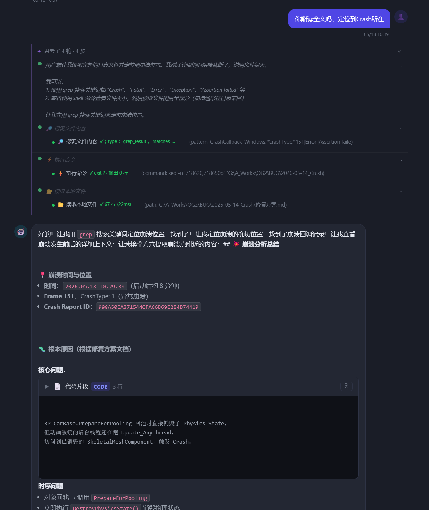

# 思考过程分组展示 & 全局AI助手升级

> 日期：2026-05-18  
> 提交范围：`e7f1b01` → `cb72cd7`（14 个提交）  
> 对应 TODO：J-3b（思考过程按轮次分组）

---

## 效果截图



截图说明：
- AI 助手对 `G:\A_Works\OG2\BUG\2026-05-14_Crash` 的崩溃日志进行了 4 轮分析
- 每轮推理文字 + 对应工具调用绑定显示
- 第 1 轮有完整推理文字（蓝色）；后续轮次无 thinking block 时显示工具标签占位
- 成功定位崩溃：`BP_CarBase.PrepareForPooling` 回池时销毁 Physics State，动画后台线程仍在跑 `Update_AnyThread`，访问已销毁的 `SkeletalMeshComponent` → Crash

---

## 一、J-3b 思考过程按轮次分组（核心改进）

> 提交：`e7f1b01`、`3c5776d`、`7a6a827`、`9e6d604`

### 之前的问题
推理链（Extended Thinking）和工具调用是两个独立面板，看不出哪段推理对应哪次工具调用。

### 现在的效果
每轮 LLM 调用作为一个"步骤组"，推理文字 + 该轮工具绑定显示：

```
✦ 思考了 4 轮 · 4 步                              [折叠]
  ● 用户想让我读取完整的日志...  ›
     └ 🔍 搜索文件内容 ✓ 23处匹配 (980ms)
  ● 🔍 搜索文件内容              ›              ← 无推理文字时显示工具标签
     └ 🔍 搜索文件内容 ✓ 找到崩溃位置 (1240ms)
  ● ⚡ 执行命令                   ›
     └ ⚡ 执行命令 ✓ exit 0 (820ms)
  ● 📂 读取本地文件               ›
     └ 📂 读取本地文件 ✓ 67行 (22ms)
```

### 实现细节

**后端新增 `RoundStartEvent`**
- `query_engine/events.py`：新增 `RoundStartEvent(round=N)`
- `engine.py`：每轮 for 循环第一行 yield
- `chat_assistant.py` / `api/chat.py`：两条路径透传

**`api/chat.py` 同步构建分组结构存 DB**
- `round_start` → 新建 `{round, reasoning:"", steps:[]}`
- `thinking_delta` → 累积 reasoning（保底，不依赖 thinking_done）
- `thinking_done` → 有内容时覆盖 reasoning
- `tool_done` → 追加到当前轮 steps
- `message_done` → 追加最后轮，用分组格式存 DB

**历史渲染兼容**
- 通过 `item.round !== undefined` 区分新旧格式
- 旧格式（平铺）：走原有 ctp 面板
- 新格式（分组）：渲染 crp-rounds-panel

### 调试记录

| 问题 | 原因 | 修复 |
|---|---|---|
| 刷新后推理文字为空 | thinking_delta 只在前端收，后端未累积 | 后端也累积 thinking_delta |
| 空轮次显示「整理回复中」| 最后轮无 thinking block | 过滤空轮次（无推理+无工具） |
| 空轮次只有圆点+箭头 | crp-reasoning-hidden 把文字隐藏了 | tool_start 时填入工具标签 |

---

## 二、工具步骤可展开显示完整结果

> 提交：`1c2af9b`

工具步骤右侧加 `›` 展开按钮，点击查看完整返回内容：

| 工具 | 展开后显示 |
|---|---|
| `web_search` | 标题 + URL + 摘要列表 |
| `read_files` | 文件名 + 代码预览（前30行）|
| `grep` | 文件:行号 + 匹配文字 |
| `shell` | exit code + stdout |
| `search_knowledge` | 结果条目列表 |

后端：`ToolDoneEvent` 加 `result` 字段，透传至 SSE `tool_done`。

---

## 三、全局AI助手全面开放工具

> 提交：`0bee0ed`

**之前**：全局聊天只有白名单 4 个工具（confirm_project / search_knowledge / search_ticket_history / fetch_url）。

**现在**：黑名单模式——排除需要 project_id 才能运行的工具（confirm_requirement 等工单操作），其余全部开放：

```
可用：shell / glob / grep / read_files / web_search / save_memory
     get_memory / load_skill / ue_call / create_github_repo 等共 22 个
```

**效果**：全局 AI 助手现在可以执行 shell 命令、读任意文件、搜索代码，和 Claude Code 能力对齐。

---

## 四、工具描述修复（模型能力误判）

> 提交：`2869cf6`

**问题**：`read_local_file` 的 tool schema 描述写着「只能读取允许目录内的文件」，但实际代码 `user_provided=True` 时完全放行，可读任意路径。模型读了错误描述，拒绝访问 `G:\A_Works\...`。

**修复**：
- `read_local_file`：描述改为「用户提供的任意路径均可读取」
- `glob` / `list_directory`：描述加入「支持绝对路径如 G:/A_Works/...」

**教训**：tool schema description 是模型理解自身能力的唯一来源，描述和代码行为必须一致。

---

## 五、其他修复

| 提交 | 内容 |
|---|---|
| `132ccac` | 输入历史持久化到 localStorage，刷新后保留 |
| `a86916c` | 输入历史保存移到 sendChatMessage 守卫之前（job 模式也保存）|
| `df2602b` | 进入系统默认全屏打开 AI 助手 |
| `12051ee` | 无推理文字的轮次隐藏推理行 |
| `7861b1e` | 推理全文直接显示，不截断 |
| `f145284` | 推理摘要改为 2 行显示 |
| `d856c3f` | web_search 结构化摘要（N条结果·标题）|
