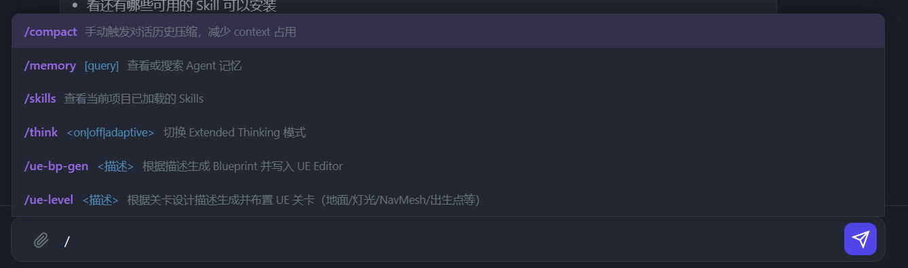

# NextPhase Commands 斜杠命令系統完整驗收

> 系列：NextPhase  
> 日期：2026-05-19  
> 提交範圍：`e973507`（A-1）→ `6d9bbb2`（鍵盤操作）

---

## 效果截圖

截圖說明：
- 輸入 `/` 立即彈出所有可用命令補全
- 高亮顯示當前選中項（`/compact`）
- 每條命令顯示：**命令名**（紫色）+ **參數提示**（藍色）+ **描述**
- 使用 ↑↓ 鍵導航，Tab/Enter 補全，Esc 關閉

---

## 完整功能清單

### 可用命令（7 個）

| 命令 | 參數 | 功能 |
|---|---|---|
| `/compact` | — | 手動觸發對話歷史壓縮 |
| `/memory` | `[query]` | 查看或搜索 Agent 記憶 |
| `/skills` | — | 查看當前項目已加載 Skills |
| `/think` | `<on\|off\|adaptive>` | 切換 Extended Thinking 模式 |
| `/ue-bp-gen` | `<描述>` | 生成 Blueprint 並寫入 UE Editor |
| `/ue-level` | `<描述>` | 生成並布置 UE 關卡 |
| `/ue-run` | `<python>` | 在 UE Editor 執行 Python 代碼 |

### 鍵盤操作

| 按鍵 | 行為 |
|---|---|
| `/` | 立即顯示所有命令補全 |
| `/m`（任意字母）| 過濾匹配命令 |
| `↑` `↓` | 在建議列表間導航 |
| `Tab` / `Enter` | 補全當前高亮命令 |
| `Esc` | 關閉建議列表 |

### 擴展方式

新增命令只需在 `backend/skills/commands/` 加 `.md` 文件 + 在 `api/commands.py` 加處理函數，服務器重啟後自動出現在補全列表。

---

## 調試記錄

| 問題 | 原因 | 修復 |
|---|---|---|
| 頁面白屏 JS 報錯 | `@file` 正則 `/[^\s]*` 中 `/` 未轉義 | 改為 `\/[^\s]*` |
| 補全框不顯示 | `insertAdjacentElement('beforebegin')` 插在 wrap 外，`position:absolute` 計算錯誤 | 改為 `afterbegin` 插入 wrap 內，加 `position:relative` |
| 輸入 `/` 不觸發 | `val.length < 2` 過濾了單字符 `/` | 移除長度限制 |
