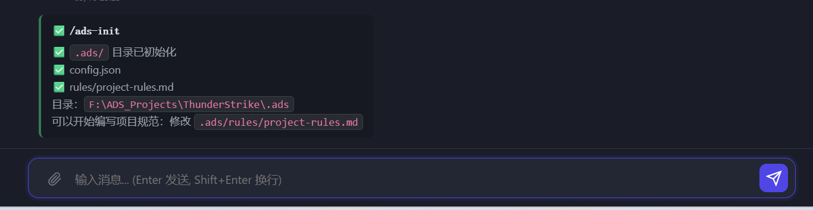

# ADSDir：.ads 目录规范完整验收

> 系列：ADSDir（.ads 目录实现）
> 日期：2026-05-19
> 提交范围：`6a3c0db`（P1）→ `e37d619`（自动初始化）
> 对应方案：`docs/20260519_04_ADS项目目录规范_ads目录设计方案.md`

---

## 效果截图



截图说明：在 ThunderStrike 项目中执行 `/ads-init`，自动创建：
- `.ads/` 目录
- `config.json`（包含项目 traits）
- `rules/project-rules.md`（规范模板）
- 目录路径：`F:\ADS_Projects\ThunderStrike\.ads`

---

## .ads/ 目录完整规范

### 目录结构

```
{项目仓库}/
└── .ads/
    ├── rules/                   ← 项目级规则（自动注入所有 Agent）
    │   ├── project-rules.md     ← 项目编码规范（/ads-init 自动创建）
    │   └── *.md                 ← 可新增多个规则文件
    ├── skills/                  ← 项目级 Skill（替代 .Agent/skills/）
    │   └── {skill-name}/
    │       └── SKILL.md
    ├── memory.md                ← 项目记忆快照（/memory-export 导出）
    └── config.json              ← 项目配置（traits 声明）
```

### config.json 格式

```json
{
  "project_name": "ThunderStrike",
  "traits": ["engine:ue5", "category:game", "feature:wave-spawner"],
  "description": "项目简介"
}
```

### rules/*.md 格式（YAML frontmatter + 规范内容）

```markdown
---
alwaysApply: true        # 对该项目所有 Agent 无条件生效
priority: medium         # high / medium / low
description: 项目编码规范
---

# ThunderStrike 项目规范

## 波次系统
- 波次配置必须使用独立 JSON 文件，不得硬编码
- 每个波次 Actor 必须继承 BP_WaveActorBase

## 命名规范
- Blueprint 前缀统一用 BP_TS_（区别于通用 BP_）
```

---

## 可用命令

| 命令 | 功能 |
|---|---|
| `/ads-init` | 初始化 .ads/ 目录（创建模板文件）|
| `/memory-export` | 项目记忆 → `.ads/memory.md`（可 git 提交共享）|
| `/memory-import` | `.ads/memory.md` → 数据库（按标题去重）|

---

## 生效时机

| 数据 | 生效时机 |
|---|---|
| `.ads/rules/*.md` | 每次 Agent 执行时实时读取（无需重启服务）|
| `.ads/skills/` | 每次 Skill 加载时实时读取 |
| `.ads/config.json` | 创建/导入项目时读取，合并 traits |
| `.ads/memory.md` | 手动执行 `/memory-import` 后生效 |

---

## 新建 vs 老项目

| 场景 | 操作 |
|---|---|
| **新建项目** | 自动创建 `.ads/` 目录结构（`_auto_init_ads_dir`）|
| **已有老项目** | 在项目内执行 `/ads-init` 手动初始化 |
| **两者** | `.ads/rules/project-rules.md` 写入规范后立即生效 |

---

## 优先级层次（注入 system prompt 的顺序）

```
1. backend/skills/rules/global.md    ← 全局规则（最高）
2. .ads/rules/*.md                   ← 项目级规则（P1 新增）
3. use_skills/ + .ads/skills/        ← Skills
4. agent_memory（最近 3-5 条）       ← 记忆
```

---

## 实现文件列表

| 文件 | 变更 |
|---|---|
| `backend/skills/loader.py` | 新增 `load_project_rules()` |
| `backend/agents/base.py` | `_resolve_skills_prompt` 注入项目 rules |
| `backend/agents/chat_assistant.py` | `_build_system_prompt` 注入项目 rules |
| `backend/actions/chat/load_skill.py` | 优先读 `.ads/skills/` |
| `backend/api/skills.py` | 优先读 `.ads/skills/` |
| `backend/api/commands.py` | `/ads-init`、`/memory-export`、`/memory-import` |
| `backend/api/projects.py` | 新建项目自动初始化 `.ads/` |
