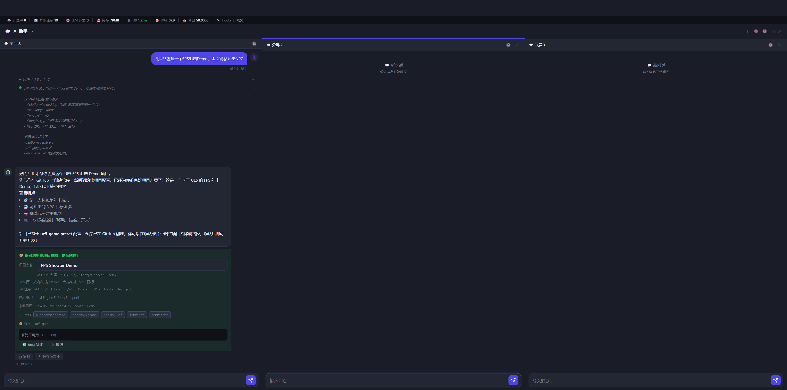

# TODO I：分屏思考面板修复

> 日期：2026-05-20
> 提交：`fdcb25a`

---

## 效果截图



截图说明：
- 三格分屏正常运行（主会话 + 分屏 2 + 分屏 3）
- 顶部 metrics-bar 在全屏模式下可见
- 主格思考面板（✦ 思考了 2 轮 · 2 步）正常展开显示
- 每轮推理文字清晰可读，工具步骤正常展示
- 确认创建项目卡片正确渲染

---

## 根本原因

思考面板（`.crp-rounds-panel`、`.chat-reasoning-panel`）在流式输出结束时会加 `crp-collapsed` class（折叠收起，节省空间）。

进入分屏模式时，代码用 `cloneNode(true)` 克隆主格消息到分屏容器，但克隆的节点**带着 `crp-collapsed` class**，导致思考面板进入分屏后处于折叠状态、不可见。

原来的代码只处理了旧版 `.chat-thinking-panel`：
```javascript
// 旧代码：只展开旧版思考面板
dstMessages.querySelectorAll('.chat-thinking-panel').forEach(p => {
    p.classList.add('ctp-expanded');
});
```

J-3b 引入的两种新面板未处理：
- `.crp-rounds-panel`（按轮次分组的思考面板）
- `.chat-reasoning-panel`（Extended Thinking 推理链）

---

## 修复

克隆后统一移除三种思考面板的折叠 class：

```javascript
// 旧版思考面板
dstMessages.querySelectorAll('.chat-thinking-panel').forEach(p => {
    p.classList.add('ctp-expanded');
});
// J-3b 分组轮次面板
dstMessages.querySelectorAll('.crp-rounds-panel').forEach(p => {
    p.classList.remove('crp-collapsed');
});
// Extended Thinking 推理链面板
dstMessages.querySelectorAll('.chat-reasoning-panel').forEach(p => {
    p.classList.remove('crp-collapsed');
});
```

一共 3 行，覆盖全部思考面板类型。
