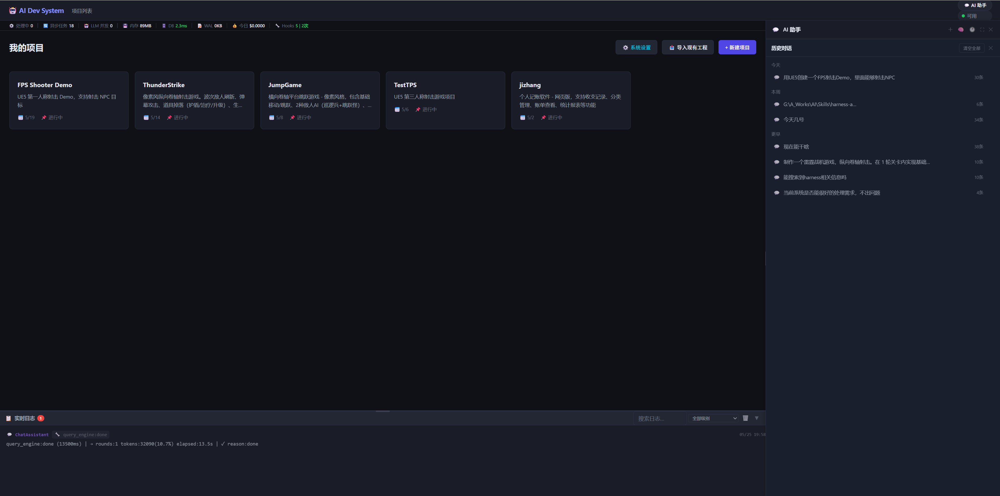

# Fix — 项目卡片高度异常与选中边线被裁剪

> 日期：2026-05-22
> 提交：`b628974`（卡片过高）、`4599b57`（等高+边线）

---

## 问题描述

### 问题 1：卡片被拉伸过高

服务启动后发现项目列表页卡片异常高，占满屏幕高度。

**根因**：`#projectListPage .project-grid` 有 `flex: 1`（撑满容器高度），`.project-grid` 的 grid 默认 `align-content: stretch`，只有一行时该行撑满整个容器，卡片跟着拉高。

**修复**：添加 `align-content: start`，行高由内容决定，不填满容器。

### 问题 2：卡片大小不一

修复问题 1 后，同行卡片高度因描述文字长短不同而参差不齐。

**根因**：误加了 `align-items: start`，导致每张卡片高度各自由内容决定，放弃了 grid 默认的同行等高行为。

**修复**：去掉 `align-items: start`，恢复默认 `stretch`，同行卡片等高。

### 问题 3：选中时上边线被裁剪

hover 卡片时上边框消失（被父容器裁剪）。

**根因**：`project-card:hover` 有 `transform: translateY(-2px)` 向上偏移，但 `project-grid` 顶部 `padding: 0`，卡片上移后超出容器顶部被裁剪。

**修复**：`project-grid` 顶部 padding 从 `0` 改为 `8px`，为偏移留出空间。

---

## CSS 改动

```css
/* 修复前 */
#projectListPage .project-grid {
    padding: 0 24px 12px;
}
.project-grid {
    display: grid;
    grid-template-columns: repeat(auto-fill, minmax(300px, 1fr));
    gap: 16px;
}

/* 修复后 */
#projectListPage .project-grid {
    padding: 8px 24px 12px;   /* 顶部 8px 防止 hover 裁剪 */
}
.project-grid {
    display: grid;
    grid-template-columns: repeat(auto-fill, minmax(300px, 1fr));
    gap: 16px;
    align-content: start;     /* 行不拉伸填满容器 */
}
```

---

## 修复效果



同行卡片等高、不被过度拉伸，hover 时上边框完整显示。
