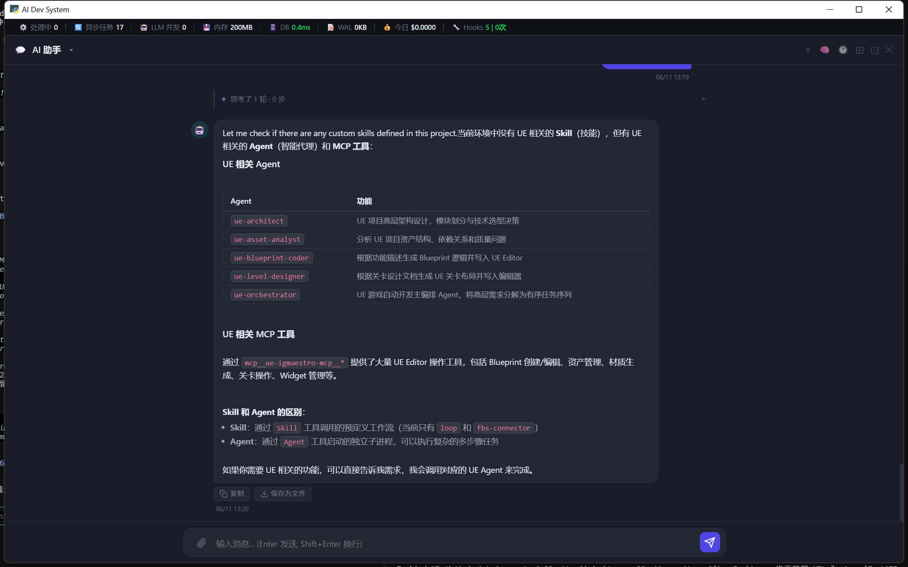

# Desktop — 桌面版首次运行成功

> 日期：2026-06-11
> 系列：Desktop（桌面版）
> 关联：`dev-notes/2026-06-11_02_Desktop_桌面版封装.md`

---

## 运行截图

桌面窗口标题栏显示 **AI Dev System**，原生 Windows 窗口控件（最小化/最大化/关闭），
AI 助手面板正常响应，正文内容、代码块、Markdown 表格全部正常渲染。

---

## 验证结果

| 项目 | 状态 |
|------|------|
| 窗口启动 | ✅ pywebview 原生窗口，标题栏正确 |
| 服务加载 | ✅ FastAPI 后端就绪后自动跳转 `/app` |
| AI 助手对话 | ✅ CodeBuddy CLI 正常响应（图中可见 UE Agent 表格） |
| Markdown 渲染 | ✅ 代码块、表格、粗体全部正常 |
| 顶部监控栏 | ✅ 处理中/异步任务/LLM 并发/内存/DB 等指标显示 |
| 系统托盘 | ✅ 最小化到托盘，右键菜单可用 |

---

## 修复记录

启动时窗口显示 `{"detail":"Not Found"}`，原因：`APP_URL` 指向根路径 `/`，
而 FastAPI 前端实际挂载在 `/app`。修复：`APP_URL = .../app`，`HEALTH_URL` 单独用 `/api/health`。

---

## 技术细节

- **端口**：18000（避免与开发服务 8000 冲突，两者可同时运行）
- **启动耗时**：约 14 秒（主要是知识库 FTS5 索引 + 资产库同步）
- **内存占用**：约 200MB（截图顶栏可见）
- **WebView 内核**：Windows Edge / WebView2
