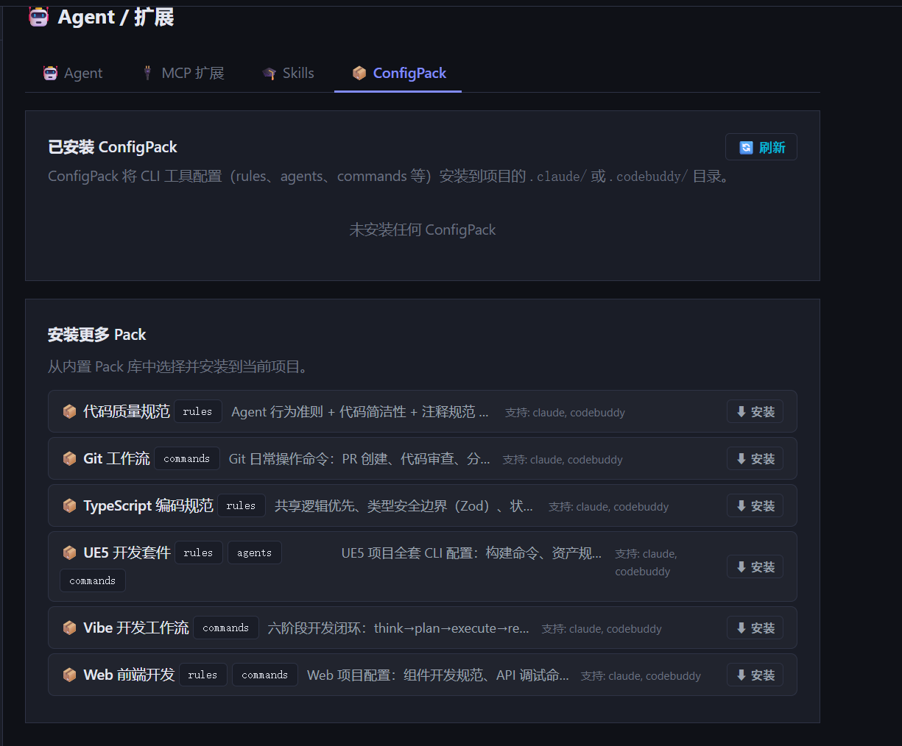

# ConfigPack 库 — Phase 3：管理功能

**日期**：2026-06-17  
**阶段**：Phase 3 完成

---

## 实现内容

### 修改文件

| 文件 | 变更 |
|---|---|
| `backend/api/projects.py` | 新增 4 个 Pack 相关端点 |
| `frontend/index.html` | `settings-agents` tab 新增 📦 ConfigPack 内部 tab |
| `frontend/app.js` | `switchAgentConfigTab` 加 packs 分支；新增 `loadProjectPacks` / `installPack` / `reinstallPack` / `removePack` |

---

## API 端点

| 方法 | 路径 | 说明 |
|---|---|---|
| GET | `/api/projects/{id}/packs` | 获取已安装 Pack 列表（含元数据） |
| GET | `/api/projects/{id}/packs/available` | 获取可安装 Pack 列表（排除已装的） |
| POST | `/api/projects/{id}/packs/{name}/install` | 安装（或重装）指定 Pack |
| DELETE | `/api/projects/{id}/packs/{name}` | 移除安装记录（不删文件） |

---

## UI 设计

`settings-agents` → `📦 ConfigPack` tab，分两区：



**已安装区**
```
📦 UE5 开发套件   [rules] [agents] [commands]
   ue5-dev
   UE5 项目全套 CLI 配置
   安装于 2026-06-17 15:30 · 目标: claude, codebuddy
                                      [↩ 重装]  [✕]
```

**安装更多区**
```
📦 Git 工作流   [commands]
   Git 日常操作命令
   支持: claude, codebuddy
                                      [⬇ 安装]
```

**删除语义**：移除安装记录，不删已 copy 到项目的文件（文件归用户所有）。  
**重装语义**：重新执行安装逻辑（copy 覆盖，CLAUDE.md 幂等追加，settings.json merge），适合 Pack 模板更新后刷新。

---

## 完整数据流（三阶段汇总）

```
Phase 1: pack_installer.py + config_packs/ + project_packs 表
Phase 2: 新建项目确认卡片 → 推荐 Pack → 用户勾选 → 创建时自动安装
Phase 3: 项目设置页 → ConfigPack tab → 查看/安装/重装/移除记录
```

---

## 待扩展（不在当前范围）

- 用户自定义 Pack 目录（`~/.ads/config_packs/`）
- Pack 远端市场
- 安装记录与文件变更 diff 展示
