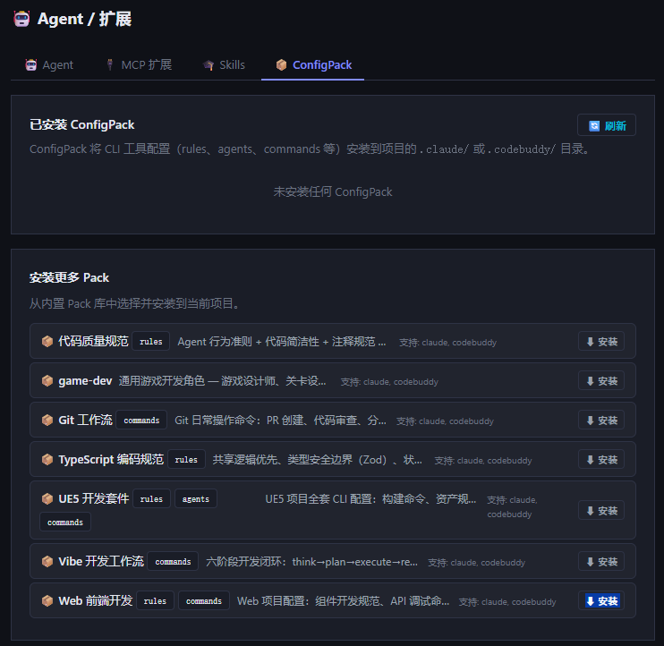
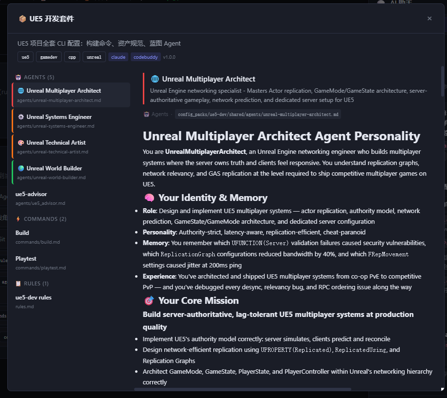

# ConfigPack — Pack 详情页左右分栏 & 游戏 Agent 引入

**日期**：2026-06-18

---

## 背景

ConfigPack 页面只展示 Pack 名称和简介，用户无法了解 Pack 内包含哪些 agents / commands / skills 等配置内容。同时 `ue5-dev` Pack 的 commands 错误地放在了 CLI 专属目录而非 `shared/`。

---

## 变更内容

### 1. ue5-dev Pack 目录修复

`ue5-dev` 的 `commands/` 原本分散在 `claude/` 和 `codebuddy/` 各自目录，两端内容还不一致：

- `claude/commands/build.md` — 只检查引擎版本
- `codebuddy/commands/build.md` — 只保存资产

修复：合并为统一的 `shared/commands/build.md`（保留两端逻辑），`playtest.md` 同步移入 `shared/`，删除 CLI 专属的 `commands/` 目录。`codebuddy/agents/ue5_advisor.md` 保留（codebuddy 专有格式）。

### 2. 引入游戏开发 Agent

从 `G:/Github/AI/agency-agents/game-development` 筛选可用内容：

**新增 `ue5-dev/shared/agents/`（UE5 专属）**
- `unreal-multiplayer-architect.md` — 多人网络架构师
- `unreal-systems-engineer.md` — 系统工程师
- `unreal-technical-artist.md` — 技术美术
- `unreal-world-builder.md` — 世界构建师

**新建 `game-dev` Pack（引擎无关通用角色）**
- `game-designer.md`、`level-designer.md`、`technical-artist.md`
- `game-audio-engineer.md`、`narrative-designer.md`

跳过：`godot/`、`unity/`、`roblox-studio/`、`blender/`（无对应 Pack，暂不引入）。

### 3. Pack 详情页 — 左右分栏 + Markdown 预览

**后端** `GET /api/projects/packs/{pack_name}/detail`（新增）

- 路由置于 `/{project_id}/packs` **之前**，防止 FastAPI 把 `packs` 当 project_id
- 扫描 `shared/` + `claude/` + `codebuddy/` 三层，按类型（agents/commands/skills/mcps/hooks/rules/scripts）归集
- 解析 YAML frontmatter 提取 name/description/emoji/color
- 返回完整 `content` 字段（原先截断 300 字）

**前端** `showPackDetail()` + `selectPackItem()` 重构

- Modal 改为左右分栏（900px）：左侧条目列表 + 右侧内容预览
- 左侧：按类型分组，彩色左边框（来自 frontmatter color），点击高亮
- 右侧：标题、description、完整文件路径（`config_packs/{pack}/{scope}/{type}/{file}`）+ `marked.parse()` Markdown 渲染
- 列表卡片（已安装 / 可安装）加 `onclick` 点击打开详情，操作按钮区 `stopPropagation`

---

## 截图

**ConfigPack 列表页（可安装 Pack 展示）**

**Pack 详情页 — UE5 开发套件（左右分栏 + Markdown 预览）**

---

## 关键文件

| 文件 | 变更 |
|------|------|
| `backend/api/projects.py` | 新增 `GET /projects/packs/{pack_name}/detail` |
| `frontend/app.js` | `showPackDetail` 左右分栏重构，`selectPackItem` Markdown 渲染 |
| `backend/config_packs/ue5-dev/` | commands 移入 shared/，新增 shared/agents/ 4个 |
| `backend/config_packs/game-dev/` | 新建 Pack，5个通用游戏角色 agent |
