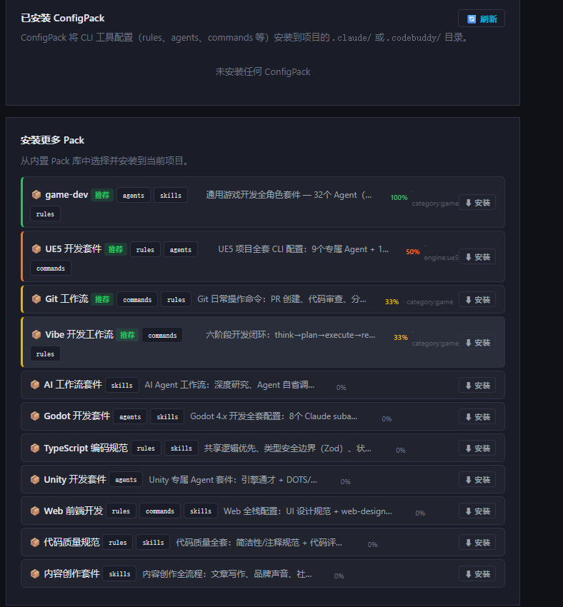

# ConfigPack 套件符合率 — traits 匹配评分与推荐显示

**日期**：2026-06-19

---

## 背景

ConfigPack 页面原来只按字母顺序列出可安装套件，用户无法判断哪些套件与当前项目相关。需要根据项目已检测的 traits 自动计算符合率，推荐最合适的套件并量化显示。

---

## 实现方案

### 符合率计算逻辑

```
match_score = 命中的 auto_traits 数 / pack 声明的 auto_traits 总数
```

例：项目 traits 为 `["category:game", "vcs:git"]`，`ue5-dev` 的 `auto_traits` 为 `["engine:ue5", "engine:ue4"]`，命中 0 个 → 0%。

`game-dev` 的 `auto_traits` 为 `["category:game"]`，命中 1/1 → 100%。

### 后端变更

**`pack_installer.py`**

1. 补全所有 pack 的 `auto_traits`（原来 6 个 pack 缺失）：
   - `godot-dev`: `["engine:godot"]`
   - `unity-dev`: `["engine:unity"]`
   - `game-dev`: `["category:game"]`
   - `ai-workflow`: `["category:ai", "category:app"]`
   - `content-creation`: `["category:content"]`
   - `vibe-workflow`: `["vcs:git", "category:game", "category:app"]`

2. 扩充 `_TRAIT_PACK_MAP`：新增 `engine:godot/unity`、`category:ai/content`，`vibe-workflow` 加入多个 category 触发

3. 新增 `score_pack(pack_meta, project_traits)` 函数：返回 `{match_score, matched_traits, is_recommended}`

**`projects API`**

`GET /{project_id}/packs/available` 增强：
- 读取项目 `traits` 字段
- 对每个可安装 pack 调用 `score_pack()`
- 返回带 `match_score`/`matched_traits`/`is_recommended` 字段
- 结果按 `match_score` 降序排列（推荐的自动置顶）

### 前端变更

可安装 Pack 每条卡片新增：

- **「推荐」badge**（绿色）+ **彩色左边框**（仅有命中时显示）
- **符合率进度条**：
  - 宽度 = 符合率百分比
  - 颜色：100% → 绿，≥50% → 橙，>0% → 黄，0% → 灰
- **命中 trait 名**显示在进度条右侧（如 `category:game`）

---

## 截图



截图说明：项目 traits 为 `category:game`（游戏项目），`game-dev` 命中 100%，`UE5 开发套件` 命中 50%（含 `engine:ue5` 未命中），`Git 工作流` / `Vibe 工作流` 各命中 33%。无关套件统一显示 0% 并排在底部。

---

## 关键文件

| 文件 | 变更 |
|------|------|
| `backend/pack_installer.py` | 补全 auto_traits、扩充 TRAIT_PACK_MAP、新增 score_pack() |
| `backend/api/projects.py` | get_available_packs 注入 match_score，按分排序 |
| `backend/config_packs/*/pack.json` | 6个 pack 补充 auto_traits 字段 |
| `frontend/app.js` | 可安装列表渲染推荐 badge + 进度条 + trait 标签 |
