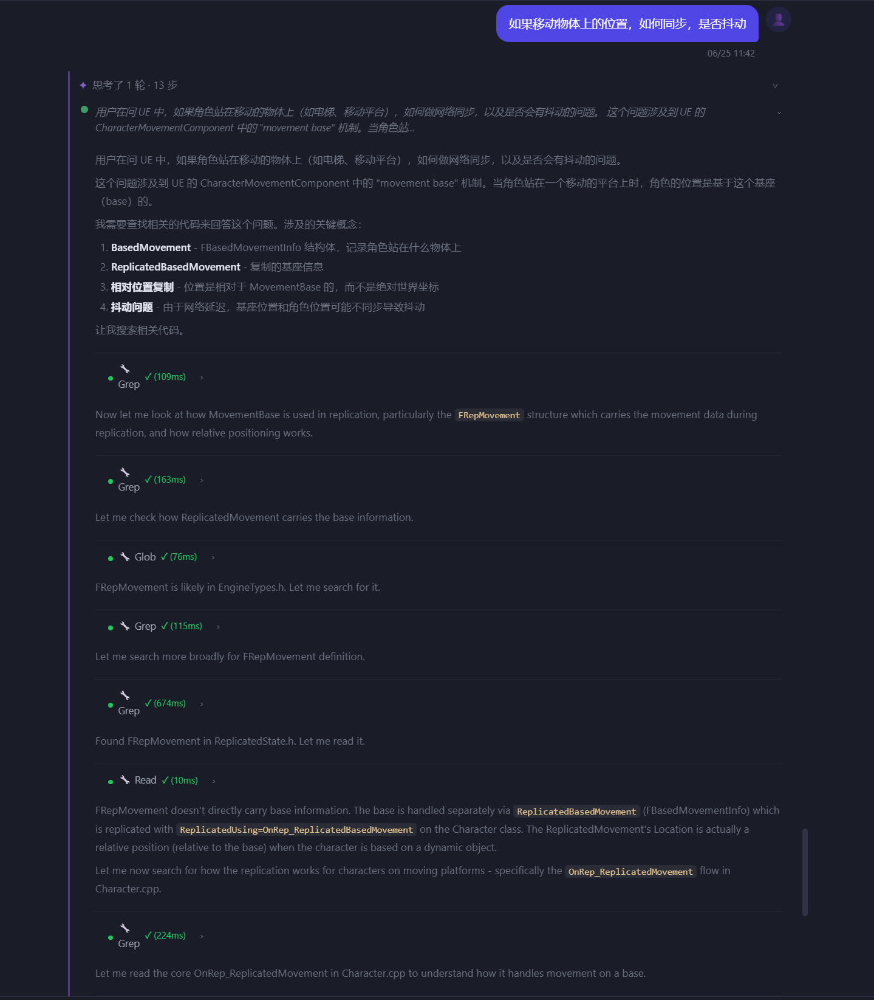

# 2026-06-25 思考面板穿插顺序与历史渲染修复

## 效果

刷新后思考过程按实时顺序展示：思考文字与工具调用穿插，与流式输出时完全一致。



---

## 问题根因

### 1. 历史消息思考面板不显示

`_updateChatPanelForContext` 和 `loadChatHistory` 两处都有 `_globalChatDom` 内存快照优先路径，恢复时直接用 `innerHTML` 覆盖 DOM——快照里没有思考面板，直接跳过了 `appendChatBubble`。

**修复**：移除两处快照优先路径，始终从 DB 重新调 `switchChatSession` 渲染。

### 2. 思考面板高度为 0（CSS）

`chatMessages` 是 `display: flex; flex-direction: column`，子元素 `crp-rounds-panel` 没有 `flex-shrink: 0`，被 flex 压缩成 0 高度。加了 `overflow: hidden` 后内容全被裁掉。

**修复**：`.crp-rounds-panel { flex-shrink: 0; }` 防止被 flex 容器压缩。

### 3. 历史渲染时轮次 body 不展开

`crp-round-body` 默认 `max-height: 0`，需要 `crp-round-expanded` 才展开。`appendChatBubble` 里生成的 round group 漏了该 class。

**修复**：历史渲染时所有 round group 加 `crp-round-expanded`。

### 4. 思考过程顺序丢失（核心问题）

**原因**：后端 `_cur_round["events"]` 记录顺序错误。
- `thinking_delta` 只追加到 `reasoning` 字符串，不写入 `events`
- `thinking_done` 最后才把完整 reasoning 一次性写入 `events`，此时所有工具已经都在里面了
- 导致 events 顺序变成 `[tool1, tool2, ..., thinkingAll]`

**修复**：引入 `_thinking_buf` 缓冲区：
- `thinking_delta` 追加到缓冲区
- `tool_done` 到来时先把缓冲区 flush 成思考块写入 `events`，再写工具
- `thinking_done` 写入尾部剩余思考文字并清空缓冲

```python
# tool_done 时：
if _thinking_buf.strip():
    _cur_round["events"].append({"type": "thinking", "text": _thinking_buf})
    _thinking_buf = ""
_cur_round["events"].append({"type": "tool", **step})
```

### 5. 前端历史渲染支持 events 格式

`appendChatBubble` 中新增 events 路径：有 `events` 字段时按顺序渲染，旧格式（`reasoning + steps`）走兼容路径。

---

## 其他修复

- `scrollChatToBottom`：改为滚动 `chatMessages` 而非 `chatPanelBody`（`chatPanelBody` 现在是 `overflow: hidden`）
- `/tasks` 分屏改为聊天面板右侧侧面板，不再进入全屏分屏模式，修复了进入全屏后无法切换项目的问题
- 旧格式 thinking（平铺步骤数组）改用 `crp-rounds-panel` 渲染，修复了没有 `.chat-thinking-panel` CSS 导致不显示的问题
