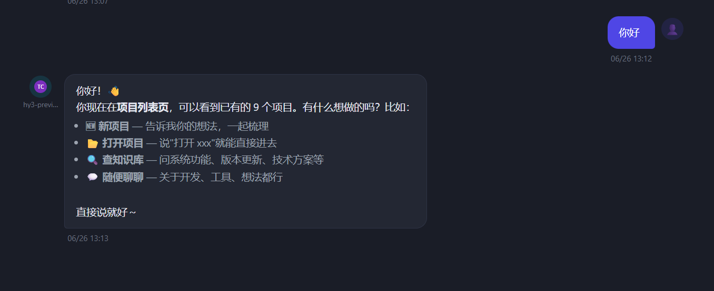

# TClaude CLI 接入修复

**日期**：2026-06-26  
**状态**：已修复 ✅

## 问题描述

TClaude（腾讯内网 Claude Code 包装器，v0.0.3）配置为 CLI 模式后，发消息无回复、无思考，前端消息气泡空白。

后端日志显示命令正常启动，但没有任何内容输出到前端。

## 根因

### 问题 1：`stream-json` 模式缺少 `--verbose` 参数

TClaude 基于 `claude-code 2.1.170`，该版本要求：

```
--print --output-format stream-json 必须配合 --verbose
```

原来的 `tclaude` adapter 没有加 `--verbose`，导致进程启动时直接报错退出：

```
Error: When using --print, --output-format=stream-json requires --verbose
```

但错误输出在 stderr，且 `_reader` 里 `JSONDecodeError` 直接 `continue`，stderr 完全没有被读取，导致静默失败——前端收不到任何内容。

### 问题 2：`result` 块错误提取逻辑错误

原来的错误提取只看 `errors[]` 数组：

```python
errors = obj.get("errors", [])
if errors and not full_text: ...
```

但 TClaude 的错误信息在 `result` 字段：

```json
{"type":"result","is_error":true,"result":"Failed to authenticate. API Error: 403 ..."}
```

### 问题 3：TClaude 需要 IOA 登录

未登录时所有模型返回 403。需要运行 `tclaude login` 完成 IOA 认证。

## 修复内容

### 1. `tclaude` adapter 加 `--verbose`（`llm_client.py`）

```python
"tclaude": {
    "build_cmd": lambda cli, model, prompt: (
        [cli, "--print", "--output-format", "stream-json", "--verbose",
         "--include-partial-messages", "--dangerously-skip-permissions", "--model", model]
        ...
    ),
}
```

### 2. 加 stderr 读取任务，诊断静默失败

新增 `_stderr_reader` coroutine，与 `_reader` 并发运行，将 stderr 内容记录到 `logger.warning`。

### 3. 修复 `result` 块错误提取

```python
err_text = obj.get("result", "") or ""
if not err_text:
    errors = obj.get("errors", [])
    err_text = errors[0] if errors else "未知错误"
```

### 4. 更新 TClaude 可用模型列表

依据 `tclaude /model` 实际输出（v0.0.3）：

| 模型 | Credits |
|------|---------|
| `claude-sonnet-4-6[1m]` | x2.00 |
| `claude-opus-4-8` | x3.33 |
| `claude-opus-4-7` | x3.33 |
| `claude-opus-4-6` | x3.33 |
| `claude-opus-4-6[1m]` | x3.33 |
| `hy3-preview-ioa` | x0.00 |

## 调试技巧

诊断 CLI 接入问题，直接在终端运行完整命令查看原始输出：

```bash
echo "hello" | tclaude --print --output-format stream-json --verbose \
  --include-partial-messages --dangerously-skip-permissions --model hy3-preview-ioa
```

## 效果



TClaude 以 `hy3-preview-ioa` 模型正常响应，前端显示回复气泡。
