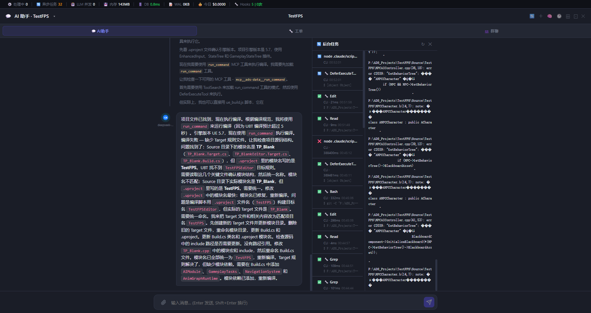

# MCP run_command 实现 + 后台任务面板

**日期**：2026-06-27  
**状态**：已上线 ✅

## 效果



截图展示：AI 助手（deepseek-v4-pro）自主识别 UBT 编译超过 5 秒，主动调用 `run_command` MCP 工具执行编译，后台任务面板实时显示工具调用列表和输出内容。

---

## 背景

TClaude/CLI 模式下，AI 执行 Bash 工具时采用阻塞方式——命令跑完才返回 `tool_result`，中间完全没有进度输出。UBT 编译动辄 2~5 分钟，用户只能等待，无法感知进度。

---

## 核心改动：MCP `run_command` 工具

### 工具定义（`backend/ads_data_mcp_server.py`）

```python
@mcp.tool()
async def run_command(command, cwd="", timeout_s=600, project_id=""):
    """
    执行 shell 命令并将输出实时推送到前端后台任务面板。
    适合耗时超过 5 秒的命令：UBT 编译、打包、批处理脚本等。
    返回结构化结果：{ exit_code, success, duration_s, stdout_tail(最后200行) }
    """
```

### 工作原理

```
AI 调 run_command(command="UBT ...")
  ↓
后端 asyncio.create_subprocess_shell 启动子进程
  ↓
每读取一行 stdout → POST /api/internal/cli-task-event {cli_task_line}
  ↓
ADS 后端收到 → 追加到内存任务表 → SSE 推送到前端
  ↓
前端任务面板实时滚动显示每一行输出
  ↓
命令结束 → 推送 {cli_task_done, exit_code, duration_s}
  ↓
返回给 AI：{ exit_code, success, duration_s, stdout_tail(最后200行) }
  ↓
AI 拿到结构化结果，继续推理（知道成功/失败/错误原因）
```

### 与 Bash 工具的区别

| | Bash 工具 | run_command MCP |
|---|---|---|
| 执行方式 | TClaude 内部执行 | ADS 后端独立 spawn |
| 进度可见 | ❌ 等命令结束才返回 | ✅ 逐行实时推送 |
| AI 感知结果 | 纯文本 stdout（可能被截断）| 结构化 JSON（exit_code/success/stdout_tail）|
| 适用场景 | 短命令（ls/git/cat）| 长命令（UBT/打包/批处理）|

---

## 后台任务面板（`/tasks`）

### 功能说明

- **自动弹出**：AI 调用任何 CLI 工具时，面板自动打开，无需手动触发
- **历史记录**：保留本次会话所有工具调用历史（完成 ✅、失败 ❌、运行中 🔄）
- **任务详情**：左侧列表点击任务，右侧显示完整输出
- **不阻塞对话**：面板独立于聊天气泡，不影响对话流

### 列表项信息

```
✅ Bash                    ← 状态图标 + 工具名
CLI · 3075ms  18:08:08    ← 耗时 + 时间戳
$ cd "F:\ADS_Projects\... ← 执行的具体指令（截断60字符，hover显示完整）
```

### 右侧输出区格式

```
✓ 完成 (3075ms)
$ cd "F:\ADS_Projects\TestFPS" && "G:\EpicGames\..."
────────────────────────────────────────
[ue_build] 项目: TestFPS
[ue_build] 引擎: UE 5.7
...
```

---

## MCP 注入修复（`backend/llm_client.py`）

TClaude 2.1.170+ 版本中，MCP server 必须通过 `--mcp-config` 参数注入，而非 `--settings`：

```python
# 修复前（无效）
flag = "--settings"   # tclaude/claude-internal 下 mcp_servers 始终为 []

# 修复后
if cli_type in ("codebuddy", "tclaude", "claude-internal"):
    flag = "--mcp-config"   # mcp_servers: [{'name': 'ads-data', 'status': 'connected'}]
```

---

## 内部事件 API（`backend/api/chat.py`）

MCP server 是独立进程，不能直接访问 event_manager，通过 HTTP 回调转发：

```
MCP run_command → POST /api/internal/cli-task-event
                    ↓
                ADS 后端更新内存任务表
                    ↓
                SSE 推送到前端（project:{id} 或 global 频道）
```

事件类型：
- `cli_task_start`：任务创建，前端打开面板并插入列表项
- `cli_task_line`：一行输出，前端追加到右侧输出区
- `cli_task_done`：任务结束，前端更新状态图标 + 耗时

---

## System Prompt 指引

在 `chat_assistant.py` 中明确告知 AI：

```
## 长命令执行规范（重要）
对于预期耗时超过 5 秒的命令，必须使用 MCP 工具 run_command 而非 Bash：
- 必须用 run_command 的场景：Build.bat、UnrealBuildTool.exe、RunUAT.bat 等
- 短命令（git status、ls、cat 等）继续用 Bash
```

---

## TClaude 版本更新记录

| 版本 | 变化 |
|---|---|
| v0.0.3 | 初始接入，`--verbose` 必需，模型名 `hy3-preview-ioa` |
| v0.0.7 | 模型名改为 `claude-hy3-preview`，新增 `claude-opus-4-8[1m]` 等 |
| v2.1.186 | Claude Code 底层升级（`--print` 模式 403 问题与 proxy token 相关）|

> **注意**：TClaude `--print` 模式（headless）需要 proxy token 有效。`tclaude login` 后需 `tclaude daemon restart` 刷新 proxy。
