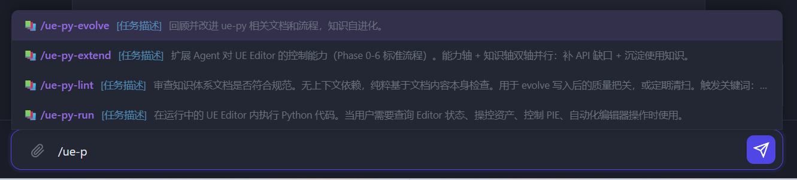
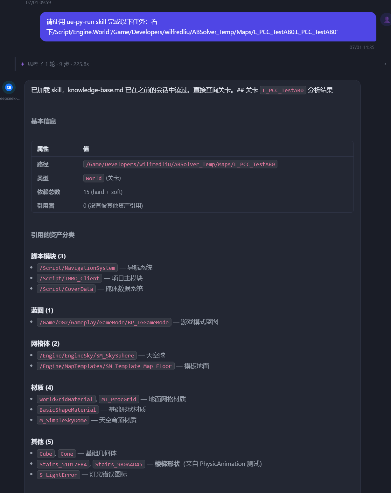

# 斜杠命令支持项目 Skill（含 .codebuddy/skills）

**日期**：2026-07-01
**状态**：已上线 ✅

## 效果



输入 `/ue-p` 时，补全下拉列出项目本地的 Skill（`ue-py-evolve` / `ue-py-extend` / `ue-py-lint` / `ue-py-run`），带 📚 标识与 skill 描述。



敲 `/ue-py-run 看下 <关卡路径>`，前端转成一条聊天消息交给 AI；AI 自动 `load_skill` 加载 `ue-py-run` 全文，连上运行中的 UE Editor 查询关卡依赖并结构化输出。

---

## 背景

用户在 OG 项目里敲 `/ue-py-run` 报「未知命令」。排查发现 `ue-py-run` 是项目仓库 `.codebuddy/skills/ue-py-run/SKILL.md` 定义的 **Skill**，不是 command。

问题有两层：

1. **Skill 和斜杠命令是两套独立机制，没打通**
   - 命令：硬编码在 `commands.py` 的 `handlers` 字典，敲 `/xxx` 走分发器，查不到就「未知命令」。
   - Skill：由 AI 在对话中自主调 `load_skill` 加载，用户无法用 `/` 触发。

2. **`.codebuddy/skills/` 根本没进入 Skill 系统**
   - Skill 索引（`chat_assistant.py`）和 `load_skill` 只扫 `.ads/skills`、`.Agent/skills`，不认 `.codebuddy/skills`、`.claude/skills`。
   - 所以 `ue-py-run` 对 AI 也完全不可见。

---

## 核心改动

### 第一层：让 `.codebuddy/skills/` 进入 Skill 系统

`backend/actions/chat/load_skill.py` 新增 `_enum_project_skill_dirs(project_id)`，枚举全部四套目录（存在才返回、去重），并并入 `extra_paths` 里的项目路径：

```python
for sub in (".ads/skills", ".Agent/skills", ".codebuddy/skills", ".claude/skills"):
    d = base / sub
    if d.exists() and d not in dirs:
        dirs.append(d)
```

改造三个「枚举 / 加载」点走新函数（写入 install 仍用原单目录 `_get_project_agent_skills_dir`）：

- `_get_available_skill_ids` 的 Layer 4
- `_load_agent_skill`（按 `agent.<name>` 在多目录里找 `SKILL.md`）
- `chat_assistant.py` 的 skill 索引拼接

效果：`.codebuddy/skills/ue-py-run` 以 `agent.ue-py-run` 身份进入索引 → **AI 对话中能自动 `load_skill` 加载它**。

### 第二层：斜杠 `/` 触发 Skill

`backend/api/commands.py`：

- `list_commands` 合并一路项目 Skill 作为 `source="skill"` 伪命令（`_list_project_skills_as_commands`）→ **进补全下拉**。
- `_dispatch_command` 加回退：handler 没命中但匹配到 skill 时（`_match_project_skill`），返回 `{type:"run_skill", skill_id, skill_name, args}`，不再「未知命令」。

`frontend/app.js`：

- `_handleSlashCommand` 收到 `run_skill` 时，转成一条聊天消息走 `sendChatMessage`，让 AI 加载 skill 全文后自主执行：

  ```js
  input2.value = task
      ? `请使用 ${sk.skill_name} skill 完成以下任务：${task}`
      : `请加载并使用 ${sk.skill_name} skill，先向我说明它能做什么。`;
  sendChatMessage();
  ```

- 补全下拉给 skill 项加 📚 标识，与命令区分。

---

## 执行方式选择

斜杠触发 skill 后有两种执行方式，选了 **注入 skill + AI 执行**（符合 skill 原生语义）：`/ue-py-run` 把 skill 全文注入对话，后面接用户参数作为任务，AI 读完 skill 后自主执行（含真正连 UE Editor 跑 Python）。

---

## 验证

真实 DB 端到端测试（OG 项目 `PRJ-20260629-2c0c9e`，repo=`I:\A_Works\OG2\UnrealEngine_Code_Inner`）：

```
dirs= ['...\.codebuddy\skills', '...\.claude\skills']
match ue-py-run= agent.ue-py-run
loaded name= ue-py-run len= 1466
skills-as-commands count= 49
```

- 该项目 49 个 skill 全部可作斜杠命令暴露。
- 敲 `/ue-py-run 看下 <关卡路径>` → AI 加载 skill、连 UE Editor、结构化输出关卡依赖（见上方截图）。

---

## 改动文件

- `backend/actions/chat/load_skill.py` — `_enum_project_skill_dirs` + 多目录枚举/加载
- `backend/agents/chat_assistant.py` — skill 索引多目录
- `backend/api/commands.py` — skill 进补全 + `run_skill` 回退分发
- `frontend/app.js` — `run_skill` 转聊天消息 + 📚 标识
