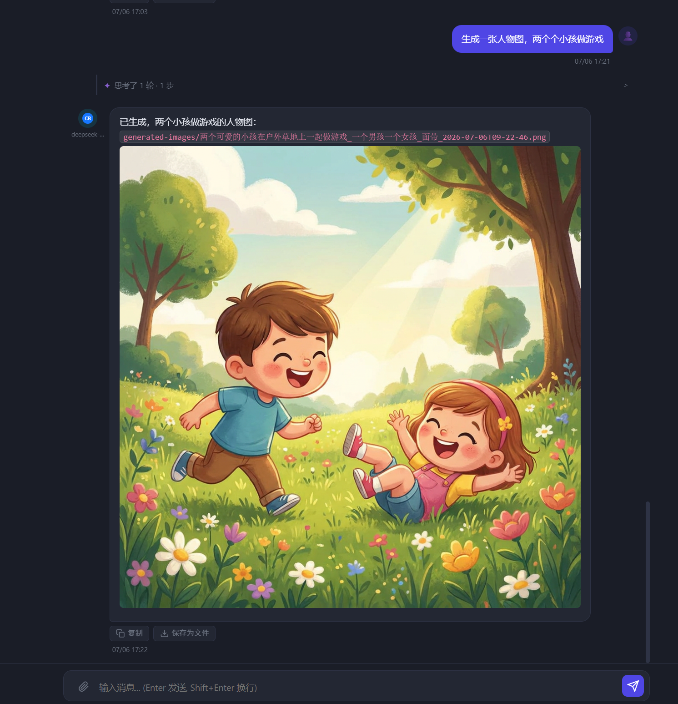

# AI 生图功能实现

日期：2026-07-06

## 功能概述

在 AI 助手对话中支持生图：AI 识别意图 → 生成参数确认卡片 → 用户确认 → 入队生图 → 聊天消息内渲染图片。

## 实现内容

### 1. GENERATE_IMAGE Action（后端）

**`backend/actions/chat/generate_image.py`**（新建）

- `GenerateImageAction`：识别到"生图/画一张"意图时，输出参数卡片（不直接入队）
- 字段：`prompt`（英文，必须）、`engine`（默认空=系统默认）、`aspect_ratio`（默认 1:1）、`image_size`（默认 2K）

**`backend/api/chat.py`**

- 注册 `GENERATE_IMAGE` → `GenerateImageAction` 到 `_ACTION_MAP`
- 新增 `POST /confirm-generate-image` 端点：用户确认后调 `image_processor.request_image()` 入队
- 系统提示追加生图指令说明（触发条件、字段格式）

### 2. 生图参数卡片（前端）

**`frontend/app.js`**

- `renderGenerateImageCard(action)`：prompt textarea + engine/ratio/size 三个下拉
- `doConfirmGenerateImage(cardId)`：POST 入队，成功后显示入队 tag + 跳转图片队列链接
- dispatch 分支和 `renderActionStateSummary` 均加入 `generate_image` 类型

### 3. LightAI 测试修复

**`backend/api/image_gen.py`**

- `TestLightAIRequest` 接受请求体中的 `api_key` / `api_base`
- 测试端点优先用请求体中的 key，未保存也能直接测试
- payload 的 `service_name`/`api_name` 改为 `connectivity_check`（与 ComicAI 保持一致）

### 4. CLI Session Resume 自动重试

**问题**：codebuddy CLI `--resume <session_id>` 失败时（session 已过期），返回 `{"type":"error","error":"No conversation found with session ID: ..."}`, 系统把错误当正常文本输出，AI 不响应。

**修复链**：

| 文件 | 改动 |
|------|------|
| `backend/llm_client.py` | `_reader()` 检测 `type=error` + resume 失败关键词，queue 推 `resume_failed` 事件 |
| `backend/query_engine/events.py` | 新增 `CliResumeFailedEvent` dataclass |
| `backend/query_engine/engine.py` | 收到 `cli_resume_failed` 转发 `CliResumeFailedEvent` 并 return |
| `backend/agents/chat_assistant.py` | 捕获事件 → 清 DB `cli_session_id=NULL` → 重建 `engine2`（`resume_session_id=""`）→ 直接重跑，不递归调用 |

### 5. 生图结果图片渲染

**问题**：AI 回复的 Markdown `` 无法渲染，且 Windows 绝对路径浏览器无法访问。

**修复**：

- `backend/main.py`：挂载 `/generated-images/` 静态路由
- `frontend/app.js` `formatChatContent`：正则替换 Windows 绝对路径 → `/generated-images/文件名`
- `frontend/app.js` `_inlineFormat`：加入 `` → `` 渲染，URL 做 `encodeURIComponent` 处理中文文件名

## 效果截图

两个小孩做游戏的人物图（nano-banana pro 生成）：

