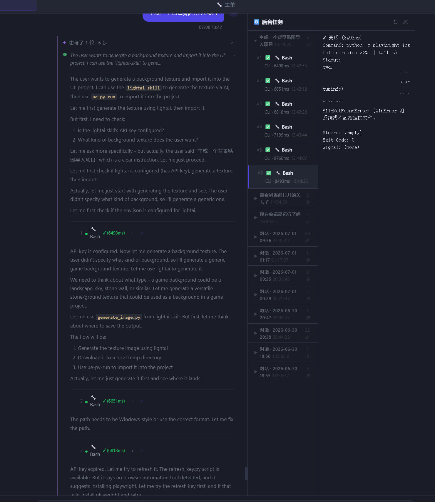

# 后台任务面板改进记录

**日期**：2026-07-08  
**分支**：main（从 feat/slash-skill-and-task-session-binding 合并）

---

## 问题背景

后台任务面板存在以下问题：

1. **无法按对话分组**：所有工具调用共用同一个 `chat_session_id` 作为 `session_key`，同一会话内所有任务堆在一组，无法区分不同对话轮次
2. **思考步骤编号与后台任务 # 不对应**：思考面板序号取全局位置，后台面板按组内编号，两者不一致
3. **时间戳显示 UTC**：`created_at` 存储 UTC，直接 `.slice(11,19)` 截取，本地时间相差 8 小时
4. **刷新后任务消失**：前端用 `chat_session_id` 过滤 DB，但 `session_key` 已改为 `msg_group_key`，两者不匹配
5. **会话排序混乱**：最新会话在中间，历史积累后无法快速找到当前对话的任务
6. **无折叠功能**：历史任务多时全部展开，列表极长

---

## 修复内容

### 1. 消息级分组 key（`msg_group_key`）

**`backend/api/chat.py`**：
- `ChatRequest` / `GlobalChatRequest` 新增 `msg_group_key` 字段
- 流式端点取 `msg_group_key`（每次发消息唯一），兜底用 `session_id`
- `_cli_task_add` 改用 `msg_group_key` + 消息内容前30字作为 `session_label`

**`frontend/app.js`**：
- `_sendChatStreaming` 请求体加入 `msg_group_key = _cliCurrentSession.key`（`sess_${Date.now()}` 格式）
- 每次发消息 `_cliSessionBegin` 生成新 key，后端任务与之绑定

### 2. 思考步骤编号与后台任务 # 统一

思考面板步骤序号改为取当前对话组内（`session_key` 相同）的位置，与后台任务面板 `#1`、`#2` 严格对应。

### 3. 时间戳本地化

```js
// 修复前
t.created_at.slice(11, 19)  // UTC 时间

// 修复后
new Date(t.created_at).toLocaleTimeString('zh-CN', {hour12: false})  // 本地时间
```

### 4. 刷新后任务恢复

去掉 `?session_id=` 过滤参数，直接拉全部历史任务，前端按 `session_key` 切组。

### 5. 会话排序 + 折叠

- 会话组按最后任务时间**倒序**，最新对话始终在顶部
- 组头显示：对话内容摘要 + 最后任务时间 + 步骤数
- 默认**展开最新组**，其余折叠
- 点击组头切换展开/折叠，状态持久化到 `sessionStorage`

---

## 效果截图



---

## 相关 commit

```
8448a9c fix: 后台任务刷新后消失——不用 session_id 过滤 DB 任务
f767b0c fix: 后台任务时间戳转本地时区
c7df100 fix: 后台任务面板按对话分组 + 思考步骤编号与组内编号对应
845c555 feat: 后台任务按最新会话置顶 + 分组可折叠
```
