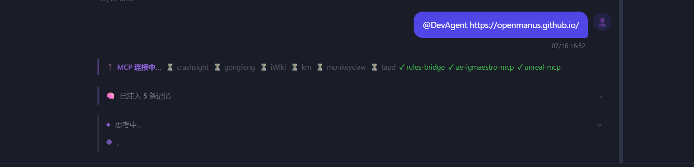

# DevNote · 2026-07-16

**类型**: 功能迭代记录  
**分支**: main

---

## 效果预览

- **@mention 流式思考**：主聊天面板 `@DevAgent`/`@OrchestratorAgent` 等，走完整流式路径（token 逐字输出 + 思考面板工具步骤实时展示），等同于普通聊天体验
- **MCP 连接感知**：发消息时若 MCP Server 正在初始化，思考面板上方出现进度条（`⏳ iWiki  ✓ unreal-mcp`），实时更新，完成后淡出


- **MCP 首次延迟消除**：切换项目时自动预热，首次对话不再等待 60s+ 的串行 MCP 启动

---

## 今日完成内容

### 一、@mention Agent 快速路由（REST 阶段，已被流式替代）

**方案 A 初版**：`@mention` 路由到 `/chat/group` REST 端点，Agent persona 注入，回复带色彩气泡。  
**持久化**：`GroupChatRequest.chat_session_id` + `_save_chat_message`（`action_data.type=group_agent_reply`），刷新后 `loadChatHistory` 可还原 Agent 气泡。

---

### 二、@mention 改走流式路径（Plan 1）

**背景**：REST 路径无思考面板、无 token 流式输出；改走 `/chat/stream` 复用完整流式基础设施。

#### 后端变更（`backend/api/chat.py` + `backend/agents/chat_assistant.py`）

| 变更 | 说明 |
|---|---|
| `ChatRequest.agent` / `GlobalChatRequest.agent` | 新增可选字段，携带 `@mention` Agent 名称 |
| `_chat_stream_generator` / `_global_chat_stream_generator` | 检测 `req.agent`，推 `agent_info` SSE 事件（emoji/color），传 `agent_override` 给 `chat_stream()` |
| `agent_override` 在 `message_done` 时 | 若无其他 action，写入 `group_agent_reply` action，刷新后可还原 |
| `ChatAssistantAgent.chat_stream()` / `chat_global_stream()` | 新增 `agent_override: Optional[str]` 参数，将 Agent persona prepend 到 system_prompt，加"不触发写操作"指令 |

#### 前端变更（`frontend/app.js`）

| 变更位置 | 说明 |
|---|---|
| `sendChatMessage` @mention 分支 | 改调 `_sendChatStreaming('/chat/stream', {agent: resolvedAgent, ...})`，移除手动 bubble/history/handled 代码 |
| `_sendChatStreaming` `agent_info` 事件处理 | 收到后原地修改 `bubbleWrapper`：更换 avatar 为 Agent emoji、插入 Agent 名称行、加主题色左边框 |
| 思考面板空轮次保留 | 修复 `_panelStartTime === 0` 判断，纯文本回复（无工具）也保留 "思考了 0 步 · Xs" 面板 |
| 空轮次 body 提示 | 无工具调用时 body 加"直接生成回复，无工具调用"文字 |

#### Bug：思考面板被"空轮次静默移除"吞掉

**现象**：@mention 回复正常，但无思考面板  
**根因**：`message_done` 后检测 `!hasReasoning && !hasSteps` → `_curRoundEl.remove()` + `_roundCount--` → `_bodyChildren===0 && _roundCount===0` → `_roundsPanel.remove()`  
**修复**：条件改为 `&& _panelStartTime === 0`，有真实轮次时保留面板

---

### 三、MCP 连接非阻塞 + 预热 + 状态感知

**背景**：每次聊天请求调 `list_tool_schemas_for_project()`，串行 `await conn.start()` 每个超时 20s，首次对话延迟 60s+。

#### `backend/mcp_client.py`

| 变更 | 说明 |
|---|---|
| `_warming_up: set` | 跟踪正在后台启动的 server，防止重复启动 |
| `_start_project_server_bg()` | 后台 fire-and-forget 启动单个 server，结果写 `_servers`，不阻塞调用方 |
| `list_tool_schemas_for_project()` | 项目层新 server 改为 `asyncio.create_task(_start_project_server_bg())` 非阻塞，返回当前已 running 工具 |
| `warmup_project_servers(repo_path)` | 新增方法，读项目 MCP 配置后批量预热；**同步** add 到 `_warming_up`（create_task 之前） |

#### `backend/api/projects.py`

- 新增 `POST /{project_id}/mcp/warmup` 端点，触发 `warmup_project_servers`，立即返回

#### `backend/api/chat.py`

- 新增 `_stream_mcp_status_events()` 异步生成器：检查 `_warming_up`，推 `mcp_status` SSE 事件，等待最多 5s（每 0.4s 推一次更新）
- 两个 stream generator 在 LLM 调用前：先 `await warmup_project_servers(repo_path)`，再 `async for ... yield` 推状态事件

#### `frontend/app.js`

| 变更 | 说明 |
|---|---|
| `showProjectDetail()` | 切换项目时 `fetch('/mcp/warmup', {method:'POST'})` fire-and-forget |
| `mcp_status` 事件处理 | 渲染 `#mcpStatusBar`（紫色左边框条），实时显示各 server 状态（⏳/✓/划线） |
| 全部连接完成 | 1.5s 后淡出状态条 |
| `message_done` | `document.getElementById('mcpStatusBar')?.remove()` |

---

## Bug 记录

### appendGroupAgentBubble 气泡写入隐藏容器

**根因**：`getElementById('groupChatMessages') || getElementById('chatMessages')` — 隐藏元素返回非 null  
**修复**：改为 `chatMode === 'group'` 判断

### llm_conversations FK constraint failed（全局 @mention）

**根因**：`set_llm_context(project_id="")` 插入空字符串违反 FK  
**修复**：改为 `project_id=None`

### loading 气泡尺寸过大

**根因**：`_buildAssistantAvatar()` 在 flex 容器里缺少 `width:fit-content`  
**修复**：`_morphTypingToAgent()` 替换为 Agent 样式气泡

### 思考面板被空轮次移除（纯文本回复）

**根因**：`_roundCount===0 && _bodyChildren===0` 时 `_roundsPanel.remove()`  
**修复**：加 `_panelStartTime===0` 条件，有轮次时保留

### MCP 状态条不显示（_warming_up 时序问题）

**现象**：前端无 MCP 状态条，后台日志显示 MCP server 在 LLM 调用 18s 后才启动  
**根因**：`_stream_mcp_status_events()` 在 `_warming_up` 为空时已执行完毕；`_warming_up.add(name)` 在 `_start_project_server_bg` 任务内部执行（异步），`warmup_project_servers` 返回时 `_warming_up` 仍为空  
**修复**：
- `warmup_project_servers` 和 `list_tool_schemas_for_project` 在 `create_task` **之前**同步 `self._warming_up.add(name)`
- `_chat_stream_generator` 在推状态事件前先 `await mcp_client.warmup_project_servers(repo_path)`

### @mention 刷新后思考面板丢失

**现象**：刷新后 DevAgent 气泡无思考面板（工具调用步骤消失）  
**根因**：`loadChatHistory` / `switchChatSession` 对 `group_agent_reply` 消息调 `appendGroupAgentBubble()`，该函数无 `thinking` 参数，DB 里保存的思考数据被忽略  
**修复**：改为先调 `appendChatBubble(... msg.thinking ...)` 渲染（自动处理新旧 thinking 格式），再对 `container.lastElementChild` 后处理加 Agent 样式；两处都改（`loadChatHistory` + `switchChatSession`）

---

## 关键文件变更

```
frontend/app.js          ← agent_info/mcp_status 事件处理、@mention 流式路由、思考面板修复、MCP 预热调用
                           loadChatHistory/switchChatSession group_agent_reply 含 thinking 还原
backend/api/chat.py      ← ChatRequest.agent、agent_override 传参、agent_info 事件、_stream_mcp_status_events
                           _chat_stream_generator 先 warmup 再推状态
backend/agents/chat_assistant.py  ← chat_stream/chat_global_stream 加 agent_override 参数，prepend persona
backend/mcp_client.py    ← 非阻塞启动、_warming_up 同步 add（create_task 之前）、warmup_project_servers
backend/api/projects.py  ← POST /{id}/mcp/warmup 端点
```
