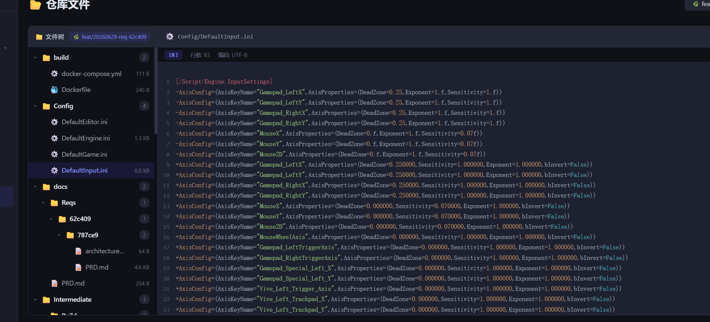

# DevNote · 2026-07-20（三）

**类型**: Bug 修复  
**提交**: `0185130`

---

## 仓库文件查看器行号错位

**现象**：文件查看器的行号与代码内容对不上，尤其在有长行或空行的 INI 文件中。



---

### 排查过程（三次错误修法）

| 尝试 | 假设 | 结果 |
|---|---|---|
| 1 | CRLF `\r\n` 导致行数翻倍 | 加了 normalize，行数不再翻倍，但仍错位 |
| 2 | `join('\n')` 在 `<pre>` 里产生多余空行 | 改为 `join('')`，空行问题消失，但仍错位 |
| 3 | 长行折行导致 gutter 高度偏移 | 加 `overflow-x:auto` + `white-space:pre`，长行不折了，但仍错位 |

### 根本原因

**双列架构本身不可靠**：`.code-gutter`（flex 列）和 `.code-content`（`<pre>` 列）是两个独立 DOM 元素，只要两者行高有任何微小差异就会累积偏移：

- `<pre>` 的 padding 影响首行位置
- 空行高度、hljs 输出行数与原始内容行数不一致等

### 最终修复（`0185130`）

**改为行号内联架构**：行号 `<span class="line-num">N</span>` 直接放在每行 `.code-line` 内容前，物理上一对一绑定，不可能错位。

```html
<!-- 之前：两列可能偏移 -->
<div class="code-gutter">
    <span class="line-num">1</span>
    <span class="line-num">2</span>
</div>
<pre class="code-content">
    <span class="code-line">line1 content</span>
    <span class="code-line">line2 content</span>
</pre>

<!-- 之后：行号内联，永远对齐 -->
<pre class="code-content">
    <span class="code-line"><span class="line-num">1</span>line1 content</span>
    <span class="code-line"><span class="line-num">2</span>line2 content</span>
</pre>
```

同时以 `lines` 数组（原始内容按 `\n` 分割）为行数基准，hljs 输出行数不匹配时回退到原文本，杜绝越界。

---

## 关键文件变更

```
frontend/app.js      ← renderCodeWithLineNumbers 改为行号内联，移除 gutterHtml
frontend/styles.css  ← .code-gutter display:none，.line-num 改为 inline-block
```
