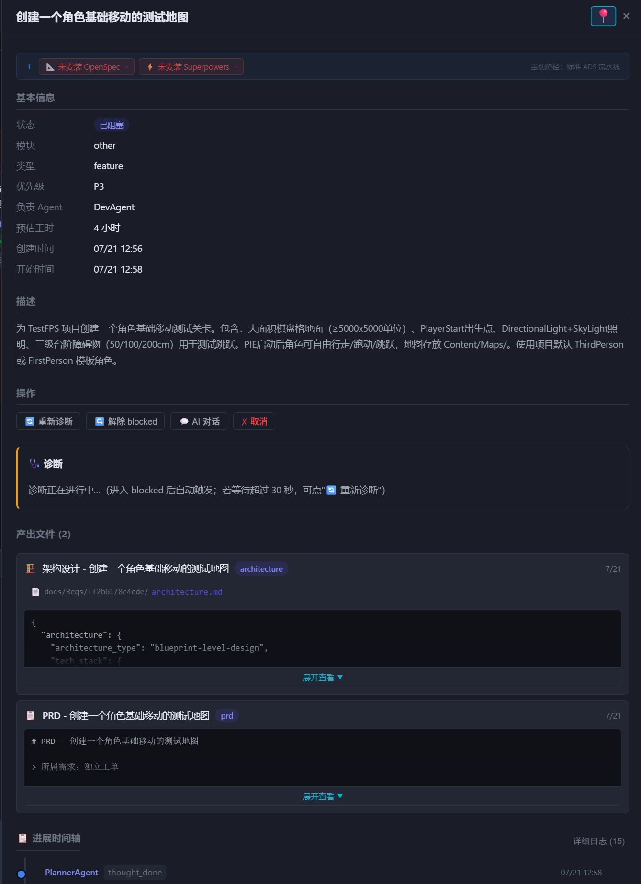

# DevNote · 2026-07-21

**类型**: 功能实现  
**提交范围**: `80e9149` → `5aec5a0`

---

## 效果预览



未安装 OpenSpec/Superpowers 时，工单抽屉顶部显示提示横幅，告知当前执行路径。

---

## 一、三层融合 P0 地基（`80e9149`）

### DB 变更

| 新增内容 | 说明 |
|---|---|
| `ticket_phase_status` 表 | 阶段状态 + reset_count，支持阶段重置 |
| `ticket_spec_versions` 表 | Specs 版本历史快照 |
| `ticket_logs.layer` 列 | spec/discipline/harness 三层标注 |
| `tickets.openspec_stage` | proposed/applied/verified/archived |
| `tickets.spec_version` | 当前 specs 版本号 |
| `tickets.change_count` | 需求变更次数 |
| `tickets.source_ticket_id` | Breaking change 来源工单 |

### `capability_check.py`（新文件）

- `has_superpowers(project_id, repo_path)` — 检测 Pack 安装
- `has_openspec(project_id, repo_path)` — 检测 CLI + `openspec/` 目录
- `load_superpowers_skills(repo_path, skills)` — 读取 SKILL.md 内容
- `get_openspec_cli()` / `ticket_has_specs()` 辅助函数

### `orchestrator.py` 新增方法

- `reset_phases(ticket_id, from_phase, reason)` — 阶段重置，累计 reset_count，超 3 次自动 blocked
- `post_milestone_comment(ticket_id, message)` — 里程碑系统通知（评论 + SSE）
- `_add_layer_log(ticket_id, action, layer, detail)` — 带 layer 字段的时间轴日志

### `agents/dev.py` Superpowers 注入

- `_inject_superpowers()` — 检测 Pack → 注入 4 个核心 SKILL.md → 写 discipline 日志
- `_do_develop()` 开头调用，无 Pack 时静默跳过，不影响原有执行路径

---

## 二、工单能力提示横幅（`5aec5a0`）

### 功能

工单抽屉顶部显示三层能力状态：
- 未安装 OpenSpec → `📐 未安装 OpenSpec →`（红色 chip，点击跳转安装页）
- 未安装 Superpowers → `⚡ 未安装 Superpowers →`
- 全装了 → 不显示横幅
- 右侧显示当前执行路径（标准 ADS / ADS+纪律 / ADS+规范 / 完整三层）

### 实现

- `_buildCapabilityBanner(hasSP, hasOS)` 函数生成 HTML
- `.cap-banner` / `.cap-missing-chip` CSS 样式
- 点击 chip 调 `switchTab()` 跳转对应安装页

---

## 三、OpenSpec init 交互问题修复（`5aec5a0`）

**问题**：`openspec init` 有交互式 harness 选择器（↑↓ Space Enter），控制台只有输出流无法输入。

**修复**：
- `_stream_command()` 新增 `stdin_input` 参数
- `init` 命令自动注入 `b"\n\n\n\n\n"` 模拟 Enter 键确认默认选择
- 默认已选 Claude Code + CodeBuddy，符合 ADS 使用场景
- UI 加说明：「ADS 将自动确认默认配置（Claude Code + CodeBuddy）」

---

## 关键文件变更

```
backend/database.py          ← 新表 + 新列
backend/capability_check.py  ← 新文件，能力检测函数
backend/orchestrator.py      ← reset_phases + post_milestone_comment + _add_layer_log
backend/agents/dev.py        ← _inject_superpowers，Superpowers 纪律注入
backend/api/openspec.py      ← _stream_command 加 stdin_input，init 自动确认
frontend/app.js              ← _buildCapabilityBanner，工单抽屉能力横幅
frontend/styles.css          ← .cap-banner / .cap-missing-chip 样式
frontend/index.html          ← OpenSpec init 交互说明提示
```

---

## 相关文档

- `docs/20260721_02_ADS三层融合架构方案.md` — 完整方案设计
- `backend/config_packs/superpowers/` — Superpowers Pack（14 个 SKILL.md）
