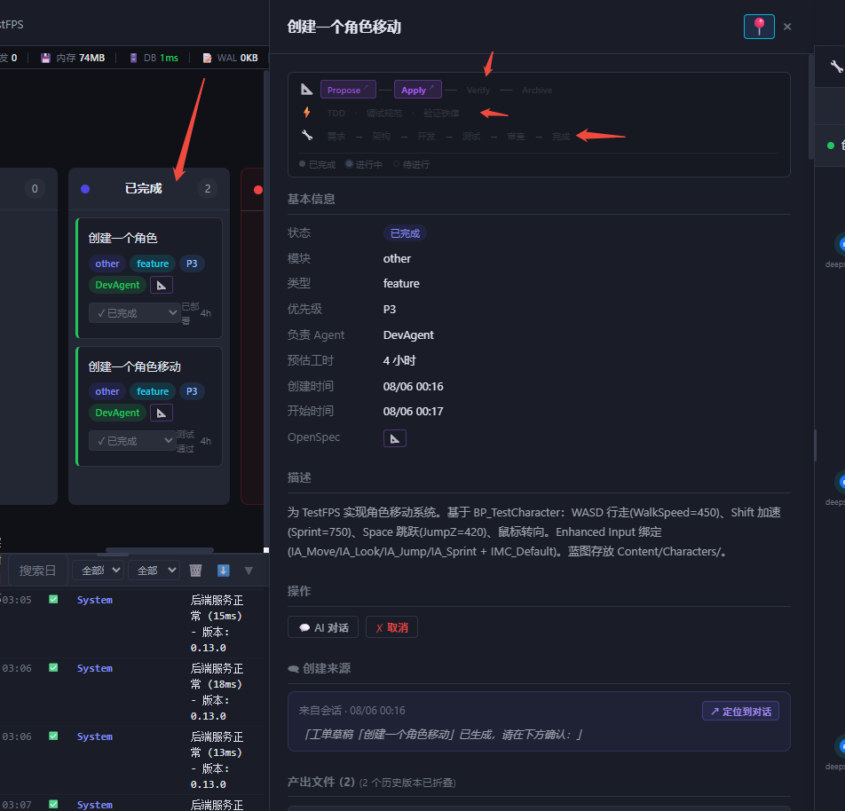

# DevNote · 2026-08-06（四）

**类型**: OpenSpec Apply 接入开发路径 + 工单草稿确认卡状态持久化  
**状态**: 已合入本次提交  
**验证对象**: TestFPS 工单「创建一个角色移动」（`TK-20260806-*`，看板「已完成」）  
**活库**: `backend/data/ai_dev_system_new.db`

---

## 一、截图（完成态）

工单跑通后，三层条规范层 **Propose → Apply** 点亮，编排层到「完成」，看板列「已完成」：



要点：
- 规范层：Propose / Apply 已完成；Verify / Archive 仍待后续测试与部署挂点
- 纪律层：TDD / 调试规范 / 验证铁律（Superpowers Pack）
- 编排层：需求 → 架构 → 开发 → … → **完成**
- 产出文件：2 个；负责人 Agent：DevAgent

---

## 二、背景：此前「有 OpenSpec 却不跑」

上一轮同名工单 `TK-20260805-2a90da` 证据：
- `openspec_stage = null`，时间轴无任何 `openspec_*`
- 磁盘无 `openspec/changes/c-2a90da/`
- Architect 未走到 `_post_architecture_milestone` 内的 Propose，状态却已进 `architecture_done` → 普通 `WriteCode` → LLM 超时空输出 → UE 无降级 → `blocked`

结论：OpenSpec 的 Apply **不是** CLI 子命令，而是 schema 的 apply 阶段（`openspec instructions apply --json` + 按 `tasks.md` 落地）。ADS 原先只接了 Propose / Verify / Archive，开发仍走 WriteCode。

---

## 三、本次落地

### 1. OpenSpec Apply 接管开发（有 change 时强制）

| 条件 | 路径 |
|---|---|
| 工单有 `openspec/changes/c-xxx/` + `tasks.md` | SkillRunner 跑 `openspec-apply` |
| 有 change 缺 `tasks.md` | **失败**，禁止降级 WriteCode |
| 无 change | 仍走 WriteCode / PlanCodeChange |

实现要点：
- 新增 `backend/skills/executable_skills/openspec-apply/SKILL.md`
- `DevAgent._do_develop` → `_run_openspec_apply`；成功写 `openspec_stage=applied`
- `WriteFileAction` 支持 `write_mode=repo`；新增 `read_repo_file`
- MCP：`instructions` 支持 `apply`；补 `instructions_apply`
- 时间轴 / 三层条：`openspec_apply(_started|_partial|_failed)`

### 2. 聊天「确认创建工单」刷新后状态丢失

根因：MCP 草稿卡在流式期间缓存，`msg_id` 早到绑不上 → 确认后 `action_state` 未落库 → 刷新又变「确认创建」。

修复：
- `mcp-action`：**先落库再 SSE**，`msg_id` 随卡片下发
- pending 缓存 / DOM 都能绑 `messageId`
- `create-direct` 无 `source_message_id` 时按标题回填 pending 草稿
- 拉历史自愈：同名工单已存在 → 卡片改「已创建 + 查看工单」

---

## 四、关键文件

```
backend/skills/executable_skills/openspec-apply/SKILL.md
backend/agents/dev.py
backend/actions/write_file.py
backend/actions/read_repo_file.py
backend/skills/runner.py
backend/capability_check.py
backend/openspec_mcp_server.py
backend/api/chat.py
backend/api/tickets.py
frontend/app.js
frontend/index.html
dev-notes/screenshots/2026-08-06_openspec_apply_ticket_done.png
```

---

## 五、后续（未做）

- Architect 未完成 Propose 时禁止进入 develop（闸门）
- Verify / Archive 与 SOP 测试/部署阶段的状态条对齐体验
- Apply 失败时的有限重试（与 UE LLM invalid 策略一并）
