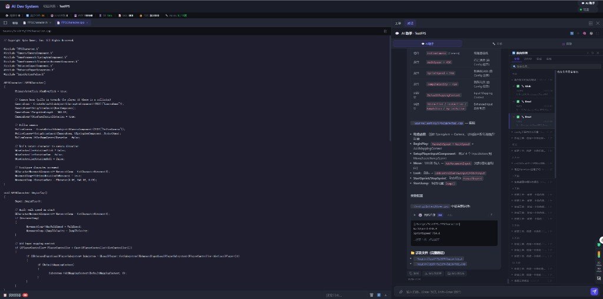

# DevNote · 2026-08-06（四）

**类型**: ADS 界面壳层统一 + 对话文件路径可点击打开  
**状态**: 已合入本次提交  
**验证对象**: TestFPS 项目对话（全屏 → 点路径 → 主舞台打开文件）

---

## 一、截图（完成态）

对话里已记录**仓库相对完整路径**；点击后退出全屏/缩回右侧，主舞台打开对应源文件：



要点：
- 右侧「对话」正文与底部「涉及文件（完整路径）」均为可点链接（如 `Source/TestFPS/FPSCharacter.cpp`）
- 主舞台工作区 Tab：`FPSCharacter.cpp` / `.h`，内容正常加载
- 路径形态：仓库相对路径（非盘符绝对路径），与 git/file API 一致

---

## 二、背景与问题

1. **对话文件点不开**  
   模型常只写裸文件名（`DefaultEngine.ini`），真实位置在 `Config/`；点击后 `git/file` 404「文件不存在」。

2. **全屏对话点路径体验差**  
   默认全屏聊天时，点文件应软退出全屏并在主舞台打开，不能走会 reload 的 `toggleChatFullscreen` 退出分支。

3. **整页上下滚动条**  
   `.project-layout` 高度只减了顶栏，漏算 26px 指标条，总高度多出一截。

4. **为何对话不记完整路径**  
   - 工具层（后台任务）本就有完整路径  
   - 最终回复是模型正文，习惯写短名  
   - CLI `ToolDoneEvent.args_hint` 曾被置空；落库也不附带本轮触及路径

---

## 三、本次落地

### 1. 壳层布局（方案见 `docs/20260806_01_ADS界面壳层与面板统一方案.md`）

- Grid：`S 侧栏 | C 主舞台(+E 底栏) | D 右侧工作台`
- 工单 / AI 对话进 D（Tab + 一键分屏）
- md / 源文件进 C 工作区 Tab（`adsShell.openMain`）
- 全屏聊天：chat 挪到 `body`，避免被 layout `display:none` 藏掉

### 2. 对话路径可点击

- `_inlineFormat` / 裸路径 → `.chat-file-link` → `openRepoFileFromChat`
- 软退出全屏 `_exitChatFullscreenSoft` → 挂回右侧 → `openMain({type:'file'})`
- 后端 `git_manager.resolve_file_path`：裸名 / 前导 `/` / `Config/` 等前缀 / `ls-files` / 磁盘搜索

### 3. 落库记录完整相对路径

- CLI `tool_start` 缓存 input，`tool_done` 写出 `args_hint`（含 Write/Edit/Read）
- 流式 `message_done` 前追加「📁 涉及文件（完整路径）」并写入 `chat_messages`
- 系统提示：引用文件必须写仓库相对完整路径，禁止裸文件名

### 4. 整页滚动条

- `--metrics-bar-height` / `--app-stage-height`
- `.project-layout` / `#projectPage` / `.main-container` 锁死舞台高度，`overflow: hidden`

---

## 四、关键文件

```
frontend/app.js
frontend/styles.css
frontend/index.html
backend/git_manager.py
backend/api/projects.py
backend/api/chat.py
backend/query_engine/engine.py
backend/agents/chat_assistant.py
backend/llm_client.py
docs/20260806_01_ADS界面壳层与面板统一方案.md
dev-notes/screenshots/2026-08-06_chat_file_fullpath_workspace.png
```

---

## 五、验证清单

- [x] 对话中 `Source/.../FPSCharacter.cpp` 可点，主舞台打开且内容正确
- [x] 回复末尾出现「涉及文件（完整路径）」列表
- [x] 全屏点路径：软退出、不整页 reload
- [x] 裸名 `DefaultEngine.ini` 可解析到 `Config/DefaultEngine.ini`（路径解析兜底）
- [ ] 整页无多余上下滚动条（若仍见，硬刷新 `?v=` 缓存）
