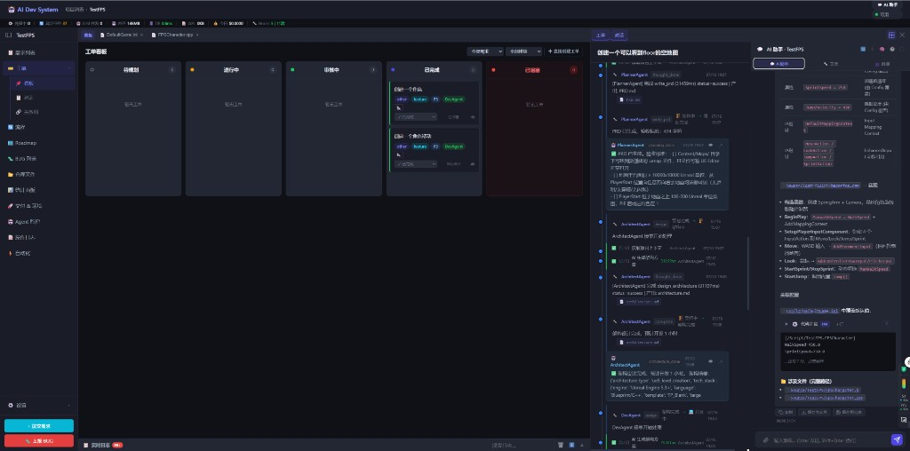
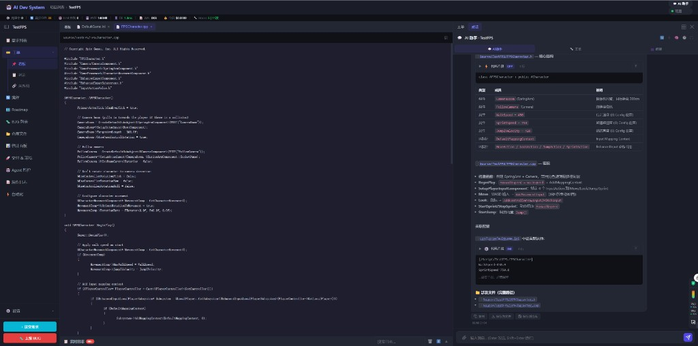

# DevNote · 2026-08-07（一）

**类型**: ADS 壳层主舞台标题栏常驻 + 三栏顶行对齐  
**状态**: 已合入本次提交  
**验证对象**: TestFPS 项目壳层（看板 / 源码 / 右侧工单+对话）  
**前置**: `dev-notes/2026-08-06_02_壳层工作区与对话文件路径可打开.md`

---

## 一、截图（完成态）

主舞台标题栏常驻：侧栏展开钮 + 页面 Tab（看板）+ 打开的文件 Tabs；点「看板」回页面时按钮仍在顶栏，不落到「工单看板」行。



打开源码时同一顶栏，路径条在 Tabs 下方；右侧工作台与主舞台顶行齐平。



要点：
- 无打开文件时也保留标题栏（仅「看板」等页面 Tab）
- 侧栏收起后展开钮始终挂在顶栏左侧
- 「工单看板」退回页内标题 + 筛选控件（不再当第二层 chrome）
- 筛选下拉 /「直接创建工单」压成单行，不再竖排换字

---

## 二、背景与问题

1. **侧栏展开钮位置跳动**  
   有文档且看文件时挂 Tab 栏；点「看板」回页面时因 `mainWsHost` 隐藏，误挂到 `board-header`，与图1不一致。

2. **无文件时没有标题栏**  
   `mainWsTabBar` 仅在 `mainTabs.length > 0` 时显示，空工作区缺少与侧栏/右栏齐平的顶行。

3. **看板筛选控件挤坏**  
   曾把 `board-header` 锁死为 40px shell 标题高，导致下拉与「直接创建工单」换行、顶对齐错乱。

4. **全屏退出顶端留空**  
   软退出全屏后 top-bar / metrics-bar 可能残留 inline，与 `--chrome-top` 不同步。

---

## 三、本次落地

### 1. 主舞台标题栏常驻

- 壳层内 `_renderMainWorkspace` 始终 `display:flex` 显示 `mainWsTabBar`
- `ws-tabbar-active` 标记 content-area；离开项目时隐藏并清 class
- 收起侧栏时 `_syncSidebarToggleInTitle` **只**挂到 `mainWsTabBar`（不再落到 board/page header）

### 2. 三栏顶行统一高度

- `--shell-titlebar-height: 40px`：侧栏标题 / 工作区 Tabs / 右栏 Tabs / 对话 header / 路径条
- `--chrome-top`：顶栏+指标条；全屏时仅指标条，避免退出后「顶端留空」
- 软退出 / `enterProject` 清掉 top-bar、metrics-bar 残留 inline

### 3. 看板页内标题降级

- `board-header`：透明背景、自适应高度，只作「工单看板」+ 筛选
- 筛选 select / 按钮固定 26px、`white-space: nowrap`

---

## 四、关键文件

```
frontend/app.js
frontend/styles.css
frontend/index.html
dev-notes/2026-08-07_01_壳层标题栏常驻与顶行对齐.md
dev-notes/screenshots/2026-08-07_shell_titlebar_kanban.png
dev-notes/screenshots/2026-08-07_shell_titlebar_file.png
```

缓存：`styles.css?v=20260806s` / `app.js?v=20260806s`

---

## 五、验收清单

- [x] 无打开文件：顶栏仍显示页面 Tab（如「看板」）
- [x] 侧栏收起：展开钮在顶栏左侧；点「看板」不落到工单看板行
- [x] 有文件：顶栏 = 展开钮 + 看板 + 文件 Tabs；内容区路径条正常
- [x] 看板筛选与「直接创建工单」单行不换字
- [x] 全屏聊天软退出后顶端无大块留空
