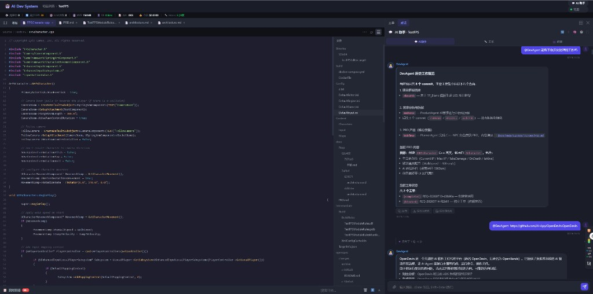

# DevNote · 2026-08-11（二）

**类型**: 主舞台代码文件页 — Cursor 风格查看器  
**状态**: 已落地（强刷前端 `app.js` / `styles.css` `?v=20260811a`）  
**相关**: 语法高亮、行号、Diff View、右上角菜单/搜索/文件树

---

## 一、效果截图



要点可见：

- 面包屑路径 `Source › TestFPS › TestCharacter.cpp`
- 右上角三按钮：菜单 / 搜索 / 文件树
- C++ **语法高亮** + **行号**
- 右侧 **文件树** 面板（可点开其它文件）
- 与右栏 AI 助手并排

---

## 二、改动摘要

主舞台 `#mainWsHost`（`adsShell.openMain`）原先只是纯文本 `<pre>`，无高亮/行号/工具栏。本次对齐 Cursor 文件页：

| 能力 | 说明 |
|------|------|
| ⋯ 菜单 | 复制相对/绝对路径、复制内容、Reveal、开仓库页；开关 Diff View / Line Numbers / Word Wrap |
| ⌕ 搜索 | 文件内查找栏；`Ctrl+F` |
| ☰ 文件树 | 右侧树（`/git/tree`），点击 `openMain` 打开文件 |
| 语法高亮 | hljs，按扩展名映射（含 UE `.cs` / `.uproject` 等） |
| 行号 | 行内 gutter；偏好存 `ads.ws.lineNumbers` |
| Diff View | 当前文件拉 `git/file-diff`，双列行号 + 增删着色 |
| Word Wrap | 偏好 `ads.ws.wordWrap` |

---

## 三、验收

1. 项目壳层打开任意 `.cpp` / `.h` → 有高亮与行号  
2. 右上角 ⋯ 可开关 Diff / 行号 / 换行  
3. ⌕ 或 `Ctrl+F` 可跳转到匹配行  
4. ☰ 打开文件树，点击另一文件切换 Tab  
5. Diff View 开启后显示相对基线的着色 diff  

---

## 四、关键文件

```
frontend/app.js
frontend/styles.css
frontend/index.html
dev-notes/2026-08-11_01_主舞台Cursor风格文件查看器.md
dev-notes/assets/2026-08-11_main-ws-file-viewer.png
```
