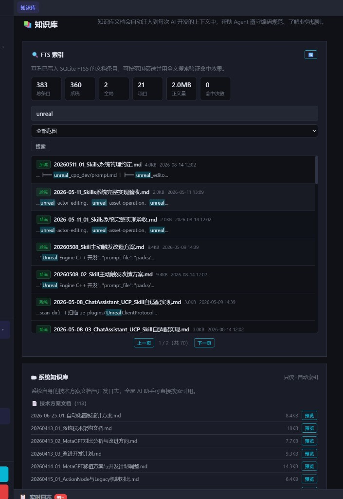

# DevNote · 2026-08-14（一）

**类型**: 知识库 — FTS 索引可视化面板  
**状态**: 已落地（设置 → 知识库 页顶部）  
**相关**: `knowledge_index` / `knowledge_fts`、会话 `search_knowledge`

---

## 一、效果截图

要点可见：

- 顶部 **FTS 索引** 卡片：总条目 / 系统 / 全局 / 项目 / 正文量 / 命中次数
- 搜索词 `unreal`，范围「全部范围」，命中 **70** 条（分页 1/2）
- 结果行带 **系统** 徽章、文件名、大小、时间；snippet 中关键词高亮
- 下方仍是原有「系统知识库」只读列表（技术方案文档等）

截图当时索引规模约：**383** 总条目（系统 360 · 全局 2 · 项目 21 · 正文约 2.0MB）

---

## 二、改动摘要

此前只能在设置页看文档文件列表，无法直接确认 SQLite FTS5 是否入库、搜不搜得到。本次在知识库页增加索引浏览器：

| 能力 | 说明 |
|------|------|
| 统计条 | `knowledge_index` 总量、系统/全局/项目拆分、正文量、`used_count` 合计 |
| 范围筛选 | all / system / global / project |
| 全文搜索 | 调 FTS5，返回 `snippet` 并前端 `**…**` → `<mark>` 高亮 |
| 条目预览 | 点击行 → `GET /api/knowledge/index/{id}` 弹窗看正文（截断 8KB） |
| 分页 | 每页 40 条 |

### API

- `GET /api/knowledge/index` — 列表 + stats + 可选 `q` / `scope` / `project_id`
- `GET /api/knowledge/index/{id}` — 单条预览

### 前端

- `frontend/index.html` — 知识库 Tab 顶部面板
- `frontend/app.js` — `loadKnowledgeIndexBrowser` / 预览弹窗
- `frontend/styles.css` — `.kb-index-*` 样式

---

## 三、验收

| 项 | 结果 |
|----|------|
| 设置 → 知识库 可见 FTS 面板 | ✅ |
| 无关键词列出索引条目 | ✅ |
| 搜 `unreal` 有 snippet 高亮 | ✅（截图 70 命中） |
| 点行可预览正文 | ✅ |
| 与「系统知识库」列表并存 | ✅ |

---

## 四、说明

- FTS **倒排结构本身**仍不可视；本面板可视化的是 `knowledge_index` 源表 + FTS 命中效果。
- 「命中次数」来自 `used_count`（工单 `prior_insights` 等路径累加）；会话工具搜索当前不一定回写该字段。
