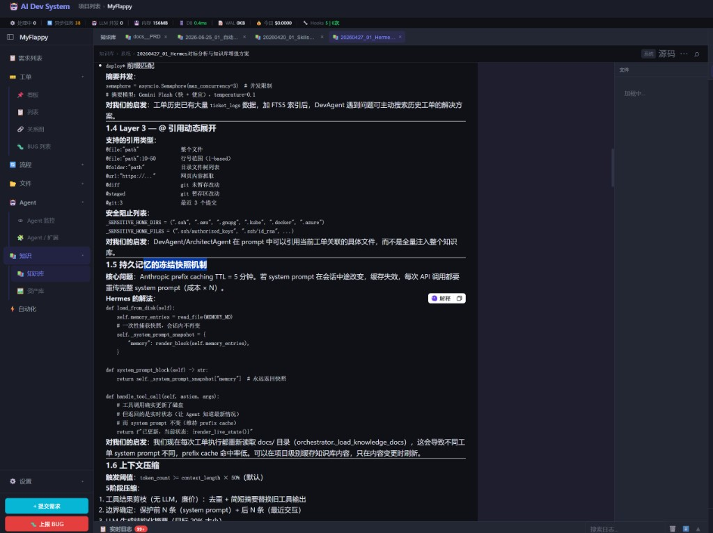

# DevNote · 2026-08-24（一）

**类型**: 知识库 — 主舞台统一阅读体验  
**状态**: 已落地（前端强刷 `?v=20260824b`；后端重启后可配合 `/search-knowledge` 一起生效）  
**相关**: FTS 索引面板（`2026-08-14_01`）、会话 `ads-kb` 链接、侧栏「知识」分组

---

## 一、效果截图

要点可见：

- 侧栏 **知识 → 知识库** 选中；上方文档 Tab：`知识库` 页面 Tab + 多份已打开文档
- 当前文档：`知识库 › 系统 › 20260427_01_Hermes对标分析与知识库增强方案`
- **Markdown 渲染**（标题 / 表格 / 代码块），与仓库 `.md` 文件同一套主舞台
- 右侧可保留 AI 助手；标题栏可切回「知识库」列表页

---

## 二、问题与目标

此前知识库有三套打开方式（FTS 弹窗纯文本、系统文档 `alert`、全局/项目编辑弹窗），会话点 `ads-kb` 也只是覆盖层 `<pre>`，和仓库文件主舞台体验割裂。

目标：**知识库页、会话链接共用同一主舞台查看器**（`type: 'knowledge'`）。

---

## 三、改动摘要

| 入口 | 行为 |
|------|------|
| FTS 索引列表点行 | `openKnowledgeDocViewer(id)` → 主舞台 Tab |
| 系统文档「打开」 | lookup → 同一查看器 |
| 全局/项目文档名 /「打开」 | 同上；「编辑」仍走编辑弹窗 |
| 会话 `[标题](ads-kb:ID)` / 工具结果标题 | `openKnowledgeDocFromChat` → 同一查看器 |

### 主舞台 `knowledge` Tab

- 面包屑：`知识库 / 系统|全局|项目 / 显示名`
- 默认 Markdown 预览，可切源码；支持文内搜索、复制正文
- 无仓库文件树 / Diff（内容来自 SQLite `knowledge_index`，非 git）
- 未进项目壳层时：Markdown 弹窗兜底

### API / 工具

- `GET /api/knowledge/index/{id}`：返回完整正文（上限 200KB）+ `display_name` / `scope`
- `search_knowledge` 结果带 `cite: [标题](ads-kb:ID)`；提示词要求用链接引用

### 侧栏（同期整理）

工单 / 流程 / 文件 / Agent / 知识 / 自动化 / 设置 分组抽屉；知识库、资产库从设置挪到「知识」。

---

## 四、验收

| 项 | 结果 |
|----|------|
| 知识库 FTS 点文档进主舞台 | ✅（截图） |
| Markdown 预览 + 源码切换 | ✅ |
| 会话 ads-kb 链接同体验 | ✅ |
| 与仓库 md 查看器视觉一致 | ✅ |
| 可编辑文档仍可「编辑」保存 | ✅（独立弹窗） |

---

## 五、说明

- 系统 `docs/` / `dev-notes/` 只读；全局/项目文档可编辑。
- Tab id 形如 `kb:{docId}`，重复打开同一文档会复用 Tab。
