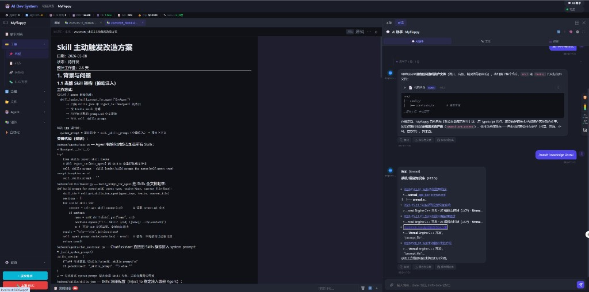

# DevNote · 2026-08-24（二）

**类型**: 知识库 / 斜杠命令 — 链接可点击与查看器收尾修复  
**状态**: 已落地（前端强刷 `?v=20260824b`，后端重启后 `/search-knowledge` 生效）  
**相关**: `2026-08-24_01_知识库主舞台统一查看器.md`

---

## 一、效果截图

要点可见：

- 右侧 AI 助手执行 `/search-knowledge unreal`
- 返回的系统/项目知识库条目已显示为**可点击链接**
- 左侧主舞台同步打开对应知识库文档
- 知识库文档页不再显示无意义的仓库文件树「加载中…」

---

## 二、问题

统一查看器落地后，又暴露出两个收尾问题：

1. `/search-knowledge` 返回 `[标题](ads-kb:123)`，但前端正则只识别 `ads-kb:/123` / `ads-kb://123`，导致链接显示成纯文本
2. 知识库文档虽已走主舞台，但右侧仓库文件树区域仍按全局偏好保留，占位显示「加载中…」

---

## 三、修复

| 项 | 修复 |
|----|------|
| `ads-kb` 链接识别 | 前端改为同时支持 `ads-kb:123` / `ads-kb:/123` / `ads-kb://123` |
| 知识库页文件树 | `type === 'knowledge'` 时直接隐藏文件树，并禁止切换按钮打开 |
| `/search-knowledge` 回退 | 无 `.ads/wiki/` 时不再直接失败，补充回退到 `knowledge_fts` |
| 命令文档 | 更新 `search-knowledge.md`，说明 FTS 回退与可点击链接行为 |

---

## 四、验收

| 项 | 结果 |
|----|------|
| `/search-knowledge unreal` 出现可点击结果 | ✅ |
| 点击结果主舞台打开知识库文档 | ✅ |
| 知识库文档右侧不再显示仓库文件树 | ✅ |
| 无 wiki 项目也能用 `/search-knowledge` | ✅（回退 FTS） |

