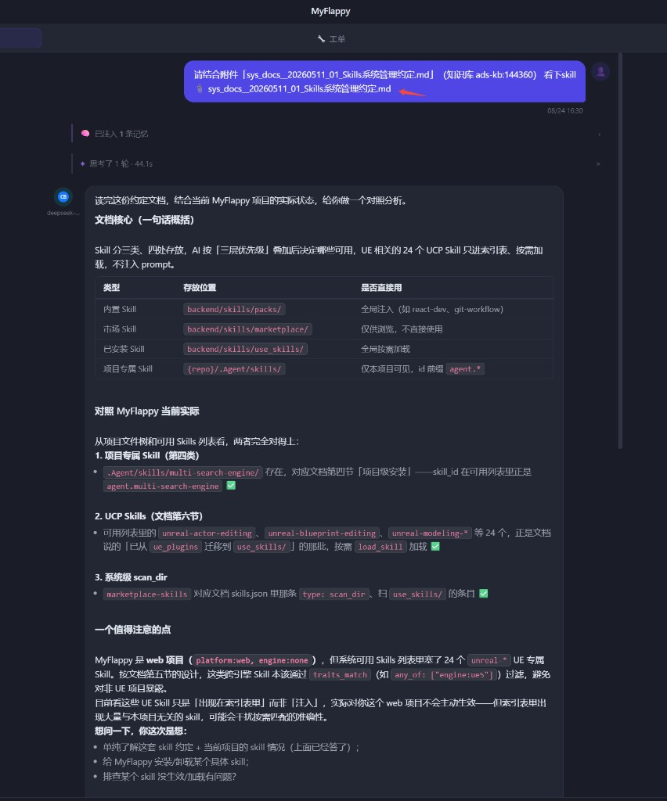

# DevNote · 2026-08-24（四）

**类型**: 主舞台文档菜单 — 引用到 AI 聊天  
**状态**: 已落地（前端强刷 `?v=20260824c`）  
**相关**: `2026-08-24_01` 知识库主舞台查看器、多会话 `newChatSession`

---

## 一、效果截图

要点可见：

- 用户通过文档菜单把 `sys_docs__20260511_01_Skills系统管理约定.md` 挂进会话
- AI 助手在**新会话**中结合附件分析 Skills 体系与 MyFlappy 现状
- 回答含分类表、项目对照、traits 过滤等具体结论（附件内容已注入上下文）

---

## 二、功能说明

主舞台文档 Tab（仓库文件 / 知识库文档）的 ⋯ 菜单新增：

**引用到 AI 聊天**

点击后：

1. 打开右侧 AI 助手面板  
2. **新建一个会话**（`newChatSession`）  
3. 将当前文档全文挂到 `chatPendingDocs`（输入框上方附件卡片）  
4. 预填「请结合附件…」提示，用户可改后发送  

发送时沿用现有附件链路：消息附带 `【附件：文件名】` + 正文，助手可直接基于文档回答。

---

## 三、改动点

| 位置 | 说明 |
|------|------|
| `adsShell.toggleFileMenu` | 知识库 / 仓库文件菜单均增加 `cite-chat` |
| `citeDocumentToChat(tab)` | 读内容 → 开聊天 → 新会话 → 挂附件 → 填输入框 |
| 知识库文档 | 若 `_content` 未缓存，按 `docId` 拉 `/knowledge/index/{id}` |

---

## 四、验收

| 项 | 结果 |
|----|------|
| 知识库文档菜单可见「引用到 AI 聊天」 | ✅ |
| 仓库文件菜单同样可用 | ✅ |
| 点击后新建会话并出现附件卡片 | ✅ |
| 发送后助手能基于文档内容回答 | ✅（截图） |

---

## 五、说明

- 引用的是**当前查看器中的文档内容**，不是仅路径字符串。  
- 大文档会整篇挂附件；超大时仍受既有附件/注入上限约束。  
- 不自动发送消息，由用户确认后再发。
