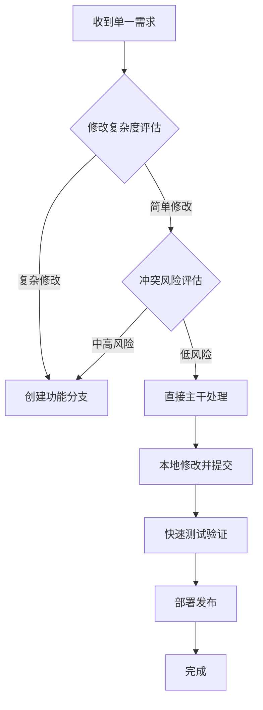

# 20260529_04 单一需求本地处理策略：无需分支方案

## 1. 核心思路

对于简单、独立的单一需求，可以不创建分支，直接在主干（main/develop）上处理：

### ✅ **适用场景**
- **简单Bug修复**：1-2个文件的简单修改
- **文档更新**：README、配置文件修改  
- **UI微调**：样式、布局的小调整
- **紧急修复**：需要快速部署的热修复
- **独立功能点**：与其他修改无依赖关系的功能

### ❌ **不适用场景**
- 复杂功能开发（涉及多个模块）
- 需要多轮测试验证的修改
- 与其他正在进行的修改有冲突风险
- 团队协作场景（多人同时修改）

## 2. 系统现有支持能力

### 2.1 Git Stash安全兜底

```python
# 系统已有实现（actions/ue_editor_control.py）
class UCPAction:
    async def _git_stash_before(self, project_id: str) -> Optional[str]:
        """写操作前 git stash 兜底"""
        repo_dir = self._get_repo_path(project_id)
        rc, out, _ = await git_manager._run_git(repo_dir, "stash", "push", "-m", "auto-stash-before-ucp")
        if rc == 0 and "Saved working directory" in out:
            return out.strip().split(" ")[-1]  # stash@{0}
        return None

    async def _git_stash_pop(self, project_id: str, stash_ref: str):
        """恢复 git stash"""
        repo_dir = self._get_repo_path(project_id)
        await git_manager._run_git(repo_dir, "stash", "pop", stash_ref)
```

### 2.2 工作树清洁检查

```python
# 系统已有实现（api/projects.py）
async def _is_working_tree_clean(path: str) -> bool:
    """判断是否无 uncommitted / untracked 文件（切分支前的安全护栏）"""
    try:
        rc, out, _ = await git_manager._run_git(path, "status", "--porcelain")
        return rc == 0 and not out.strip()
    except Exception:
        return False
```

### 2.3 直接提交模式

系统支持直接在当前分支提交修改：

```python
# Git提交流程（基于git_manager.py模式）
async def commit_directly(project_id: str, message: str, files: List[str] = None):
    """直接提交到当前分支"""
    repo_dir = git_manager._repo_path(project_id)
    
    # 1. 添加修改的文件
    if files:
        for file in files:
            await git_manager._run_git(repo_dir, "add", file)
    else:
        await git_manager._run_git(repo_dir, "add", ".")
    
    # 2. 提交
    rc, _, err = await git_manager._run_git(repo_dir, "commit", "-m", message)
    return rc == 0
```

## 3. 本地处理策略

### 3.1 决策流程



### 3.2 具体实施步骤

#### 3.2.1 安全检查阶段

```python
async def can_handle_locally(project_id: str, change_scope: ChangeScope) -> LocalHandlingResult:
    """判断是否可以本地处理"""
    
    # 1. 检查当前工作树是否清洁
    repo_dir = git_manager._repo_path(project_id)
    is_clean = await _is_working_tree_clean(repo_dir)
    if not is_clean:
        return LocalHandlingResult(can_handle=False, reason="工作树不清洁")
    
    # 2. 检查修改复杂度
    if change_scope.file_count > 3:
        return LocalHandlingResult(can_handle=False, reason="修改文件过多")
    
    if change_scope.estimated_lines > 50:
        return LocalHandlingResult(can_handle=False, reason="修改规模过大")
    
    # 3. 检查冲突风险
    conflict_risk = await assess_conflict_risk(project_id, change_scope)
    if conflict_risk > 0.3:  # 30%冲突风险阈值
        return LocalHandlingResult(can_handle=False, reason="冲突风险过高")
    
    return LocalHandlingResult(can_handle=True)
```

#### 3.2.2 修改执行阶段

```python
async def handle_locally(project_id: str, change_request: ChangeRequest) -> LocalHandlingResult:
    """本地处理单一需求"""
    
    try:
        # 1. 创建备份点（可选）
        backup_tag = f"backup-before-{change_request.id}"
        await git_manager._run_git(repo_dir, "tag", backup_tag)
        
        # 2. 执行修改
        for file_change in change_request.file_changes:
            await apply_file_change(file_change)
        
        # 3. 验证修改
        validation_result = await validate_changes(change_request)
        if not validation_result.success:
            # 回滚到备份点
            await git_manager._run_git(repo_dir, "reset", "--hard", backup_tag)
            return LocalHandlingResult(success=False, error="验证失败")
        
        # 4. 提交修改
        commit_message = f"fix: {change_request.description}"
        await commit_directly(project_id, commit_message, change_request.files)
        
        # 5. 可选：删除备份标签
        await git_manager._run_git(repo_dir, "tag", "-d", backup_tag)
        
        return LocalHandlingResult(success=True)
        
    except Exception as e:
        # 异常回滚
        await git_manager._run_git(repo_dir, "reset", "--hard", backup_tag)
        await git_manager._run_git(repo_dir, "tag", "-d", backup_tag)
        return LocalHandlingResult(success=False, error=str(e))
```

## 4. 风险控制机制

### 4.1 多层安全保障

```python
class LocalChangeSafety:
    """本地修改安全控制器"""
    
    def __init__(self):
        self.safety_layers = [
            self._pre_change_validation,
            self._real_time_monitoring,
            self._post_change_verification
        ]
    
    async def execute_safely(self, change_func: Callable) -> SafetyResult:
        """安全执行修改"""
        
        # 1. 前置验证
        pre_check = await self._pre_change_validation()
        if not pre_check.passed:
            return SafetyResult(success=False, error="前置验证失败")
        
        # 2. 实时监控执行
        with self._change_monitor():
            try:
                result = await change_func()
            except Exception as e:
                return SafetyResult(success=False, error=f"执行异常: {e}")
        
        # 3. 后置验证
        post_check = await self._post_change_verification()
        if not post_check.passed:
            return SafetyResult(success=False, error="后置验证失败")
        
        return SafetyResult(success=True, data=result)
```

### 4.2 紧急回滚策略

```python
class EmergencyRollback:
    """紧急回滚机制"""
    
    async def create_rollback_point(self, project_id: str) -> RollbackPoint:
        """创建回滚点"""
        repo_dir = git_manager._repo_path(project_id)
        
        # 创建临时分支作为回滚点
        rollback_branch = f"rollback-{datetime.now().strftime('%Y%m%d-%H%M%S')}"
        await git_manager._run_git(repo_dir, "branch", rollback_branch)
        
        return RollbackPoint(
            branch_name=rollback_branch,
            commit_hash=await self._get_current_commit(repo_dir)
        )
    
    async def rollback(self, project_id: str, rollback_point: RollbackPoint):
        """执行回滚"""
        repo_dir = git_manager._repo_path(project_id)
        
        # 硬重置到回滚点
        await git_manager._run_git(repo_dir, "reset", "--hard", rollback_point.commit_hash)
        
        # 删除临时分支
        await git_manager._run_git(repo_dir, "branch", "-D", rollback_point.branch_name)
```

## 5. 性能优化策略

### 5.1 轻量级处理流程

```python
class LightweightLocalHandler:
    """轻量级本地处理器"""
    
    async def optimize_local_processing(self, change_request: ChangeRequest):
        """优化本地处理性能"""
        
        # 1. 最小化Git操作
        optimization_strategies = [
            self._batch_git_operations,      # 批量Git操作
            self._skip_unnecessary_checks,   # 跳过不必要的检查
            self._use_incremental_validation # 增量验证
        ]
        
        # 2. 并行处理（如果安全）
        if change_request.parallel_safe:
            await self._parallel_execution(change_request)
        else:
            await self._sequential_execution(change_request)
```

### 5.2 智能缓存机制

```python
class LocalProcessingCache:
    """本地处理缓存"""
    
    def __init__(self):
        self.validation_cache = {}    # 验证结果缓存
        self.risk_assessment_cache = {}  # 风险评估缓存
        self.git_status_cache = {}    # Git状态缓存
    
    async def get_cached_validation(self, file_hash: str) -> Optional[ValidationResult]:
        """获取缓存的验证结果"""
        if file_hash in self.validation_cache:
            cached = self.validation_cache[file_hash]
            if not cached.is_expired():
                return cached.result
        return None
```

## 6. 混合策略实现

### 6.1 动态决策系统

```python
class DynamicBranchingStrategy:
    """动态分支策略"""
    
    async def determine_strategy(self, change_request: ChangeRequest) -> HandlingStrategy:
        """根据需求特征确定处理策略"""
        
        strategy_score = {
            "local": 0,
            "feature_branch": 0,
            "hotfix_branch": 0
        }
        
        # 计算各项得分
        strategy_score["local"] += self._calculate_local_score(change_request)
        strategy_score["feature_branch"] += self._calculate_feature_score(change_request)
        strategy_score["hotfix_branch"] += self._calculate_hotfix_score(change_request)
        
        # 选择最优策略
        best_strategy = max(strategy_score.items(), key=lambda x: x[1])
        
        return HandlingStrategy(
            strategy_type=best_strategy[0],
            confidence=best_strategy[1] / sum(strategy_score.values())
        )
```

### 6.2 渐进式升级机制

```python
class ProgressiveUpgrade:
    """渐进式升级机制"""
    
    async def upgrade_if_needed(self, change_request: ChangeRequest, 
                              current_strategy: HandlingStrategy) -> HandlingStrategy:
        """如果需要，升级处理策略"""
        
        # 监控修改复杂度变化
        complexity_trend = await self._monitor_complexity_trend(change_request)
        
        if complexity_trend.increasing and current_strategy.strategy_type == "local":
            # 从本地处理升级到功能分支
            return HandlingStrategy(strategy_type="feature_branch", confidence=0.8)
        
        return current_strategy
```

## 7. 最佳实践指南

### 7.1 适用场景判断矩阵

| 修改类型 | 文件数量 | 代码行数 | 依赖关系 | 推荐策略 |
|---------|---------|---------|---------|---------|
| Bug修复 | 1-2个 | < 20行 | 无 | ✅ 本地处理 |
| 文档更新 | 1-3个 | < 50行 | 无 | ✅ 本地处理 |
| UI调整 | 1-3个 | < 30行 | 低 | ✅ 本地处理 |
| 功能增强 | > 3个 | > 50行 | 中 | ⚠️ 功能分支 |
| 架构重构 | > 5个 | > 100行 | 高 | ❌ 功能分支 |

### 7.2 操作清单

**开始前检查：**
- [ ] 工作树是否清洁
- [ ] 是否有其他人在修改相同文件
- [ ] 修改是否独立且简单
- [ ] 是否有充分的测试覆盖

**执行中监控：**
- [ ] 实时验证修改正确性
- [ ] 监控冲突风险
- [ ] 准备紧急回滚方案

**完成后验证：**
- [ ] 功能测试通过
- [ ] 无回归问题
- [ ] 及时部署验证

## 8. 总结

单一需求的本地处理策略提供了**轻量级、高效率**的修改方式，特别适合：

1. **简单独立的修改**：避免分支管理的开销
2. **快速响应需求**：缩短从修改到部署的时间
3. **降低复杂度**：减少分支合并的复杂性

**关键成功因素：**
- 严格的前置风险评估
- 完善的安全保障机制
- 智能的策略选择系统
- 实时的监控和回滚能力

通过这种策略，可以在保证安全性的前提下，显著提升简单修改的处理效率。