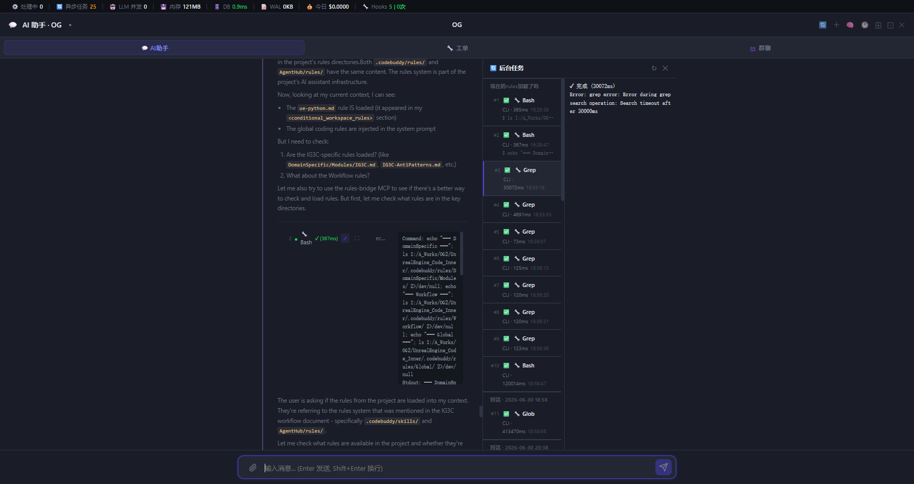

# Workflow 的 N 种存在形式

> 当 AI 要按步骤干活时，"流程"应该写在哪？

---

## 1. 问题：AI 需要流程，但流程放哪？

想象一下：你要让一个新来的实习生做一道红烧肉。你会：

1. 给他一本《烹饪百科全书》，让他在做菜时自己翻到"红烧肉"那页
2. 把红烧肉的菜谱写在一张便签上，贴在灶台

放在 AI 编码助手身上，问题就变成了：**"让 AI 按步骤开发一个角色移动系统"这个流程，应该定义在哪里？**

有三个候选位置：

```
┌────────────────────────────────────────────────────┐
│ 到底写在哪？                                        │
│                                                    │
│  📄 Rule 文件？   📋 Skill 文件？   🗂️ Reference 文件？ │
│  rules/Workflow/   skills/xxx/     skills/xxx/     │
│                   SKILL.md        references/      │
└────────────────────────────────────────────────────┘
```

但在回答"放哪"之前，先回答一个更根本的问题：**没有 workflow 时，AI 难道就不会干活了吗？**

---

## 2. Workflow 的本质：给 AI 的默认工作流加路标

### 2.1 AI 天生自带"工作流"

如果你直接对 Claude Code 说"帮我做一个角色移动系统"——没有任何 SKILL.md，没有任何 rules——它会怎么做？

```
AI 的内在执行过程（Agent Self-Discovery）：
1. 理解需求（"角色移动系统"）
2. 搜索代码库（找 UCharacterMovementComponent 在哪）
3. 设计方案（继承还是插件？）
4. 写代码
5. 问你要不要跑一下试试
```

这个"理解 → 搜索 → 设计 → 写代码 → 验证"的流程，不是任何文档定义的，而是 AI 在训练过程中从**数百万个代码仓库和开发对话**里学到的。本质上，这是 AI 根据经验自我探索出的**默认工作流**。

**AI 不需要你的 workflow 也能干活。** workflow 不是 AI 的"操作手册"——AI 自己就会操作。

### 2.2 那 workflow 解决了什么问题？

默认工作流能干活，但产出的是**通用的、教科书式的代码**。而团队需要的是**团队的代码**：

```
AI 默认产出                        团队需要的产出
──────────────────────────────────────────────────
LogTemp                            LogIG3C
GetOwner() 跨帧存指针               TWeakObjectPtr
FName(*Str)                        FName(Str)
直接改引擎代码                      先问"可以改引擎吗"
只跑 PIE 验证                       C1~C6 + Cooked 回归
不写文档注释                        @param @return
```

这些差异，AI 的训练数据里没有，必须由团队显式注入。**Workflow 就是注入的方式。**

### 2.3 公式：Workflow = AI 默认流 + 团队路标

```
                ┌──────────────────────┐
                │  AI 训练自带的工作流    │
                │  (理解→搜索→设计→编码) │  ← 70~80% 来自训练
                └──────────┬───────────┘
                           │ 叠加
                ┌──────────▼───────────┐
                │  团队注入的路标      │
                │  (P0 spec / P1 design│  ← 20~30% 来自团队
                │   / 反模式/ Log规范) │
                └──────────────────────┘
                           │
                           ▼
                ┌──────────────────────┐
                │  最终执行的 workflow  │
                └──────────────────────┘
```

### 2.4 一个形象的比喻：导航软件

没有 workflow 的 AI，就像打开了导航但没有设目的地——**车能开，但去哪不确定**。

```
AI 默认工作流 = 导航软件本身
  → 知道怎么走（搜索代码、解析语法、生成函数）
  → 但不知道去哪、在哪停、走哪条路

Workflow = 导航目的地 + 途经点 + 限速提醒
  → P0: 先到"写 spec.md"这个途经点
  → P1: 再到"出 design"这个途经点
  → 反模式规则 = "前方 500 米有测速，限速 60"
```

没有团队 workflow，AI 自己也会到终点（你要求的"角色移动系统"）。但团队 workflow 保证了：**它走的是团队修的那条路，不是绕远路或钻小巷。**

### 2.5 看两个真实案例

两个同一个项目（UE5 开放世界游戏，IG3C 模块）的真实需求，展示了 workflow 在"简单"和"复杂"两类任务上的不同反应。

**案例 A：加一个移动速度的 Log（简单，直接编码）**

```
AI 默认会怎么做？
  → 搜到 OGCharacterMovementComponent.cpp
  → 在 UpdateMovementParametersPreCMC 里加一行 UE_LOG
  → 回复"改好了"

加了 workflow 后：
  ① Workflow 判定：单文件 + 简改 + 不涉反模式 → "直接编码"
  ② AI 写代码时，rules 自动注入"禁止 LogTemp，必须用 LogOGMovement"
  ③ 改完后触发 /code-review 兜底审查
```

结果：AI 本来会用 `UE_LOG(LogTemp, ...)`，workflow 让它用 `UE_LOG(LogOGMovement, ...)`。**改动量差不多，但产出符合团队规范。**

**案例 B：Walk↔Run 速度平滑过渡（中等复杂度，全流程 P0→P4）**

需求：Walk 与 Run 切换时速度一帧跳变（200→600），要做 0.3s 缓出插值。

AI 默认会怎么做？
```
1. 理解需求 → 搜到 SetGait() → 在 Gait 赋值处插 lerp
2. 写代码 → 加个临时变量存 StartSpeed
3. 回复"改好了，试试看"
```

加了 workflow 后，AI 被约束走了一层一层的 Artifact：

```
┌────────────────────────────────────────────────────────────┐
│  没有 workflow                            有 workflow       │
├────────────────────────────────────────────────────────────┤
│  直接动手改代码              →  ① F1: 先问 4 个设计问题     │
│                                 （范围、时长、曲线、打断策略）│
│                              →  ② P0: 写 spec.md           │
│                                  （含 §6 验收标准 4 条）    │
│                              →  ③ P0 checkpoint: 你确认    │
│                              →  ④ P1: 写 design.md         │
│                                  （方案选型 + 3 个风险）    │
│                              →  ⑤ P1 checkpoint: 你确认    │
│                              →  ⑥ P2: 编码（≤ 40 行 C++）  │
│                              →  ⑦ P2 checkpoint: 编译验证   │
│                              →  ⑧ P3: test_plan.md + 测试  │
│                              →  ⑨ P3 checkpoint: 你签收    │
│                              →  ⑩ P4: 自动归档到 OGDocs    │
│                                                             │
│  产出：几行代码             产出：spec.md + design.md       │
│                              + diff_summary.md              │
│                              + test_plan.md + test_report   │
│                              + 代码改动 + 归档              │
└────────────────────────────────────────────────────────────┘
```

这看起来"重"了，但每一层都避免了实际问题：

```
P0 那 4 个问题 → 避免了"时长到底 0.3 还是 0.5，曲线用哪种"
P0 的 spec    → 给 P1 design 提供明确的输入
P1 的方案设计  → 避免了"插值时机选错导致和其他系统打架"
P1 的风险清单  → 提前标注了"和 OverrideMaxSpeed 冲突"的风险
P2 的编译验证  → 避免了语法错误
P3 的测试计划  → 4 条验收标准逐条可追溯
```

**workflow 不替 AI 做具体的事，它只保证 AI 不会跳过关键步骤、不会踩团队已知的坑。** 对简单任务（加 Log），workflow 放行直接改；对复杂任务（速度平滑），workflow 设了 4 个 checkpoint 确保每一步都经过确认。

---

## 3. Workflow 产出什么：spec 是核心产物

### 3.1 workflow 不只是"步骤"，更是"产物"

前文讨论了 workflow 的本质（80% 自探索 + 20% 团队路标）。但那个 20% 的路标具体长什么样？从根本上说，workflow 定义了**三步走**：

```
① 先产出什么（artifact）  →  spec.md、design.md
② 再决定怎么做（steps）  →  P0→P1→P2→P3→P4
③ 最后验证是否做到（check）→  对照 spec 验收
```

其中 **spec（规格说明书）是 workflow 的核心产物**——它连接了上游（需求来源）和下游（设计、编码、验证）：

```
来源（TAPD / Chat / CrashSight / 文档）
       │
       ▼
    spec.md ←★ Workflow 的核心产物
       │
       ├──→ P1 design（方案设计，以 spec 为输入）
       ├──→ P2 code（编码实现，以 design 为输入，以 spec 为检验）
       └──→ P3 verify（验证，逐条对照 spec.md 的验收标准）
```

### 3.2 这其实就是 Spec-Driven Development

**SpecDD（规格驱动开发）**是软件开发领域的一种成熟方法论：**先写规格说明书，再写代码，最后拿规格来验收。**

把传统 SpecDD 和当前的 IG3C workflow 摆在一起：

```
SpecDD 传统流程           IG3C Workflow（AI 版）
─────────────────────────────────────────────────
需求分析                  F1 入口适配（TAPD/CrashSight/Chat）
   ↓                         ↓
写 Spec                  P0 spec.md（50~100 行精炼版）
   ↓                         ↓
技术方案设计              P1 design.md（含 reflex-impact 影响分析）
   ↓                         ↓
编码实现                  P2 代码 + 资产改动
   ↓                         ↓
对照 Spec 测试            P3 验证（逐条对照 spec.md）
   ↓                         ↓
归档文档                  P4 归档到 OGDocs
```

IG3C 的 P0→P4 就是**把 SpecDD 的方法论翻译成了 AI 能理解、能执行、能卡住自己的 markdown 指令。**

### 3.3 checkpoint 就是 SpecDD 的"评审会"

传统 SpecDD 里，spec 写完后要评审才能往下走。IG3C workflow 里的 4 个 checkpoint 就是数字化的评审：

```
P0 checkpoint:  owner 确认 spec.md 的 8 个问题
                     ↓（等价于传统 Spec 评审会）
P1 checkpoint:  owner 选设计方案
                     ↓（等价于技术评审）
P2 checkpoint:  owner 确认 diff 和编译通过
                     ↓（等价于 Code Review）
P3 checkpoint:  owner 确认验收结果
                     ↓（等价于验收测试签收）
```

没有 workflow，SpecDD 只是一个口号——你没法让 AI 自动停在"先写 spec"这一步。但如果没有 SpecDD 思想，workflow 也可能退化成"写了就跑"——AI 跳过需求确认就动手。

### 3.4 "直接编码"是 SpecDD 的豁免路径

第三节的分层式中提到过**直接编码**（不写 spec，不改 < 3 文件时跳过全流程）。从 SpecDD 角度看，这个豁免的本质是：

```
为什么"加一行 Log"不用写 spec？
  → SpecDD 的核心理念是"先对齐再动手"
  → 但"加一行 Log"这件事一目了然，不需要对齐
  → 走完整流程只会浪费 P0 写 spec 和 P3 测试的时间
  → 所以 SpecDD 允许对"显然正确的小改动"免检

判定条件（< 3 文件、不涉反模式、不涉网络）
  就是在问："这事值不值得走一遍完整的 SpecDD？"
```

从 workflow 的角度看：**spec 是 workflow 加工的材料，不是所有工作都必须经过完整的材料加工流水线。** 有些工件不值得开一趟流水线——这是务实的选择，不是偷工减料。

### 3.5 验证闭环：从 spec 到测试再到报告

workflow 最关键的环节是 P3——它把 spec 里的"验收标准"翻译成"测试用例"，并在报告里标明通过与否：

```
spec.md 的 §6 验收标准               P3 测试用例（逐条对应）
┌─────────────────────────────┐    ┌──────────────────────────────┐
│ [AC-1] SetSpeed(600) 后      │    │ C++ AutomationTest:         │
│       MaxWalkSpeed == 600    │───→│ CHECK(GetMaxSpeed()==600)   │
├─────────────────────────────┤    ├──────────────────────────────┤
│ [AC-2] 5m 坠落落地前触发      │    │ Functional Test BP:         │
│       空中状态                │───→│ MTest_Fall_5M → 采集 bInAir │
├─────────────────────────────┤    ├──────────────────────────────┤
│ [AC-3] 斜坡速度 ≤ 平地 80%   │    │ PIE 脚本采集 → 数据比对     │
├─────────────────────────────┤    ├──────────────────────────────┤
│ [AC-4] 50 NPC 同屏 ≥ 30fps  │    │ Unreal Insights 采集→分析   │
└─────────────────────────────┘    └──────────────────────────────┘
                                      │
                                      ▼
                               test_report.md
                               [AC-1] ✓ 600.0 == 600.0  PASS
                               [AC-2] ✓ bInAir == true  PASS
                               [AC-3] ✓ 73% < 80%      PASS
                               [AC-4] ✗ 28.4fps < 30   FAIL
```

**spec 的每一条验收标准，到 P3 都变成一条具体的测试用例。没有测试覆盖的验收标准，等同于没有验收。** P3 checkpoint 的作用就是让 owner 确认：所有的验收标准要么通过了，要么有明确的理由不过。

---

## 4. 路线一：自包含式（All-in-one）

**核心理念**：一份 SKILL.md 搞定一切——入口、步骤、分支、异常处理全在里面。

### 长什么样

```
skills/
└── team-combat/
    └── SKILL.md           ← 所有内容都在这里
```

打开 SKILL.md，长这样：

```markdown
## Phase 1: 需求分析
- 读取 OGDocs 战斗设计文档
- 调用 AskUserQuestion 确认需求范围

## Phase 2: 方案设计
- 使用 Task 派发 designer 子代理（并行）
- 使用 Task 派发 gameplay 子代理（并行）
- 合并两份方案

## Phase 3: 编码实现
- 生成 C++ 骨架代码
- 写入蓝图默认值

## Phase 4: 验证
- 编译检查
- 运行测试用例
```

### 它靠什么驱动？

没有 if/else，没有配置文件，纯靠 **自然语言编排三要素**：

```
┌─────────────────────────────────────────────────┐
│          三要素驱动一切                          │
│                                                 │
│  Phase         Agent            Question         │
│  ┌─────┐      ┌──────┐        ┌─────────┐      │
│  │Step1│ ──→  │Expert│        │选A还是B?│      │
│  │Step2│      │Expert│  ←──   │选C还是D?│      │
│  │Step3│      │Expert│        │继续/重做│      │
│  └─────┘      └──────┘        └─────────┘      │
│    ↑              ↑                ↑            │
│  章节顺序       Task派发       用户选择          │
│  = 执行顺序   = 并发执行     = 分支路由         │
└─────────────────────────────────────────────────┘
```

### 一个具体的例子

假设你有一个 `/code-review` skill，它大概长这样：

```
Phase 1: 读取 diff
Phase 2: 派发 5 个子代理并行审查（安全专家 + 性能专家 + ...）
Phase 3: 合并报告
Phase 4: 输出到聊天
```

AI 读到 `Phase 1 → Phase 2 → Phase 3 → Phase 4`，就会按顺序执行。读到"派发 5 个子代理并行"，就会调用 Task 工具一次派发 5 个。读到"AskUserQuestion"，就会停下来问你选哪个。

### 数据说话

一份对 72 个 SKILL.md 的统计显示：

```
简单型（1-3 Phase，0 agent）  ████████████████████ 27 个
中等型（4-6 Phase，1-2 agent）█████████████████   24 个
复杂型（7+ Phase，3-4 agent）  ██████████         14 个
超复杂（7+ Phase，5+ agent）   █████              7 个
```

最复杂的 skill 可以编排 40+ 个子代理（通过路由表）。**100% 纯 markdown，零代码。**

### 优点与缺点

```
✅ 优点:
   - 单个文件，一目了然
   - 修改简单，不需要跨文件同步
   - 适合快速迭代的小团队

❌ 缺点:
   - 规则无法复用——每个 skill 都得自己写一遍
   - 以 MyGame 项目为例，"禁止 LogTemp"这条规则如果放在 SKILL.md 里，
     每个 skill 都得抄一遍，72 个 skill 抄 72 次
   - 团队大了以后规则容易不一致
```

---

## 5. 路线二：分层式（Rule + Skill + Reference）

**核心理念**：把"流程规范"和"怎么执行"分开，让规则可以被多个 skill 共享。

### 长什么样

```
AgentHub/
├── rules/
│   └── Workflow/
│       └── IG3C/
│           ├── ig3c-B-p0-spec.md       ← 规范：spec.md 应该怎么写
│           ├── ig3c-B-p1-design.md     ← 规范：design.md 应该怎么写
│           └── ...
│
├── skills/
│   └── ig3c-developer/
│       ├── SKILL.md                    ← 入口：子命令路由表
│       └── references/
│           ├── p0-spec.md              ← 执行指南：AI 照着做
│           ├── p1-design.md            ← 执行指南：AI 照着做
│           └── ...
```

### 三层各司其职

```
┌─────────────────────────────────────────────────────────┐
│                    三层各司其职                           │
│                                                         │
│  ┌──────────────────────────────────────┐               │
│  │  Rule 层（rules/Workflow/）           │               │
│  │  职责：定义"该做成什么样"               │               │
│  │  例子：spec.md 必须包含 §1~§7 章节      │               │
│  │        P0 必须有 8 题 checkpoint       │               │
│  │  谁维护：Team Lead / 架构师             │               │
│  │  谁读：AI（按 paths: 自动注入）          │               │
│  └────────────┬─────────────────────────┘               │
│               │ 只引用不依赖                              │
│               ▼                                          │
│  ┌──────────────────────────────────────┐               │
│  │  Reference 层（references/）          │               │
│  │  职责：告诉 AI "具体怎么做"             │               │
│  │  例子：进入 P0 后先调 get_coding_rules │               │
│  │        → 判 profile → 写 spec.md      │               │
│  │        → 停 checkpoint                │               │
│  │  谁读：AI（按子命令加载）                │               │
│  └────────────┬─────────────────────────┘               │
│               │ 编排路由                                  │
│               ▼                                          │
│  ┌──────────────────────────────────────┐               │
│  │  SKILL.md                             │               │
│  │  职责：定义"/ig3c-developer code"       │               │
│  │        走哪条路、加载哪个 reference     │               │
│  │  谁调：开发者输入 /ig3c-developer       │               │
│  └──────────────────────────────────────┘               │
└─────────────────────────────────────────────────────────┘
```

### 为什么这么分？

用一个真实的例子说明：

**MyGame 项目有"反模式"规则**（比如 `IG3C-AntiPatterns.md`），记录了 12 个历史踩坑案例：

```
AP-001: 不要用 GetOwner() 跨帧存指针，会 dangling
AP-003: 不要在 OnEnter 里写耗时逻辑，会卡主线程
```

这条规则**同时被两个场景需要**：

```
┌────────────────────────────────────────────┐
│  反模式规则（AntiPatterns.md）              │
│                                            │
│  ├── → /ig3c-developer（编码时遵守）          │
│  │       AI 写代码时自动加载，避免踩坑        │
│  │                                            │
│  └── → /code-review（审查时检查）             │
│          AI 审查代码时加载，看有没有违反       │
└────────────────────────────────────────────┘
```

如果这两个场景各自在 SKILL.md 里写一遍，就得维护两份副本，改了一个忘了另一个——**不重用就变质**。

分层后，`IG3C-AntiPatterns.md` 作为 rule 只存一份，两个 skill 都能引用。

### 直接编码 vs 全流程

一个有趣的细节：分层后，"什么时候走完整流程"的判定逻辑也放到了 rule 层：

```markdown
## 何时不走 workflow, 直接编码
- 单文件简单修改（typ0 / 加 log / rename 变量）
- 用户明确说"不需求流程"
- 改动 < 3 个文件 + 不涉及反模式 + 不涉网络
```

这条规存在 `ig3c-trigger.md`（rule 层），而不是 SKILL.md。理由是：

- 如果某天团队决定放宽或收紧条件，只需要改 rule
- rule 改完后，所有引用它的 skill 自动生效
- 如果写死在一份 SKILL.md 里，其他 skill 想复用就得复制粘贴

### 优点与缺点

```
✅ 优点:
   - 规则一次编写，多处复用
   - 修改规则不影响 skill 的执行逻辑
   - 适合大型项目（如 UE5 游戏）、多团队协作

❌ 缺点:
   - 结构复杂，新手需要理解三层的关系
   - 文件多，查阅成本高
   - 需要维护 rule/skill/reference 之间的同步
```

---

## 6. 两种模式对比全景图

### 架构对比

```
自包含式（一条龙）              分层式（三权分立）
                                
┌─────────────┐              ┌─────────────┐
│  SKILL.md   │              │   Rule.md   │ ← 设计协议
│             │              │             │
│  Phase 1    │              └──────┬──────┘
│  Phase 2    │                     │ 引用
│  Phase 3    │              ┌──────▼──────┐
│  Phase 4    │              │ Reference   │ ← 执行 SOP
│             │              │             │
│  规则内嵌   │              └──────┬──────┘
│  步骤内嵌   │                     │ 编排
│             │              ┌──────▼──────┐
└─────────────┘              │  SKILL.md   │ ← 入口路由
                             │             │
                             └─────────────┘
```

### 适用场景对比

```
┌─────────────────────────────────────────────────────┐
│               自包含式  ←→  分层式                    │
├─────────────────────────────────────────────────────┤
│                                                      │
│  小团队   ───────────────────────────────── 大团队    │
│  快速迭代  ──────────────────────────────── 规范治理  │
│  skill 独立 ───────────────────────────── 规则跨 skill │
│  20 个 skill ──────────────────────────── 200+ skill  │
│  少审核    ───────────────────────────────── 多审核   │
│                                                      │
└─────────────────────────────────────────────────────┘
```

### 选择决策树

```
你的 workflow 会不会被多个 skill/场景共享？
     │
     ├── 会 → 规则抽成 rule（分层式）
     │        example: "反模式"规则既被 /ig3c-developer 用
     │                 又被 /code-review 用
     │
     └── 不会 → 全部塞 SKILL.md（自包含式）
                  example: /team-release 的发布流程独一份
```

---

## 7. 路线三：代码驱动式（OpenSpec 模式）

前文两种路线（自包含式 & 分层式）有一个共同前提：**workflow 定义在 Markdown 里，由 AI 自己阅读理解后执行。**

但这不是唯一的做法。Fission-AI 开源的 **OpenSpec** 走了一条完全不同的路：把 workflow 定义在 **TypeScript CLI 代码 + Schema 配置文件**中，通过命令行和文件系统来驱动 AI。

### 7.1 OpenSpec 的工作原理

```
用户输入 /opsx:propose "添加移动速度日志"
       │
       ▼
  OpenSpec CLI（TypeScript 实现）
       │
       ├── ① 在 openspec/changes/ 下创建目录
       ├── ② 生成 proposal.md + specs/ + design.md + tasks.md
       └── ③ 把产物路径写入 AI context
              │
              ▼
        AI agent 读取产物文件 →
        才知道"现在该做什么"
```

**关键区别**：OpenSpec 里 AI **不直接读取 workflow 指令**。AI 只读取 CLI 产生的产物文件（spec、design、tasks），从文件结构中感知"当前在什么阶段"。

```
                    ┌──────────────────────┐
                    │  OpenSpec CLI        │
                    │  定义流程、创建文件   │
                    └──────────┬───────────┘
                               │ 写入
                               ▼
              ┌───────────────────────────────┐
              │   filesystem（产物文件）       │
              │   proposal/specs/design/tasks  │
              └───────────────┬───────────────┘
                              │ AI 读取
                              ▼
              ┌───────────────────────────────┐
              │  AI agent                     │
              │  只读产物，不读 workflow 指令   │
              └───────────────────────────────┘
```

### 7.2 三种路线对比

| 维度 | 自包含式 | 分层式 | OpenSpec（代码驱动） |
|---|---|---|---|
| **Workflow 在哪** | SKILL.md | rules/Workflow/*.md | **CLI 代码 + Schema 配置** |
| **AI 如何感知流程** | 读 Markdown 指令 → 自我驱动 | 读 Rule + Reference → 自我驱动 | 读 CLI 产生的产物文件 → 被动响应 |
| **推进权在谁手里** | AI（Markdown → 自然语言理解） | AI（Rule → 自我决策） | **CLI（写文件系统 → 触发 AI 反应）** |
| **灵活性** | 高 | 高 | 低（流程固化在 CLI 中） |
| **精确性** | 低（依赖 AI 理解能力） | 中 | **高（代码精确控制）** |
| **与工具耦合** | 与 AI agent 解耦 | 与 AI agent 解耦 | **与 CLI 工具耦合** |
| **修改 workflow** | 改 SKILL.md | 改 rule/reference | **改 TypeScript 代码 + 重新部署** |
| **成本** | 无外部依赖 | 无外部依赖 | **依赖 CLI 安装和维护** |

### 7.3 三方不是一个维度的比较

严格来说，OpenSpec 和"前两种路线"解决的**不是同一个问题**：

```
前两种路线回答：  "workflow 以什么文件形式存在？"
              → Markdown（SKILL.md / Rule）

OpenSpec 回答：  "workflow 由什么系统来驱动？"
              → CLI + 文件系统
```

用表格来理解它们在"文件层"的定位：

```
AgentHub / Game Studios 的做法：
  ┌──────────────────────────────┐
  │   Markdown (SKILL.md/rule)   │  ← 既是 workflow 定义，也是 AI 指令
  │   AI 直接读 Markdown 执行     │
  └──────────────────────────────┘

OpenSpec 的做法：
  ┌──────────────────┐          ┌──────────────────────┐
  │  TypeScript CLI  │──write→  │  产物文件             │
  │  (workflow 定义)  │          │  (spec/design/tasks)  │  ← 只含需求，不含流程
  └──────────────────┘          └──────────┬───────────┘
                                           │ AI 读
                                           ▼
                                    ┌──────────────┐
                                    │  执行编码     │
                                    └──────────────┘
```

**AgentHub 的 workflow 定义本身就是 AI 指令；OpenSpec 的 workflow 定义在 CLI 里，产物文件只是"需求说明书"。**

### 7.4 它们能共存吗？

能。实际上两者的定位可能互补：

```
你可以用 OpenSpec 来管理"我要改什么"（propose → apply → archive）
然后用 AgentHub 的 rule 来约束"我怎么改"（禁止 LogTemp、模块规则等）

OpenSpec 管需求流转（变更管理）
AgentHub 管代码质量（规则约束）
```

以刚才的"Walk↔Run 速度平滑过渡"为例，三条路线的产出对比如下：

```
只 OpenSpec:
  用户: /opsx:propose "Walk↔Run 速度平滑过渡"
  CLI: 创建 proposal + specs + tasks
  AI 读 tasks → 改 SetGait() → 归档
  结果: 功能实现了，但代码里不标注"为什么选 ease-out 不选线性"、
        "为什么 0.3s"等设计决策，后续维护全靠读代码猜

只 AgentHub:
  用户: /ig3c-developer "Walk↔Run 速度平滑过渡"
  AI: P0 spec → P1 design → P2 code → P3 test → P4 archive
  结果: 有完整的 spec/design/test 记录，设计决策有据可查
       但缺一个"变更管理"的入口——没有统一的 change 目录结构

一起用:
  用户: /opsx:propose "Walk↔Run 速度平滑过渡"
  CLI: 创建 openspec/changes/speed-transition/ 目录
  AI 读 OpenSpec 产物 → 同时触发 AgentHub rules 加载
     → 自动注入 IG3C rule（Movement 子领域规范）
     → 自动注入"禁止 LogTemp"等全局规则
  按照 OpenSpec 的 tasks.md 逐条完成编码
  归档到 OpenSpec 的 archive 目录 + AgentHub 的 OGDocs
  结果: 既有 spec/design/test 文档，又有统一的 change 管理
```

不过这是理论上的可能性——实际融合需要解决"OpenSpec 的产物文件如何触发 AgentHub 的规则加载"这个技术问题。

### 7.5 小结

OpenSpec 代表了一条完全不同的路线，可以看作是"第三次选择"：

```
如果你问"workflow 应该放 SKILL.md 还是 rules 里？"
  → 这是前两种路线（自包含式 vs 分层式）

如果你问"workflow 应该让 AI 自己读还是由外部系统驱动？"
  → 这就是第三条路（代码驱动式）
```

两条问题是正交的。实际上，三种方式都可以灵活搭配，取决于你遇到的**具体约束**：团队规模、规则复用度、对流程精确性的要求。

---

## 8. 落地：UE 项目怎么选

### 8.1 为什么要单独讨论 UE

前文两种模式和 72 skill 的统计，来自一个通用游戏开发工作室（Claude-Code-Game-Studios）。但 UE 项目有自己独特的"三重矛盾"，让选择变得没那么简单：

```
① 代码量巨大
   → 几百万行 C++，几十个模块，规则数量惊人
   → 禁止 LogTemp、禁止 STL 容器、禁止循环依赖、禁止...
   → 每个 skill 各抄一份？不现实

② 混合语言
   → C++ + Blueprint + TypeScript + ini + xml
   → 每种语言有自己的规范（cpp.md / typescript.md）
   → workflow 需要感知文件类型才能正确注入规则

③ 人多
   → 几十个开发者同时改同一仓库
   → 规则不一致 → Review 吵架 → 修不完
   → 需要"统一出口"来约束所有人
```

三重矛盾指向一个问题：**在 UE 项目里，规则被复用的频率远高于通用项目。**

### 8.2 UE 模式匹配分析

把前面两种路线放到 UE 的约束下对照：

| 维度 | 自包含式放 UE 会怎样 | 分层式放 UE 会怎样 |
|---|---|---|
| 规则管理 | 每个 skill 自己记"禁止 LogTemp"，改一次遍历 N 个文件 | 改一处 `rules/Global/CodingGuide.md`，全局生效 |
| 模块约束 | 战战斗 skill 和角色 skill 各写一份周期依赖规则，容易不一致 | `rules/Modules/combat.md` 和 `IG3C.md` 独立维护，各管各的 |
| 新人上手 | 一个 SKILL.md 搞定，但"要先读哪个版 Sch 本？" | 三个层要理解，但看懂了就知道全部规则在哪 |
| 维护负担 | 文件少，但改一条全局规则要翻遍所有 skill | 文件多，但改规则只动一处 |

**双方在 UE 场景下的加减分：**

```
自包含式:
  + 文件少、起手快
  + 单个 skill 一目了然
  - 全局规则每份 SKILL.md 各抄一次
  - 改规则要遍历 N 个文件
  - 跨模块约束不一致的风险高

分层式:
  + 全局规则只存一份，多处自动生效
  + 模块约束由 paths: 按文件类型自动注入
  + 编辑 C++ 自动加载 cpp.md，编辑 TS 自动加载 typescript.md
  - 结构复杂，新成员需要理解三层关系
  - 文件多，查阅需要导航
  - 需要维护 rule/skill/reference 之间的同步
```

对比 Game Studios 那 72 个自包含式 skill——它们的 workflow 各自独立（`/dev-story`、`/code-review`、`/team-release` 互不引用规则），规则不共享就无须分层。而 UE 项目恰恰相反：**大量规则天然需要跨 skill 共享。** 这就是分层式更适合 UE 的根本原因。

### 8.3 UE 项目的最佳实践

综合来看，不是"选分层还是选自包含"，而是 **分层为主、自包含为辅，两者共存**：

```
AgentHub/
├── rules/
│   ├── Global/                     ← 全局常驻规则（所有 skill 都遵守）
│   │   ├── IMMO_Context.md         (项目定位、VCS 边界)
│   │   └── CodingGuide.md          (语言规范、编译禁止项)
│   │
│   ├── DomainSpecific/
│   │   ├── Modules/                ← 按 UE 模块分类（按需注入）
│   │   │   ├── combat.md           (战斗模块规则)
│   │   │   ├── vehicle.md          (载具模块规则)
│   │   │   ├── IG3C-*.md          (角色系统子规则 ×14)
│   │   │   └── ...
│   │   │
│   │   └── FileTypeExtension/      ← 按 UE 文件类型（按需注入）
│   │       ├── cpp.md              (C++ 编码规范)
│   │       └── typescript.md       (TS 编码规范)
│   │
│   └── Workflow/                   ← 流程协议
│       ├── IG3C/                   (角色系统完整 workflow ×16 rule)
│       ├── autoaicr.md             (写完自动审查)
│       └── precommit-cr.md         (提交前拦截审查)
│
├── skills/
│   ├── ig3c-developer/             ← 分层式（引用 IG3C 下 16 个 rule）
│   ├── code-review/                ← 分层式（引用 AntiPatterns.md）
│   ├── crashsight-link/            ← 自包含式（崩溃诊断独有流程）
│   ├── cook-error-blame/           ← 自包含式（打包报错独有流程）
│   └── ...
```

**判定标准是一条决策链：**

```
这个 workflow 的目标是？
     │
     ├── 生成 C++ 代码或修改核心 UE 模块？
     │       ↓
     │   有全局规则需要遵守吗（LogTemp、STL、模块依赖等）？
     │       ↓
     │   是 → 分层式
     │           ↓
     │       规则写到 rules/ 对应位置
     │       SKILL.md 只做入口路由
     │       references/ 做执行 SOP
     │
     └── 只做诊断/打包/独立分析、不生成 C++ 代码？
             ↓
         自包含式
              ↓
          全部写 SKILL.md
          不依赖 rules/ 层
```

### 8.4 怎么开始：给没有 workflow 的 UE 项目

```
第一步：先跑起来，不要一次性追求大而全

  ① 挑一个你最常用的开发技能（比如写战斗代码）
     建一个自包含的 SKILL.md：
       skills/dev-combat/SKILL.md

  ② 跑几轮，收集"AI 总是踩的坑"
     比如：总是用 LogTemp、总是不写注释、总是跨帧存指针

  ③ 把共性的坑抽成 rule
     rules/Global/CodingGuide.md  → "禁止 LogTemp"
     rules/DomainSpecific/Modules/combat.md → 战斗模块规范

  ④ 逐步扩展
     一个 rule 成熟了（验证过 3 轮），再给另一个 skill 引用
     不要一次性定义所有规则，AI 记不住

  Workflow 不是一个"建好再说"的系统
  它是一个"用着用着长出来"的系统
```

### 8.5 在 UE 项目中自动化测试 spec

workflow 最关键的闭环是"spec 写了 → 代码实现了 → 测试证明了"。在 UE 项目里，这个闭环可以分四层来实现：

```
层                  工具                   适合验证的 spec 类型
────────────────────────────────────────────────────────────────
① 纯逻辑测试      C++ Automation Tests    数值计算、状态机、配置
② 行为测试        Functional Tests BP     角色移动、战斗连招、交互
③ 集成验证        Gauntlet + PIE          网络同步、多端联调
④ 性能保障        Unreal Insights         帧率、内存、加载时间
```

从 spec 到测试的映射——一个实际的例子：

```markdown
spec.md §6 验收标准:
  [AC-1] SetSpeed(600) 后 GetMaxSpeed() == 600
         → ① C++ AutomationTest（不依赖 World，最轻量）

  [AC-2] 从 5m 高度坠落，落地前触发空中状态
         → ② Functional Test BP（需要角色 + 物理模拟）

  [AC-3] 上行斜坡时速度不高于平地的 80%
         → ② + ①：Functional Test 采集 + C++ 数值比对

  [AC-4] 多人同屏 50 NPC 帧率不低于 30fps
         → ④ Unreal Insights + utrace-analysis

  [AC-5] 网络延迟 200ms 时移动不出现瞬移
         → ③ Gauntlet：DS + Client + 200ms 延迟注入
```

在 P3 的 reference 中，这个映射关系被写成了可执行的 SOP：

```
P3 参考执行流程：
  1. 解析 spec.md §6 → 提取验收标准列表
  2. 对每一条判定测试方式：
     ├─ 纯数值   → 自动生成 C++ Automation Test
     ├─ 行为     → 自动生成 Functional Test BP（通过 ue-py-run）
     ├─ 性能     → 自动启动 PIE + Insigths 采集 + utrace 分析
     └─ 联机     → 自动生成 Gauntlet 配置
  3. 执行测试
  4. 采集结果 → 逐条写入 test_report.md
  5. 未通过的 → 自动进迭代修复（≤ 3 轮）
```

整体闭环：

```
P0 spec.md                    P3 自动化测试
┌──────────────────┐        ┌──────────────────────────────┐
│ [AC-1] 数值验证  │──自动→ │  C++ Automation Test        │
├──────────────────┤        ├──────────────────────────────┤
│ [AC-2] 行为验证  │──自动→ │  BP Functional Test          │
├──────────────────┤        ├──────────────────────────────┤
│ [AC-3] 混合验证  │──自动→ │  Functional + 数值比对       │
├──────────────────┤        ├──────────────────────────────┤
│ [AC-4] 性能验证  │──自动→ │  Unreal Insights + 分析      │
├──────────────────┤        ├──────────────────────────────┤
│ [AC-5] 网络验证  │──自动→ │  Gauntlet DS+Client 联跑     │
└──────────────────┘        └──────────────────────────────┘
         │                            │
         └─────── AskUserQuestion ────┘
              "所有验收标准都通过了吗？"
```

**UE 项目的落地建议：分三步走**

```
第 1 步：先做纯逻辑测试
   → C++ Automation Test（不依赖 World）
   → AI 生成最稳，收益最快

第 2 步：加功能测试
   → 用 Python 自动生成 BP Functional Test
   → 需要 ue-py-run 支持，一次写好 SOP

第 3 步：再加集成 + 性能
   → 只有前两层跑稳了才需要
   → 通常在 release 模式才跑

关键不是一次测全，而是 spec 里的每条验收标准
至少有一种测试方式覆盖。哪怕第一步只是 AI 手动
跑一次 PIE 并问 owner"看起来对吗"，也比不测强。
```

### 两者不是二选一

回到落地现实：AgentHub 里既有分层式也有自包含式，Game Studios 里也有把公共约束抽出来的 skill。**两种模式可以共存于同一项目：**

```
├── skills/
│   ├── ig3c-developer/     ← 分层式（UE 核心模块 + 多规则引用）
│   ├── code-review/        ← 分层式（引用反模式 rule）
│   ├── crashsight-link/    ← 自包含式（崩溃诊断独有流程）
│   └── cook-error-blame/   ← 自包含式（打包报错独有流程）
```

关键是判断：**这份流程的规则，会被多个 skill 共享吗？**
- 会 → 分层式，甚至考虑升级为 rule
- 不会 → 保留自包含式，不引入多余的架构成本

---

## 9. 总结

走到这里，我们其实回答了三个问题：

**Q1: Workflow 的本质是什么？**
不是"AI 的操作手册"——AI 自己就会干活。Workflow 是给 AI 的默认工作流叠加团队的路标，比例大约是 **80% 自探索 + 20% 人工注入**。这 20% 决定了产出是"通用的教科书代码"还是"团队的代码"。

**Q2: Workflow 长什么样？它产出什么？**
Workflow 不只是"步骤集"，它最核心的产出是 **spec（规格说明书）**——P0 写 spec，P1 以 spec 设计，P2 以 spec 编码，P3 对照 spec 验证。这就是 Spec-Driven Development 在 AI 工作流中的落地形态。

从组织形式上看，有两种主流形式：

| 形式 | 核心理念 | 适合 | 代表 |
|---|---|---|---|
| **自包含式** | 一份 SKILL.md 搞定一切 | 规则独立、快速迭代、小团队 | Game Studios 72 skill |
| **分层式** | Rule + Skill + Reference 三层分离 | 规则共享、多人协作、大型项目 | AgentHub 40+ skill |
| **代码驱动式** | CLI + Schema 定义 workflow | 需要精确控制流程 | OpenSpec |

三种可以共存于同一项目——取决于你对流程精确性的要求。

**Q3: 怎么选？**
先问第一个问题：**"你的 workflow 需要外部系统精确控制吗？"**
- 是 → 代码驱动式（OpenSpec 模式），由 CLI 控制流程推进
- 否 → 再问第二个问题：**"这份流程逻辑会被多个场景共享吗？"**
  - 会 → 抽成 rule（分层式）
  - 不会 → 放 SKILL.md（自包含式）

最后，回到开头的实习生做红烧肉比喻——加上本质理解后的完整版：

```
没有 workflow 的 AI：实习生自己会做饭，但按自己的习惯来
                → 味道不确定，调料随缘，流程看心情

自包含式 = 把菜谱写在小便签上贴在灶台
        → 实习生照做，口味稳定

分层式 = "去《烹饪百科全书》翻到第 123 页，然后按 SOP 做"
     → 菜谱可复用（所有实习生学红烧肉都翻同一页）
     → 但书架管理成本高（要整理百科、更新页码）

选哪个？看你厨房有多大、厨师有多少、菜品要不要反复复用。
```

---

*参考文档：*
- `AgentHub/OVERVIEW.md` — MyGame AgentHub 全景指南
- `D:\a\20260630_AgentHub-Workflow-Architecture.md` — OG 分层架构详解
- `G:\B_OA\AI\opengame\AIGame\Claude-Code-Game-Studios\docs\2026-06-30_02_Skill编排workflow统计分析.md` — 72 skill 统计分析

---

## 附图

### 后台任务面板与思考步骤联动效果



> 思考步骤与后台任务面板序号对应，点击 ↗ 可直接跳转定位。后台任务按对话自动分组，每条任务显示全局序号、工具类型、耗时和时间戳。
```
