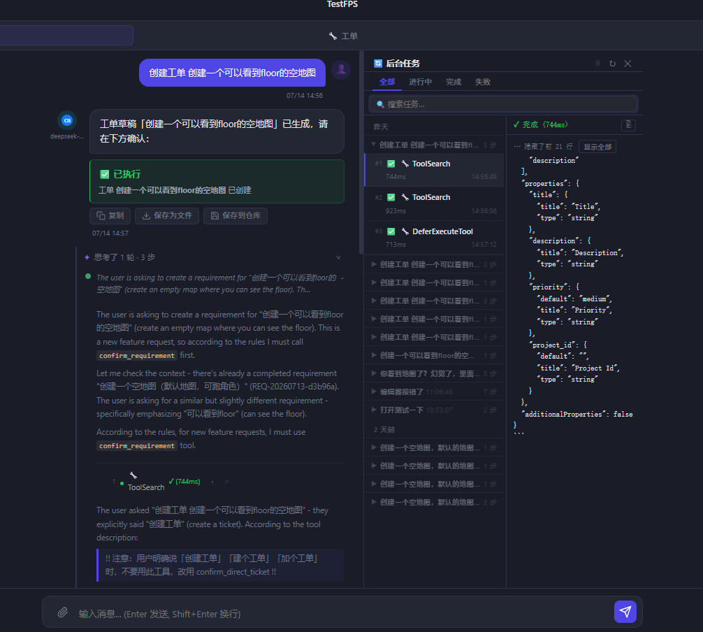

# DevNote · 2026-07-14

**类型**: 开发进度记录  
**分支**: main  
**提交范围**: `d5aea68` → `0fa74aa`（共 12 次提交）

---

## 效果预览



图中可见：
- 左侧聊天面板：AI 正确调用 `confirm_direct_ticket`，工单草稿已执行
- 中间思考面板：「思考了 1 轮 · 3 步」展示 MCP 工具调用（ToolSearch × 2 + DeferExecuteTool）
- 右侧后台任务面板：状态标签页 + 搜索框 + 日期分组 + JSON 折叠输出

---

## 今日完成内容

### 一、工单时间轴 Agent 步骤追踪

- `BaseAgent.emit_step()` 手动步骤打点，`_emit_react_tool()` REACT 工具透出
- `DevAgent._do_develop()` 2 步打点（代码生成 / 自测验证）
- `DevAgent._do_retry_with_reflection()` 3 步打点（拉上下文 / 反思 / 重开发）
- `ArchitectAgent.execute()` 覆盖，2 步打点（读上下文 / AI 生成架构）
- tier 分类：`error/warn → primary`，`skill_step_done → primary`，`thought_done → primary`
- 前端：`_renderSkillStepItem` / `_renderReactToolItem` 步骤卡片渲染
- `thought_done` 解析产出文件标签，点击弹 git diff 弹窗（支持跨分支搜索 + 磁盘 fallback）

### 二、多项 UI 修复

| 问题 | 修复 |
|---|---|
| 删需求 FK constraint failed | 补删 `ticket_comments` |
| 确认卡片不显示 | `mcp_action_callback` 直接构建 + 流结束后 flush pending cards |
| 错误详情不展示 | `parsed.error` 兼容，error 级别默认展开 |
| blocked 条目无诊断入口 | 加 🩺 AI 诊断按钮 |
| BUG 卡片无详情 | onclick 打开详情/关联工单 |
| `comment-locate-btn` 不可见 | 改为常驻显示（低透明度） |
| 文件标签点击"不存在" | 遍历所有分支 + 磁盘 fallback |

### 三、独立工单桶（无需拆单）

- `POST /tickets/create-direct` 端点，幂等创建 standalone 需求
- `RequirementStatus.STANDALONE`，独立工单桶需求置顶、紫色样式
- 工单看板顶部"✚ 直接创建工单"按钮，弹窗含三档执行起点
- `orchestrator._build_context()` 兼容 standalone req_short

### 四、AI 会话识别需求 vs 工单

- `confirm_direct_ticket` MCP 工具，区分「原子任务 ≤ 4h」与「大功能需拆单」
- `confirm_requirement` 内置关键词拦截（含"工单"字样强制跳转）
- AI 系统提示加判断规则（工单关键词最高优先级）
- 前端 `_buildConfirmDirectTicketCardHtml` 确认卡片 + `doConfirmDirectTicket`

### 五、会话-工单双向链接

- DB migration：`requirements/tickets` 各加 `source_message_id/session_id` 字段
- 创建时前端传 source 字段 → 后端存库 + 回填 `action_result`
- `renderSourceSection`：工单抽屉显示来源区块（时间 + 消息摘要 + 定位按钮）
- `locateSourceMessage`：切换 session + 滚动高亮定位
- 需求列表有来源时显示 🗨 角标

### 六、工单对话思考面板

- `_buildTicketThinkingEl` 接收 meta，无工具步骤也显示模型/耗时/tokens
- `_buildTicketAssistantAvatar` 显示该次调用实际模型（不用全局配置）
- `cli_task_start/done` 同步到聊天思考面板（MCP 工具调用实时可见）
- `_extractCliToolName` 从 `ToolSearch: xxx` / `mcp__ads__foo` 提取工具名

### 七、后台任务面板优化

**输出区智能格式化**：
- JSON 块 `<details>` 折叠，预览前 80 字符，展开查看完整
- URL 自动变可点击链接（`target="_blank"`）
- 默认显示最后 25 行 + "显示全部"按钮
- error/warning/ok 行分色高亮
- 右上角 ⎘ 复制全部按钮

**列表区改进**：
- 状态标签页：全部 / 进行中 / 完成 / 失败
- 搜索框实时过滤，匹配时自动展开分组
- 日期分区（今天 / 昨天 / N 天前）
- Session 组头显示进行中/失败角标
- 🗑 清理按钮（删除 5 分钟前已完成任务）
- 左右分栏拖拽调宽（120-360px，持久化）
- 任务卡片重构：工具名全称 + 耗时 + 命令摘要

---

## 待优化

- [ ] `confirm_direct_ticket` 路由：AI 提取 title 时会去掉"创建工单"前缀导致拦截失效 → 考虑在 description 里加工单上下文
- [ ] 工单时间轴步骤：ArchitectAgent 的"读取项目上下文"步骤没有实质等待，可考虑合并为单步
- [ ] 后台任务面板历史：DB 持久化任务太多时加分页

---

## 关键文件变更

```
backend/agents/base.py          ← emit_step + _emit_react_tool
backend/agents/dev.py           ← _do_develop 步骤打点
backend/agents/architect.py     ← execute() 覆盖
backend/api/tickets.py          ← create-direct + tier分类 + source字段
backend/api/chat.py             ← mcp_action_callback + confirm_direct_ticket
backend/actions/chat/confirm_requirement.py  ← ConfirmDirectTicketAction
backend/ads_data_mcp_server.py  ← confirm_direct_ticket MCP工具
backend/database.py             ← source_message_id/session_id migration
frontend/app.js                 ← 全部前端改动（+~1500行）
frontend/styles.css             ← 样式（+~250行）
```
