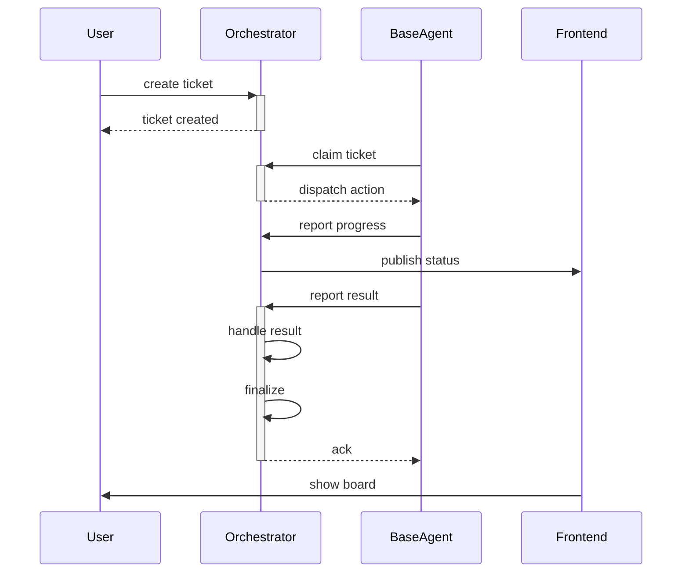
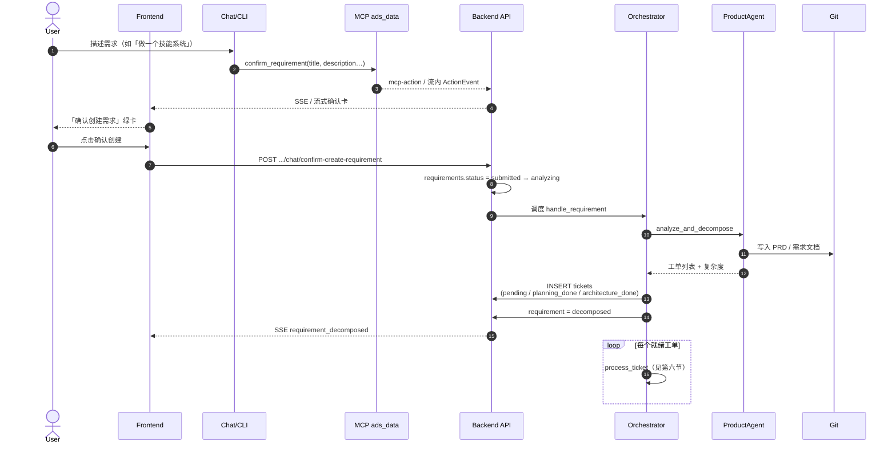
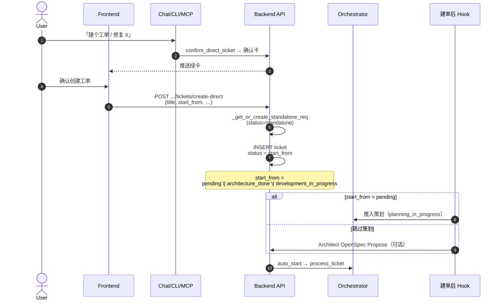
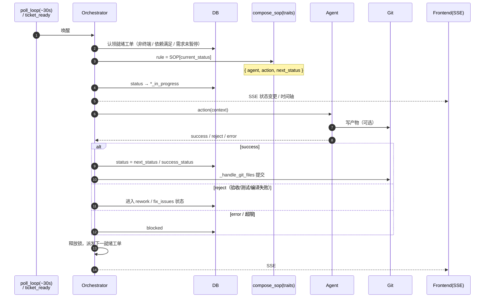
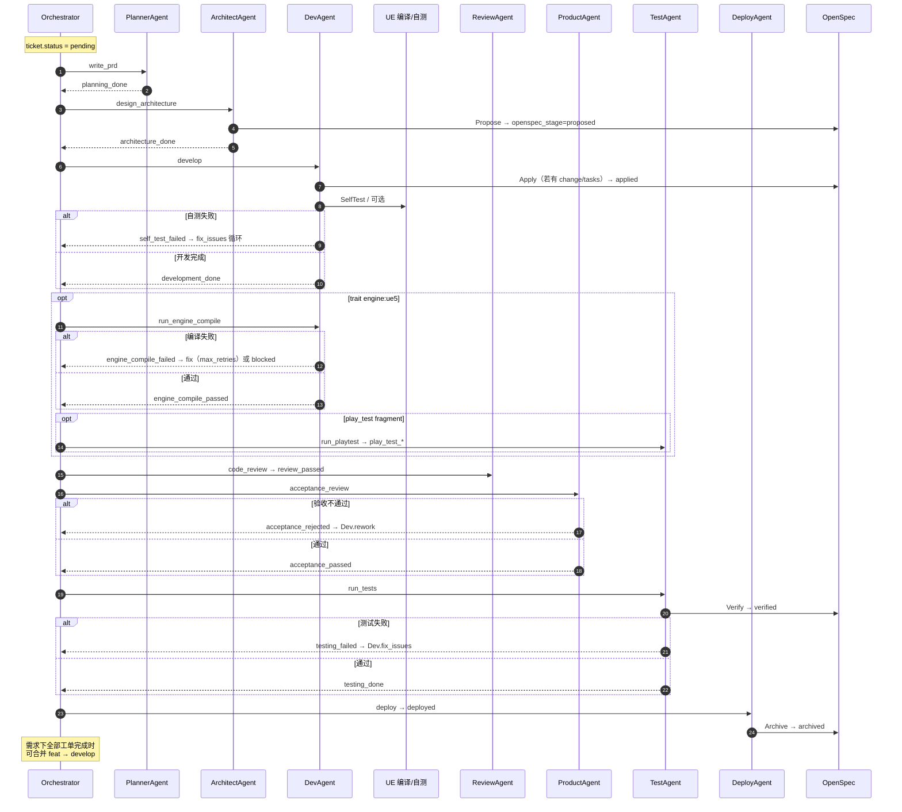
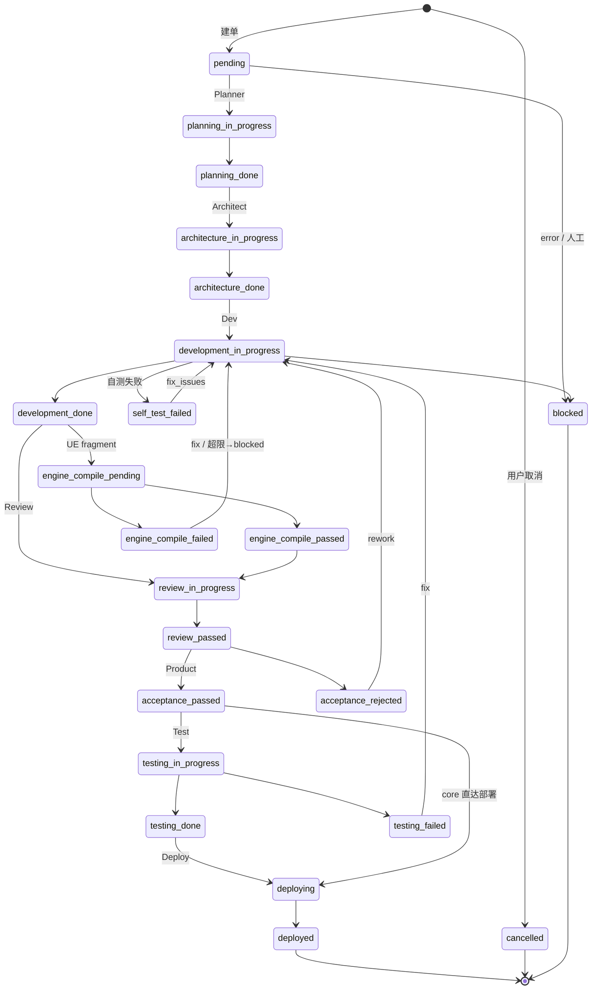
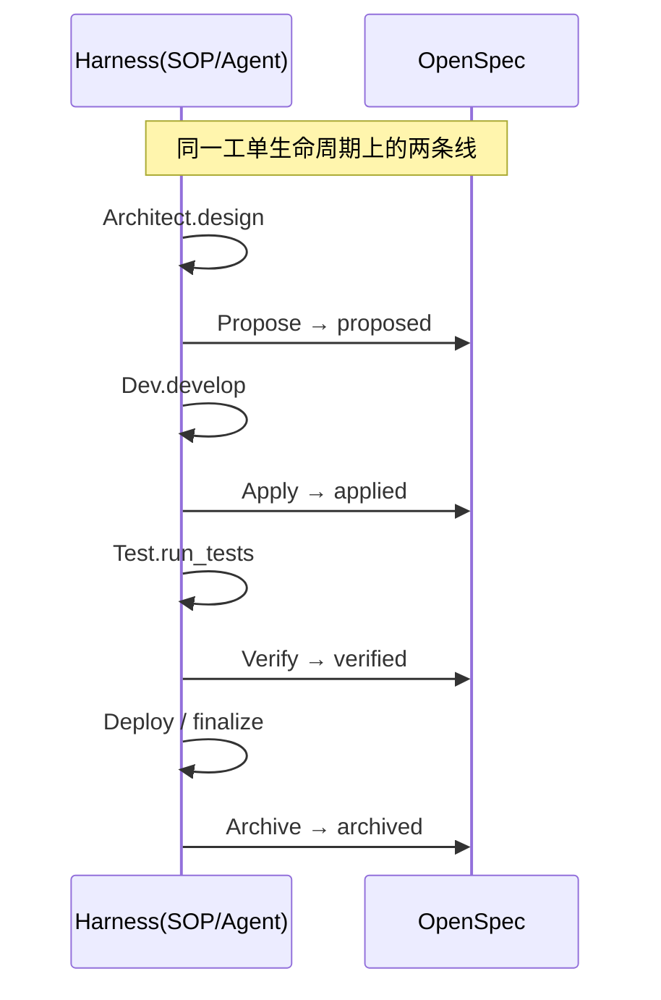

# ADS 工单系统流程时序图

**创建日期**: 2026-08-17  
**状态**: 文档（对齐当前代码：Orchestrator + SOP + OpenSpec）  
**范围**: 从用户对话确认 → 建需求/工单 → Agent 流水线 → 完成/部署  

关联文档：

- `docs/20260714_01_独立工单桶设计方案.md` — 直接建单 / standalone
- `docs/20260714_02_会话工单双向链接与背景追溯方案.md` — 会话 ↔ 工单
- `docs/20260721_01_OpenSpec ≠ Harness Engineering.md` — Spec 层 vs Harness
- `docs/20260804_01_工单编排系统性问题修改方案.md` — 编排竞态
- `docs/20260807_01_工单Checkpoint快照与还原方案.md` — Checkpoint

---

## 一、总览时序（对标 AgentFlow 风格 · 代码实名）

四条生命线与仓库实体对应：

| AgentFlow | ADS |
|-----------|-----|
| 用户/团队 | `User` |
| AgentFlow | `Orchestrator` |
| AI Agent | `BaseAgent` |
| Dashboard | `Frontend` |

箭头只保留**短标识**；完整 API / 方法见下方对照表。



### 箭头 ↔ 代码对照

| 图上短文案 | 代码实际调用 |
|------------|--------------|
| `create ticket` | `POST .../chat/confirm-create-requirement` 或 `POST .../tickets/create-direct` |
| `ticket created` | 落库 `tickets` / `requirements`，再调度 `handle_requirement` 或 `process_ticket` |
| `claim ticket` | `poll_loop` / `ticket_ready` → `process_ticket` → `_try_claim_ticket` |
| `dispatch action` | `compose_sop(traits)[status]` → `{agent, action, next_status}` |
| `report progress` | Agent 执行中写 timeline / logs；状态切 `*_in_progress` |
| `publish status` | `event_manager.publish_to_project(..., "ticket_status_changed", ...)` |
| `report result` | Agent `return` → `Orchestrator._handle_agent_result` |
| `handle result` | success → SOP 下一状态；reject → rework/fix；error → `blocked` |
| `finalize` | `_finalize_openspec_after_done` / Checkpoint / 全部完成后 merge |
| `show board` | `frontend/app.js` 看板 + 时间轴 + `STATUS_LABELS` |

`BaseAgent` 运行时具体类：`PlannerAgent` · `ArchitectAgent` · `DevAgent` · `ReviewAgent` · `ProductAgent` · `TestAgent` · `DeployAgent` 等（见 `backend/agents/`）。

---

## 二、系统结构总览

ADS 以**工单（Ticket）**为执行单元。用户侧通过聊天确认卡创建**需求**或**直接工单**；后端 **Orchestrator** 按项目 **SOP**（`compose_sop(traits)`）轮询/事件驱动，依次调度 Agent；**OpenSpec**（Propose → Apply → Verify → Archive）作为并行 Spec 层叠在 Harness 之上。

```
用户 ──► 聊天/CLI/MCP 确认卡 ──► API 落库
                                    │
                    ┌───────────────┴───────────────┐
                    ▼                               ▼
            需求拆单路径                        独立工单桶路径
         (Product 拆成多单)                  (create-direct)
                    │                               │
                    └───────────► Orchestrator ◄────┘
                                      │
                         SOP[status] → Agent.action
                                      │
                              Git 提交 / UE 编译·测玩
                                      │
                                 完成 / 部署 / 阻塞
```

---

## 三、参与者（细化）

| 角色 | 说明 |
|------|------|
| User | 产品/开发者 |
| Frontend | 看板、确认卡、时间轴、主舞台 |
| Chat/CLI | 全局/项目聊天；CLI 经 QueryEngine |
| MCP | `ads_data`：`confirm_requirement` / `confirm_direct_ticket` 等 |
| API | FastAPI：`chat` / `requirements` / `tickets` |
| Orchestrator | 认领工单、按 SOP 派发、处理结果 |
| Agents | Planner / Architect / Dev / Review / Product / Test / Deploy … |
| Git | 写文件、提交、分支合并 |
| UE（可选） | 引擎编译、PIE/玩法测试（trait `engine:ue5`） |
| OpenSpec | change/tasks 规范层 |

---

## 四、路径 A：需求确认卡 → 拆单 → 工单流水线

适用于「做一个某某功能」等偏大的需求。



### 复杂度 → 初始工单状态

| 复杂度 | 初始 status | 含义 |
|--------|-------------|------|
| XS（simple / ≤1 单） | `architecture_done` | 跳过策划+架构 |
| S（medium / ≤2 单） | `planning_done` | 跳过 Planner |
| 其它 | `pending` | 完整 SOP 从策划开始 |

---

## 五、路径 B：直接工单（独立工单桶）

适用于「建个工单修 XX」「改一下 README」等原子任务（设计目标 ≤~4h）。



---

## 六、Orchestrator 单工单调度时序



---

## 七、典型 Agent 流水线时序（Trait-first + UE）

实际跳转由 `backend/sop/_core.yaml` + `fragments/*`（如 `engine_compile`、`play_test`）决定。下图为常见 UE 项目路径。



### Web 默认 SOP（无 traits）差异

`default_sop.yaml` 常见路径更短：

`pending → Architect → Dev → Review → Product 验收 → Test`，完成后 Orchestrator 做分支合并；Deploy 更常出现在 trait-first / UE fragment 路径。

---

## 八、状态机（工单细粒度）



### 需求状态（Requirement）

| Code | 中文 |
|------|------|
| `submitted` | 已提交 |
| `analyzing` | 分析中 |
| `decomposed` | 已拆单 |
| `in_progress` | 进行中 |
| `paused` | 已暂停 |
| `completed` | 已完成 |
| `cancelled` | 已取消 |
| `standalone` | 独立工单桶 |

### 看板折叠展示（Frontend）

细粒度 status 折叠为：`pending` / `todo` / `in_progress` / `in_review` / `done` / `blocked` / `cancelled`（待规划 / 待办 / 进行中 / 审核中 / 已完成 / 已阻塞 / 已取消）。

---

## 九、OpenSpec 与 Harness 并行层



三层 UI（Spec / Discipline / Harness）见前端 `HARNESS_PHASES`；OpenSpec 阶段字段为 `tickets.openspec_stage`，**不是** `TicketStatus`。

---

## 十、关键 API（摘录）

| 方法 | 路径 | 作用 |
|------|------|------|
| POST | `/api/projects/{id}/chat/confirm-create-requirement` | 确认卡 → 创建需求 |
| POST | `/api/projects/{id}/requirements` | 手动创建需求并拆单 |
| POST | `/api/projects/{id}/tickets/create-direct` | 直接建工单 |
| POST | `/api/projects/{id}/chat/mcp-action` | MCP 动作 / 确认卡 |
| PATCH | `/api/projects/{id}/tickets/{tid}/status` | 手动改状态 |
| POST | `.../tickets/{tid}/start\|reject\|unblock` | 启停与驳回 |
| GET | board / timeline / ticket-graph | 观察 |

---

## 十一、关键代码

| 路径 | 职责 |
|------|------|
| `backend/models.py` | 状态枚举、`STATUS_LABELS` |
| `backend/orchestrator.py` | 认领、派发、结果、合并、OpenSpec finalize |
| `backend/sop/_core.yaml` / `default_sop.yaml` / `fragments/*` | 流水线定义 |
| `backend/agents/*.py` | 各阶段 Agent |
| `backend/actions/chat/confirm_requirement.py` | 确认卡动作 |
| `backend/api/tickets.py` / `chat.py` / `requirements.py` | HTTP API |
| `frontend/app.js` | 确认卡、看板映射、三层进度条 |

---

## 十二、阅读提示

1. **时序以 SOP 为准**：项目 traits 不同，插入的 fragment（UX / 美术 / HTML 原型 / 编译 / 玩法测）不同。  
2. **确认卡不落库**：MCP/`confirm_*` 只推草稿；用户点「确认」才调创建 API。  
3. **阻塞与循环**：验收/测试/编译失败会回到 Dev 修复；超限或硬错误进入 `blocked`。  
4. **在支持 Mermaid 的查看器中打开本文**（GitHub / VS Code / Cursor 预览）即可渲染全部时序图与状态图。
