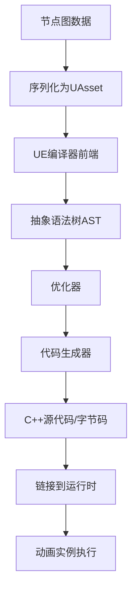

# UE动画蓝图（Animation Blueprint）实现原理深度解析

UE动画蓝图**不是将JS代码转成可视化**，而是相反：**将可视化节点图编译成C++代码/字节码**。让我详细解析其实现原理：

## 一、动画蓝图核心技术架构

```
┌─────────────────────────────────────────────┐
│       UE动画蓝图（Animation Blueprint）       │
├─────────────────────────────────────────────┤
│ 可视化节点编辑器     │ 运行时系统             │
├─────────────────────┼───────────────────────┤
│ 节点图              │ Animation Instance     │
│ 连线连接            │ Animation Blueprint    │
│ 参数面板            │ Anim Instance Proxy    │
│ 调试视图            │ Update Animation       │
│ 实时预览            │ Evaluate Anim Graph    │
└─────────────────────┴───────────────────────┘
```

## 二、编译流程：从节点图到可执行代码

### 1. **完整编译流程**



### 2. **具体实现步骤**

```cpp
// 1. 节点图数据结构
class FAnimGraphNode_Base {
    virtual void UpdateGraphNode() = 0;
    virtual void EvaluateGraphNode(FPoseContext& Output) = 0;
    TArray<FPinRecord> InputPins;  // 输入引脚
    TArray<FPinRecord> OutputPins; // 输出引脚
    FAnimNode_Base* RuntimeNode;   // 运行时节点
};

// 2. 编译为C++代码
class FAnimBlueprintCompiler {
    void CompileAnimBlueprint(UAnimBlueprint* Blueprint) {
        // 第一步：创建AST
        FAnimBlueprintGeneratedClass* GeneratedClass = CreateGeneratedClass();
        
        // 第二步：序列化节点图
        TArray<FAnimNode_Base*> SerializedNodes = SerializeGraph();
        
        // 第三步：生成C++代码
        GenerateCppCode(GeneratedClass, SerializedNodes);
        
        // 第四步：编译为DLL/字节码
        CompileToNativeCode(GeneratedClass);
    }
    
    // 生成类似这样的C++代码：
    void UAnimInstance_Generated::NativeUpdateAnimation(float DeltaSeconds) {
        // 自动生成的代码
        // 1. 更新状态机
        FAnimUpdateContext UpdateContext(this, DeltaSeconds);
        UpdateStateMachines(UpdateContext);
        
        // 2. 评估动画图
        FPoseContext PoseContext(this);
        EvaluateGraph(PoseContext);
        
        // 3. 应用结果
        Output.Result.Pose = PoseContext.Pose;
    }
};
```

## 三、运行时执行系统

### 1. **动画实例运行时架构**

```cpp
// 运行时核心类
class UAnimInstance : public UObject {
    // 虚函数，由生成的子类重写
    virtual void NativeUpdateAnimation(float DeltaSeconds);
    virtual void NativeInitializeAnimation();
    
    // 运行时动画图
    TArray<FAnimNode_Base*> AnimNodeSequence;
    
    // 状态机
    TMap<FName, FAnimNode_StateMachine*> StateMachines;
};

// 动画图评估
class FAnimInstanceProxy {
    void UpdateAnimation() {
        // 1. 预处理
        PreUpdateAnimation();
        
        // 2. 更新所有动画节点
        for (FAnimNode_Base* Node : AnimNodeSequence) {
            Node->Update_AnyThread(Context);
        }
        
        // 3. 评估姿势
        EvaluateAnimationGraph();
    }
    
    void EvaluateAnimationGraph() {
        FPoseContext Output(this);
        
        // 从输出节点开始反向求值
        FAnimNode_Root* RootNode = GetRootNode();
        RootNode->Evaluate_AnyThread(Output);
        
        // 应用蒙太奇、混合等
        ApplyMontages(Output);
        
        // 最终姿势输出
        FinalPose = Output.Pose;
    }
};
```

### 2. **节点执行引擎**

```cpp
// 节点基类
struct FAnimNode_Base {
    virtual void Initialize_AnyThread(const FAnimationInitializeContext& Context) = 0;
    virtual void Update_AnyThread(const FAnimationUpdateContext& Context) = 0;
    virtual void Evaluate_AnyThread(FPoseContext& Output) = 0;
    virtual void CacheBones_AnyThread(const FAnimationCacheBonesContext& Context) = 0;
    
    // 运行时数据
    mutable FExposedValueHandler ExposedValueHandler;
    TArray<FExposedValueHandler> PropertyAccessHandlers;
    
    // 性能优化
    bool bCachedValid = false;
    mutable FAnimNodeCachedData CachedData;
};

// 具体节点实现示例：状态机节点
struct FAnimNode_StateMachine : public FAnimNode_Base {
    int32 StateMachineIndex = INDEX_NONE;
    int32 MaxTransitionsPerFrame = 0;
    float ElapsedTime = 0.0f;
    
    TArray<FAnimationState> States;
    TArray<FAnimationTransition> Transitions;
    
    virtual void Update_AnyThread(const FAnimationUpdateContext& Context) override {
        // 评估当前状态
        FAnimNode_Base* CurrentState = GetCurrentState();
        if (CurrentState) {
            CurrentState->Update_AnyThread(Context);
        }
        
        // 检查状态转换条件
        CheckForTransitions();
        
        // 执行状态转换
        if (bTransitionRequested) {
            ExecuteTransition();
        }
    }
    
    virtual void Evaluate_AnyThread(FPoseContext& Output) override {
        FAnimNode_Base* CurrentState = GetCurrentState();
        if (CurrentState) {
            CurrentState->Evaluate_AnyThread(Output);
        }
    }
};
```

## 四、蓝图到代码的具体转换

### 1. **节点到C++代码的映射**

```cpp
// 蓝图中的混合空间节点
// 可视化表示：
// [BlendSpace1D] -> [BlendSpacePlayer] -> [OutputPose]

// 编译为C++代码：
class FAnimNode_BlendSpacePlayer_Generated : public FAnimNode_BlendSpacePlayer {
    // 自动生成的初始化代码
    void Initialize_AnyThread(const FAnimationInitializeContext& Context) override {
        // 设置混合空间资源
        BlendSpace = Cast<UBlendSpace1D>(LoadObject(TEXT("/Game/Animations/BlendSpace_1D")));
        
        // 设置参数绑定
        ExposedValueHandler.Bind(this, GET_MEMBER_NAME_CHECKED(ThisClass, X));
        
        // 调用父类初始化
        Super::Initialize_AnyThread(Context);
    }
    
    // 自动生成的更新代码
    void Update_AnyThread(const FAnimationUpdateContext& Context) override {
        // 获取输入参数
        float XValue = GetInputValue<float>(Context, 0);
        
        // 更新混合空间位置
        Position = XValue;
        
        // 调用父类更新
        Super::Update_AnyThread(Context);
    }
};
```

### 2. **状态机编译示例**

```cpp
// 蓝图状态机 -> C++代码
class FAnimNode_StateMachine_Generated : public FAnimNode_StateMachine {
    enum EState {
        State_Idle = 0,
        State_Walk = 1,
        State_Run = 2,
        State_Jump = 3
    };
    
    EState CurrentState = State_Idle;
    
    // 编译生成的转换条件检查
    bool CheckTransitions(const FAnimationUpdateContext& Context) {
        switch (CurrentState) {
            case State_Idle:
                if (Speed > 0.1f && Speed <= 2.0f) {
                    TransitionToState(State_Walk, 0.2f);
                    return true;
                } else if (Speed > 2.0f) {
                    TransitionToState(State_Run, 0.1f);
                    return true;
                } else if (bIsJumping) {
                    TransitionToState(State_Jump, 0.1f);
                    return true;
                }
                break;
                
            case State_Walk:
                if (Speed <= 0.1f) {
                    TransitionToState(State_Idle, 0.3f);
                    return true;
                } else if (Speed > 2.0f) {
                    TransitionToState(State_Run, 0.1f);
                    return true;
                }
                break;
                
            // 更多状态...
        }
        return false;
    }
    
    // 编译生成的评估函数
    void Evaluate_AnyThread(FPoseContext& Output) override {
        switch (CurrentState) {
            case State_Idle:
                IdleNode.Evaluate_AnyThread(Output);
                break;
            case State_Walk:
                WalkNode.Evaluate_AnyThread(Output);
                break;
            case State_Run:
                RunNode.Evaluate_AnyThread(Output);
                break;
            case State_Jump:
                JumpNode.Evaluate_AnyThread(Output);
                break;
        }
        
        // 应用状态间混合
        if (bIsBlending) {
            ApplyStateBlend(Output);
        }
    }
};
```

## 五、Three.js中实现类似系统的方案

### 1. **架构对比**

| UE动画蓝图   | Three.js等效实现                |
| ------------ | ------------------------------- |
| 节点编辑器   | 自定义节点编辑器（HTML/Canvas） |
| 编译到C++    | 编译到JavaScript函数            |
| AnimInstance | AnimationMixer扩展              |
| 线程安全更新 | 主线程/Worker线程               |
| 硬件加速     | WebGL/WebGPU                    |

### 2. **Three.js中实现动画蓝图编译器**

```javascript
// 1. 节点定义
class AnimationBlueprintNode {
    constructor(type, params) {
        this.type = type; // 'state_machine', 'blend', 'play', etc.
        this.params = params;
        this.inputs = [];
        this.outputs = [];
        this.id = generateId();
    }
    
    // 编译为可执行代码
    compile() {
        switch(this.type) {
            case 'play_animation':
                return this.compilePlayAnimation();
            case 'blend':
                return this.compileBlend();
            case 'state_machine':
                return this.compileStateMachine();
            default:
                return '';
        }
    }
    
    compilePlayAnimation() {
        return `
            const action = mixer.clipAction(animations["${this.params.clipName}"]);
            action.setEffectiveTimeScale(${this.params.speed || 1.0});
            action.setLoop(THREE.LoopRepeat, Infinity);
            return { type: 'action', action };
        `;
    }
    
    compileBlend() {
        const input0 = this.inputs[0]?.compile() || 'null';
        const input1 = this.inputs[1]?.compile() || 'null';
        return `
            (function() {
                const result0 = ${input0};
                const result1 = ${input1};
                
                if (result0 && result1 && result0.action && result1.action) {
                    result0.action.setEffectiveWeight(${this.params.weight});
                    result1.action.setEffectiveWeight(${1 - this.params.weight});
                    return { type: 'blend', actions: [result0.action, result1.action] };
                }
                return null;
            })()
        `;
    }
}

// 2. 蓝图编译器
class AnimationBlueprintCompiler {
    constructor(blueprintData) {
        this.blueprint = blueprintData;
        this.compiledCode = '';
    }
    
    compile() {
        // 构建节点图
        const nodes = this.buildNodeGraph();
        
        // 拓扑排序
        const sortedNodes = this.topologicalSort(nodes);
        
        // 生成JavaScript代码
        this.compiledCode = this.generateJSCode(sortedNodes);
        
        // 创建可执行函数
        return this.createExecutableFunction();
    }
    
    generateJSCode(nodes) {
        const codeParts = [];
        
        codeParts.push(`
            // 动画蓝图生成的代码
            class AnimationBlueprintInstance {
                constructor(mixer, animations) {
                    this.mixer = mixer;
                    this.animations = animations;
                    this.variables = {};
                    this.runningActions = new Set();
                }
                
                update(deltaTime) {
                    // 更新所有活跃的动画
                    this.mixer.update(deltaTime);
                }
        `);
        
        // 为每个节点生成方法
        nodes.forEach((node, index) => {
            const nodeCode = node.compile();
            codeParts.push(`
                evaluateNode_${node.id}() {
                    return ${nodeCode};
                }
            `);
        });
        
        // 主评估函数
        codeParts.push(`
                evaluate() {
                    // 从输出节点开始评估
                    return this.evaluateNode_${this.getOutputNodeId()}();
                }
            }
            
            return AnimationBlueprintInstance;
        `);
        
        return codeParts.join('\n');
    }
    
    createExecutableFunction() {
        // 使用Function构造函数创建可执行函数
        const func = new Function('THREE', this.compiledCode);
        return func(THREE);
    }
}
```

### 3. **运行时解释器方案（不编译）**

```javascript
// 1. 节点图解释器
class AnimationGraphInterpreter {
    constructor(mixer, animations) {
        this.mixer = mixer;
        this.animations = animations;
        this.nodes = new Map();
        this.connections = [];
        this.runtime = new AnimationGraphRuntime();
    }
    
    // 注册节点类型及其处理器
    registerNodeType(type, processor) {
        this.nodeProcessors.set(type, processor);
    }
    
    // 评估节点图
    evaluate(graphData, context) {
        // 构建执行顺序
        const executionOrder = this.calculateExecutionOrder(graphData);
        
        // 逐节点执行
        const results = new Map();
        
        for (const nodeId of executionOrder) {
            const node = graphData.nodes.get(nodeId);
            const processor = this.nodeProcessors.get(node.type);
            
            if (processor) {
                // 收集输入值
                const inputs = this.collectNodeInputs(nodeId, results);
                
                // 执行节点逻辑
                const output = processor.execute(node, inputs, context);
                
                // 存储结果
                results.set(nodeId, output);
            }
        }
        
        return this.getFinalOutput(results, graphData);
    }
    
    // 节点处理器示例
    registerDefaultProcessors() {
        // 播放动画处理器
        this.registerNodeType('play_animation', {
            execute: (node, inputs, context) => {
                const action = this.mixer.clipAction(
                    this.animations[node.params.clip]
                );
                
                if (node.params.speed !== undefined) {
                    action.timeScale = node.params.speed;
                }
                
                if (node.params.weight !== undefined) {
                    action.weight = node.params.weight;
                }
                
                action.play();
                
                return {
                    type: 'animation_action',
                    action,
                    weight: node.params.weight || 1.0
                };
            }
        });
        
        // 混合处理器
        this.registerNodeType('blend', {
            execute: (node, inputs, context) => {
                const [input0, input1] = inputs;
                const weight = node.params.weight || 0.5;
                
                if (input0 && input1) {
                    input0.action.setEffectiveWeight(weight);
                    input1.action.setEffectiveWeight(1 - weight);
                    
                    return {
                        type: 'blend_result',
                        actions: [input0.action, input1.action],
                        weight
                    };
                }
                
                return null;
            }
        });
    }
}
```

## 六、性能优化关键技术

### 1. **热路径优化**

```cpp
// UE中的优化：内联频繁调用的函数
FORCEINLINE void UpdateAnimationNode(FAnimNode_Base* Node) {
    // 内联代码以减少函数调用开销
    Node->UpdateInternal();
}
// Three.js中的等效优化
class OptimizedAnimationGraph {
    // 使用JIT编译优化热路径
    compileHotPath(nodes) {
        // 识别热路径（经常执行的节点）
        const hotPathNodes = this.identifyHotPath(nodes);
        
        // 为热路径生成优化代码
        const hotPathCode = this.generateOptimizedCode(hotPathNodes);
        
        // 使用Function或eval执行
        this.hotPathFunction = new Function('context', hotPathCode);
        
        // 在更新循环中直接调用优化函数
        this.update = (deltaTime) => {
            this.hotPathFunction({ deltaTime });
        };
    }
}
```

### 2. **数据驱动优化**

```javascript
// 使用数组存储代替对象，提高缓存友好性
class DataDrivenAnimationGraph {
    constructor() {
        // 使用连续数组存储节点数据
        this.nodeData = new Float32Array(1024); // 预分配内存
        this.connectionData = new Uint16Array(2048);
        
        // 使用Struct of Arrays (SoA) 布局
        this.nodeProperties = {
            positions: new Float32Array(1024),  // 所有节点的位置
            rotations: new Float32Array(1024),  // 所有节点的旋转
            scales: new Float32Array(1024),     // 所有节点的缩放
        };
    }
    
    // SIMD友好的更新函数
    updateSIMD(deltaTime) {
        // 批量处理节点更新
        for (let i = 0; i < this.nodeCount; i += 4) {
            // 可以在这里使用SIMD指令（如果浏览器支持）
            this.processNodeBatch(i, deltaTime);
        }
    }
}
```

## 七、调试和开发工具

### 1. **实时调试系统**

```javascript
class AnimationBlueprintDebugger {
    constructor(graphInstance) {
        this.instance = graphInstance;
        this.breakpoints = new Set();
        this.watchVariables = new Map();
        this.executionLog = [];
        
        // 代理所有节点方法以捕获执行信息
        this.instrumentNodes();
    }
    
    instrumentNodes() {
        // 为每个节点添加调试钩子
        this.instance.nodes.forEach(node => {
            const originalEvaluate = node.evaluate;
            
            node.evaluate = (...args) => {
                // 记录执行开始
                this.logExecutionStart(node.id);
                
                // 检查断点
                if (this.breakpoints.has(node.id)) {
                    this.pauseAtBreakpoint(node.id);
                }
                
                // 执行原始函数
                const result = originalEvaluate.apply(node, args);
                
                // 记录执行结果
                this.logExecutionEnd(node.id, result);
                
                return result;
            };
        });
    }
    
    // 实时可视化
    createDebugVisualization() {
        const debugCanvas = document.createElement('canvas');
        const ctx = debugCanvas.getContext('2d');
        
        // 绘制节点图
        this.drawNodeGraph(ctx);
        
        // 高亮当前执行节点
        this.highlightActiveNodes(ctx);
        
        // 显示变量值
        this.displayVariableValues(ctx);
    }
}
```

## 八、与Three.js现有系统的集成

### 1. **集成到AnimationMixer**

```javascript
// 扩展AnimationMixer以支持蓝图
THREE.AnimationMixer.prototype.registerBlueprint = function(blueprintData) {
    const compiler = new AnimationBlueprintCompiler(blueprintData);
    const BlueprintClass = compiler.compile();
    
    const instance = new BlueprintClass(this, this._actions);
    
    // 存储实例引用
    if (!this._blueprints) {
        this._blueprints = new Map();
    }
    this._blueprints.set(blueprintData.id, instance);
    
    return instance;
};

// 在更新循环中
function updateAnimations(deltaTime) {
    // 更新所有混合器
    mixers.forEach(mixer => {
        mixer.update(deltaTime);
        
        // 更新所有蓝图实例
        if (mixer._blueprints) {
            mixer._blueprints.forEach(blueprint => {
                blueprint.update(deltaTime);
            });
        }
    });
}
```

## 九、总结：UE动画蓝图的核心原理

1. **不是JS转可视化**，而是**可视化转编译代码**
2. **编译时优化**：节点图在编辑时编译为优化的C++代码
3. **运行时效率**：生成直接操作内存的原生代码
4. **类型安全**：编译时检查节点连接类型
5. **热重载**：蓝图修改后实时重新编译

### **在Three.js中复现的关键：**

1. **构建节点编辑器**：允许可视化创建动画逻辑
2. **实现编译器**：将节点图转换为优化的JavaScript
3. **创建运行时**：在Three.js动画系统中执行编译结果
4. **性能优化**：使用JIT编译、预计算、批处理等技术
5. **调试支持**：实时监控和调试动画图

### **技术挑战：**

1. **性能差距**：JavaScript vs 编译C++
2. **工具链不完善**：缺少UE级别的编辑器
3. **线程限制**：Web Workers vs UE的多线程
4. **内存管理**：手动优化 vs 自动管理

### **可行方案：**

```javascript
// 最小可行实现
class SimpleAnimationBlueprint {
    constructor() {
        this.nodes = [];
        this.compiled = null;
    }
    
    addNode(type, params) {
        const node = { type, params, id: this.nodes.length };
        this.nodes.push(node);
        return node.id;
    }
    
    compile() {
        // 简单编译：生成可执行的函数字符串
        const code = this.generateCode();
        this.compiled = new Function('mixer', 'deltaTime', code);
        return this.compiled;
    }
    
    generateCode() {
        return `
            // 生成的动画逻辑
            const actions = [];
            
            // 节点1: 播放动画
            const action1 = mixer.clipAction(animations["Walk"]);
            action1.play();
            actions.push(action1);
            
            // 节点2: 设置权重
            const weight = 0.5;
            action1.setEffectiveWeight(weight);
            
            return actions;
        `;
    }
    
    update(mixer, deltaTime) {
        if (this.compiled) {
            return this.compiled(mixer, deltaTime);
        }
    }
}
```

**结论**：虽然Three.js无法完全复制UE动画蓝图的底层编译系统，但可以通过构建节点编辑器+JavaScript编译器+运行时解释器的组合，实现类似的可视化动画编程体验。关键是通过预编译、JIT优化和高效的数据结构来弥补性能差距。